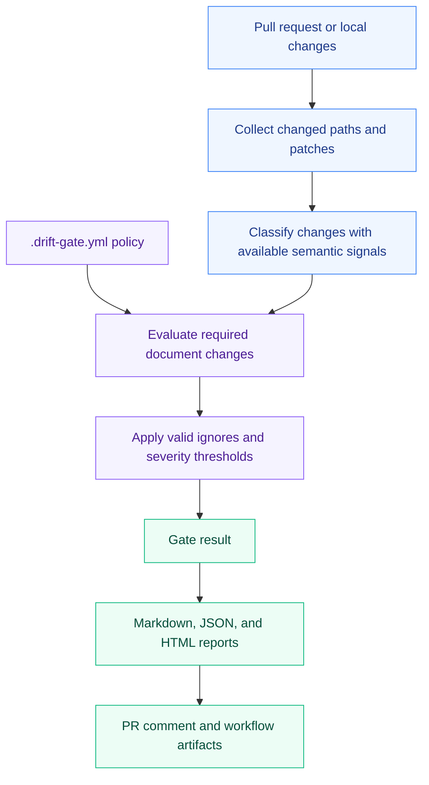

<div align="center">

# Drift Gate

**Code changes. Contracts should keep up.**

Catch missing API specs, runbooks, release notes, and security docs before merge.<br>
A GitHub Action and local CLI, powered by your team's policy.

[](https://github.com/cres17/pr-convention-checker/actions/workflows/ci.yml)
[](https://github.com/cres17/pr-convention-checker/actions/workflows/benchmark.yml)
[](LICENSE)

[](pyproject.toml)
[](action.yml)
[](#policy-example)
[](#semantic-detection)
[](drift_gate/tests)

[Quick Start](#quick-start) · [How It Works](#how-it-works) · [GitHub Action](#github-action) · [Policy Example](#policy-example) · [Examples & Guides](#examples--guides)

</div>

---

## Why Drift Gate?

A PR can pass its tests and still leave the next developer with an outdated
contract. Drift Gate checks whether code changes include the documents your
team expects, using explicit rules in `.drift-gate.yml`.

| When this changes… | Keep these in sync |
| :--- | :--- |
| API routes or OpenAPI definitions | API docs and CHANGELOG entries |
| Database schemas or migrations | Runbooks and release notes |
| Environment variables or configuration | `.env.example` |
| CI workflows or infrastructure | Operations docs |
| Authentication or RBAC | Security docs |

**Deterministic decisions.** Your policy controls pass/fail; an LLM is not
required. Optional Claude enrichment improves checklist wording without
changing the gate decision.

**Checks that fit your workflow.** Run locally before opening a PR, then use
the GitHub Action to publish results during review.

## How It Works



The policy defines which documents must change alongside code. Drift Gate
evaluates those requirements and applies your gate thresholds. Local runs can
write reports; the GitHub Action can also post a PR comment and upload artifacts.

## Quick Start

Requires **Python 3.10+**. From a local clone of this repository:

```bash
py -m pip install -e .
py main.py init --preset api
py main.py check --explain
```

These commands install Drift Gate, create a starter policy, and check the
current working tree with rule explanations. Adjust the generated paths to
match your project.

> **Platform tip:** The examples use the Windows `py` launcher. On macOS or
> Linux, use `python3` instead.

### Everyday commands

```bash
py main.py check                         # check current working tree
py main.py report --out-html report.html # write an HTML report
py main.py docs-check README.md --json   # verify docs match CLI/schema
py main.py review --base main            # deterministic code review helper
py main.py demo                          # generate benchmark.html
py main.py eval --compare-baseline       # run fixture benchmark
```

If Python's Scripts directory is on `PATH`, the console command is also
available:

```bash
drift-gate check
drift-gate report --out-html report.html
```

## GitHub Action

Commit your `.drift-gate.yml` policy, then create
`.github/workflows/drift-gate.yml`:

```yaml
name: Drift Gate

on:
  pull_request:
    types: [opened, synchronize, reopened]

permissions:
  contents: read
  pull-requests: write

jobs:
  drift-gate:
    runs-on: ubuntu-latest
    steps:
      - uses: actions/checkout@v4
      - uses: cres17/pr-convention-checker@v1
```

<details>
<summary><strong>Optional: enrich checklists with Claude</strong></summary>

Add an Anthropic API key to improve checklist wording. The deterministic gate
decision stays the same:

```yaml
      - uses: cres17/pr-convention-checker@v1
        with:
          anthropic_api_key: ${{ secrets.ANTHROPIC_API_KEY }}
```

</details>

<details>
<summary><strong>Action configuration</strong></summary>

| Input | Default | Purpose |
| :--- | :--- | :--- |
| `policy_file` | `.drift-gate.yml` | Path to your team's policy |
| `github_token` | `${{ github.token }}` | Token for posting PR comments |
| `post_comment` | `true` | Publish the result as a PR comment |
| `fail_on_blocker` | `true` | Fail the workflow when the configured gate returns `fail` |
| `upload_report_artifact` | `true` | Upload generated reports as a workflow artifact |
| `anthropic_api_key` | Empty | Enable optional Claude checklist enrichment |

See [action.yml](action.yml) for all inputs and outputs, including the model
setting and generated report paths.

</details>

## Policy Example

This policy requires **API docs and release notes** whenever a route or OpenAPI
file changes. Save it as `.drift-gate.yml`:

```yaml
rules:
  - id: api-contract-sync
    when:
      any_changed:
        - "src/routes/**"
        - "openapi/**"
    require:
      groups:
        - name: "API docs"
          any_changed:
            - "docs/api/**"
            - "docs/spec.md"
        - name: "Release notes"
          all_changed:
            - "CHANGELOG.md"
    severity: blocker
    message: "API surface changed without synced contract docs"

gate:
  fail_on_blocker: true
  fail_on_major_count: 2

ignore_paths:
  - "src/internal/**"
```

> [!IMPORTANT]
> Keep required docs paths such as `docs/**` and `CHANGELOG.md` out of
> `ignore_paths`. Ignored paths are excluded from both trigger and requirement
> checks.

<details>
<summary><strong>Rule field reference</strong></summary>

| Field | Meaning |
|---|---|
| `id` | Rule ID, also used by `drift-ignore` |
| `when.any_changed` | Paths that trigger the rule |
| `when.min_change_intensity` | Optional threshold such as `signature-change` or `route-contract-change` |
| `require.groups[].any_changed` | Group is satisfied when any listed path changed |
| `require.groups[].all_changed` | Group is satisfied only when every listed path changed |
| `severity` | `blocker`, `major`, `minor`, or `nit` |
| `gate.fail_on_blocker` | Fail CI on blocker violations |
| `gate.fail_on_major_count` | Fail CI when major count reaches this number |

</details>

## Suppressing Intentional Drift

Add this to the PR description:

```text
drift-ignore: api-contract-sync
reason: internal-only refactor, no public contract changed
```

For `blocker` and `major` rules, `reason:` is required. Without it, the ignore
is rejected and the rule still counts toward the gate.

## Outputs

| Format | Use it for |
| :--- | :--- |
| **Markdown** | Readable summaries and PR comments |
| **JSON** | Automation and structured rule decisions |
| **HTML** | Visual reports for review; generate locally with `--out-html` |

<details>
<summary><strong>Example JSON report</strong></summary>

Illustrative passing result:

```json
{
  "summary": {"blocker": 0, "major": 0, "minor": 0, "nit": 0, "gate_decision": "pass"},
  "scan_metrics": {"scanned_files": 3, "evaluated_rules": 1, "runtime_seconds": 0.01},
  "result": "pass",
  "change_types": ["api-surface"],
  "violations": [],
  "rule_decisions": [],
  "skipped_rules": [],
  "rejected_ignores": [],
  "ignore_audit": [],
  "temporal_warnings": [],
  "gate": {"fail_on_blocker": true, "fail_on_major_count": 2}
}
```

</details>

## Semantic Detection

Drift Gate combines path rules with patch/semantic signals. Current adapters
cover Python, TypeScript/JavaScript, Go, Java, Kotlin, and Ruby. When
`tree-sitter-language-pack` is installed, grammar-backed parsing is used where
available; conservative patch heuristics remain as fallback.

Learn how signals are evaluated in the [detector guide](docs/detector-guide.md).

## Examples & Guides

Start with an example that matches your stack, then adapt its policy paths to
your repository.

| Stack | Example |
| :--- | :--- |
| Python APIs | [FastAPI](examples/fastapi/README.md) · [Django](examples/django/README.md) |
| JavaScript / TypeScript | [Express](examples/express-api/README.md) · [Next.js](examples/nextjs/README.md) |
| Database migrations | [Prisma](examples/prisma/README.md) |
| Deployment workflows | [GitHub Actions](examples/github-actions-deploy/README.md) |

**Further reading:** [Detector guide](docs/detector-guide.md) ·
[Migration guide](docs/migration-guide.md) ·
[Troubleshooting](docs/troubleshooting.md)

## Development

### Repository workflows

| Workflow | Runs on | Checks and artifacts |
| :--- | :--- | :--- |
| [CI](.github/workflows/ci.yml) | Pushes and PRs to `main` / `develop`; published releases | Tests on Ubuntu, Windows, and macOS with Python 3.10–3.12; critical Ruff checks; baseline and multi-engine benchmarks |
| [Benchmark](.github/workflows/benchmark.yml) | Pushes to `main`; published releases | Tests, baseline comparison, and multi-engine evaluation; uploads benchmark reports and attaches reports to releases |

The status badges at the top link directly to the corresponding workflow runs.

### Local checks

```bash
py -m pip install -e ".[dev]"
py -m pytest -q
py main.py docs-check README.md --json
py main.py eval drift_gate/tests/fixtures --recursive --compare-baseline --engines semantic-aware --max-fp 0 --max-fn 0 --min-f1 1.0
```

The evaluation command checks the fixture suite against explicit false-positive,
false-negative, and F1 thresholds. Use `py main.py demo` to generate a browsable
`benchmark.html` report.

## License

Released under the [MIT License](LICENSE).
