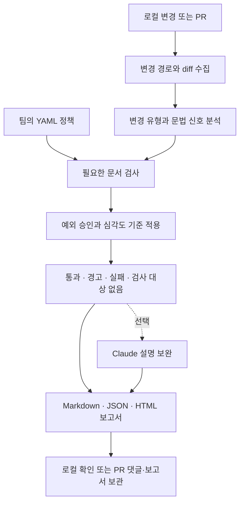

<div align="center">

# Drift Gate

**코드 변경에 맞춰 문서도 함께 바뀌었는지 확인합니다.**

API 명세, 설정 예제, 운영 문서의 누락을 PR에서 점검하는 개발 도구입니다.<br>
팀의 규칙을 YAML로 정의하고, 로컬 CLI와 GitHub Actions에서 같은 정책으로 검사합니다.

[](https://github.com/cres17/pr-convention-checker/actions/workflows/ci.yml?query=branch%3Aver2)
[](LICENSE)

[](pyproject.toml)
[](action.yml)
[](#정책-작성)
[](#분석-대상과-적용-예제)
[](drift_gate/tests)

[기술 스택](#기술-스택) · [사용 흐름](#사용-흐름) · [시작하기](#시작하기) · [버전별 변경](#버전별-변경) · [검증 결과](#검증-결과)

</div>

---

> **`ver2` 개발 브랜치** — 기존 기술 구성을 유지하면서 API·환경변수의 내용 검사와 승인 검증을 확장했습니다. 확인된 오탐·미탐은 [검증 결과](#검증-결과)에 공개합니다.

## 서비스 개요

API 경로를 바꾸고 테스트까지 고쳤더라도 문서에는 이전 주소가 남을 수 있습니다. 새 환경변수를 사용하는 코드를 추가했는데 `.env.example`에 키가 없다면 다른 개발자는 실행에 필요한 설정을 놓치게 됩니다.

Drift Gate는 이런 변경을 코드 리뷰 전에 확인하도록 만들었습니다. `.drift-gate.yml`에 코드 경로와 함께 확인할 문서를 연결하면, 변경 내용에 따라 필요한 문서를 검사하고 누락된 항목과 판정 근거를 보고서로 남깁니다.

| 코드에서 바뀐 부분 | 함께 확인할 문서 | 현재 검사 방식 |
|---|---|---|
| API 메서드·경로 | API 명세 | 인식 가능한 메서드·경로의 추가·삭제를 문서 diff와 대조 |
| 정적인 환경변수 키 | `.env.example` 등 설정 예제 | 설정한 샘플 파일에 새 키가 있는지 확인 |
| DB 스키마·마이그레이션 | 운영 문서·변경 이력 | 정책에 지정한 문서의 동반 수정 확인 |
| CI·인프라 설정 | 배포·운영 문서 | 정책에 지정한 문서의 동반 수정 확인 |
| 인증·권한 로직 | 보안 문서 | 정책에 지정한 문서의 동반 수정 확인 |

**통과·실패는 정책 엔진이 결정합니다.** Claude API는 선택 기능으로, 검사가 끝난 뒤 체크리스트와 설명을 보완합니다. API 키 없이도 기본 검사와 보고서 생성이 동작합니다.

## 기술 스택

`main`과 `ver2` 모두 **Python · YAML 정책 · Tree-sitter · GitHub Actions · pytest**를 사용합니다. `ver2`에서는 이 구성을 유지하고 분석 로직과 의존성 버전 조건을 수정했습니다.

| 영역 | 기술 | 역할 |
|---|---|---|
| 구현 언어 | **Python 3.10+** | 정책 평가, CLI, 외부 연동 구현 |
| 정책 설정 | **YAML · PyYAML** | 검사할 코드 경로, 필요한 문서, 심각도와 예외 규칙 정의 |
| 변경 수집 | **Git diff · GitHub REST API** | 로컬 변경 또는 PR의 파일·patch 수집 |
| 코드 분석 | **Tree-sitter · tree-sitter-language-pack** | 언어별 문법 분석 신호 추출. 정규식·휴리스틱과 함께 사용 |
| 자동 검사 | **GitHub Actions** | PR 검사, 댓글 작성, 보고서 보관 |
| 테스트·코드 검사 | **pytest · Ruff** | 회귀 테스트와 주요 Python 오류 검사 |
| 보고서 | **Markdown · JSON · HTML** | 리뷰용 요약, 자동화용 데이터, 브라우저 보고서 출력 |
| AI 도구 연동 | **MCP** | 로컬 AI 도구에서 정책 조회와 검사 기능 호출 |
| 선택 기능 | **Claude API** | 판정 후 체크리스트·근거 설명 보완 |

실행 의존성은 [pyproject.toml](pyproject.toml), 테스트와 코드 검사 설정은 [CI 설정](.github/workflows/ci.yml)에 있습니다. MCP와 Claude 연동은 `main`에도 있던 기능입니다.

<details>
<summary>코드 구조와 역할</summary>

| 경로 | 담당 역할 |
|---|---|
| [`drift_gate/core`](drift_gate/core) | 정책·변경 모델, 규칙 평가, 최종 판정 |
| [`drift_gate/adapters`](drift_gate/adapters) | Git·GitHub 입력, 문법 분석, CLI·Action·MCP·Claude 연동 |
| [`drift_gate/reporters`](drift_gate/reporters) | Markdown·JSON·HTML 보고서 생성 |
| [`drift_gate/tests`](drift_gate/tests) | 단위·통합 테스트와 고정 평가 사례 |
| [`scripts`](scripts) · [`docs/assessment`](docs/assessment) | 개선 전후 측정 도구와 원본 결과 |

</details>

## 분석 대상과 적용 예제

Drift Gate 자체는 Python으로 구현했습니다. 아래 언어는 **검사할 저장소의 코드 분석 대상**입니다. 언어별 어댑터가 존재한다는 뜻이며, 모든 문법이나 프레임워크를 완전히 분석한다는 뜻은 아닙니다.

| 분석 대상 | 파일 확장자 | 어댑터가 확인하는 주요 신호 |
|---|---|---|
| Python | `.py` | 함수·클래스, API 라우트, 설정 접근 |
| TypeScript · JavaScript | `.ts`, `.tsx`, `.js`, `.jsx` | export·타입, API 라우트, 설정 접근 |
| Go | `.go` | 함수와 공개 타입 |
| Java · Kotlin | `.java`, `.kt`, `.kts` | 공개 타입·함수 관련 선언 |
| Ruby | `.rb` | 메서드·클래스·모듈 |

Tree-sitter는 변경된 코드 조각을 분석합니다. 불완전한 diff나 지원하지 않는 구문에서는 휴리스틱을 사용하며, 분석 방법과 사유를 보고서에 남깁니다. **문서 내용 검사에는 별도의 정규식과 제한된 항목 비교가 사용됩니다.** 전체 프로그램과 문서의 의미가 같음을 증명하지는 않습니다.

| 적용할 프로젝트 | 정책 예제 |
|---|---|
| Python API | [FastAPI](examples/fastapi/README.md) · [Django](examples/django/README.md) |
| JavaScript · TypeScript | [Express](examples/express-api/README.md) · [Next.js](examples/nextjs/README.md) |
| DB 마이그레이션 | [Prisma](examples/prisma/README.md) |
| 배포 자동화 | [GitHub Actions](examples/github-actions-deploy/README.md) |

FastAPI·Django·Express·Next.js·Prisma는 적용 예제를 제공하는 대상입니다. 이 프레임워크들이 Drift Gate의 실행 의존성에 포함되지는 않습니다.

## 사용 흐름



1. **규칙을 정합니다.** 어떤 코드 변경에 어떤 문서가 필요한지 `.drift-gate.yml`에 작성합니다.
2. **변경을 검사합니다.** 경로와 diff를 분석하고, 규칙에 따라 파일 동반 수정 또는 API·설정 항목을 확인합니다.
3. **근거를 확인합니다.** 누락된 문서를 보완하거나 정해진 예외 절차를 따릅니다. 담당자 승인 필수 예외는 PR 본문에 이름만 적어서는 허용되지 않습니다.

### 검사 예시

코드의 `@app.get('/users')`를 `@app.get('/members')`로 변경하고 API 내용 검사 규칙이 적용된 경우입니다.

| 문서 변경 | 결과 |
|---|---|
| 문서를 수정하지 않음 | 실패 |
| 다른 API 문서의 오타만 수정 | 실패 |
| `GET /users`를 삭제하고 `GET /members`를 추가 | 통과 |

이 예시는 한 줄 라우트와 `GET /members` 형태의 문서에 해당합니다. Markdown 표와 중첩 OpenAPI YAML 등은 [지원 범위와 한계](#지원-범위와-한계)를 확인하세요.

## 시작하기

Python 3.10 이상과 Git이 필요합니다. 아래는 macOS·Linux 기준입니다. Windows에서는 `python3` 대신 `py`를 사용하고, 가상환경은 `.venv\Scripts\Activate.ps1`로 활성화합니다.

### 먼저 예제 보고서 보기

```bash
git clone --branch ver2 https://github.com/cres17/pr-convention-checker.git
cd pr-convention-checker
python3 -m venv .venv
source .venv/bin/activate
python -m pip install -e .
drift-gate demo
```

생성된 `benchmark.html`을 브라우저로 열면 저장소에 포함된 합성 사례의 판정과 근거를 볼 수 있습니다. 실제 서비스 PR을 검사한 결과는 아닙니다. Tree-sitter 문법을 처음 읽을 때는 다운로드가 필요할 수 있습니다.

### 내 저장소에 적용하기

설치한 가상환경이 활성화된 상태에서 **검사할 Git 저장소로 이동**합니다.

```bash
drift-gate init --preset api
```

생성된 `.drift-gate.yml`의 코드·문서 경로를 프로젝트에 맞게 수정합니다. 정책 파일이 이미 있다면 초기화 대신 기존 파일을 편집하세요. 변경한 새 파일은 Git에 추가한 후 검사합니다. 아직 추적하지 않는 파일은 로컬 diff에 포함되지 않습니다.

```bash
drift-gate check --base HEAD --explain
```

`HEAD`와 현재 작업 트리를 비교하므로 커밋 전 확인에 사용할 수 있습니다. 이미 커밋한 변경을 비교하려면 `--base main`처럼 실제 기준 브랜치를 지정합니다.

| 필요한 작업 | 명령 |
|---|---|
| HTML 보고서 저장 | `drift-gate report --base HEAD --out-html report.html` |
| JSON 결과 확인 | `drift-gate check --base HEAD --json` |
| CLI·정책 문서의 정합성 확인 | `drift-gate docs-check README.md --json` |
| 기존 평가 사례 전체 실행 | `drift-gate-eval --recursive --compare-baseline` |

## 정책 작성

예를 들어 다음 정책은 API 계약 수준의 변경이 있을 때 API 문서를 확인합니다.

```yaml
rules:
  - id: api-doc-sync
    when:
      any_changed: ["src/routes/**"]
      min_change_intensity: route-contract-change
    require:
      groups:
        - name: API 문서
          any_changed: ["docs/api/**"]
          content: api-routes
    severity: blocker
```

`content`는 문서를 어떻게 확인할지 정합니다.

| 값 | 용도 |
|---|---|
| `paths` | 지정한 문서 파일이 함께 수정됐는지만 확인 |
| `api-routes` | 문서 diff에서 인식 가능한 HTTP 메서드·경로 변경 확인 |
| `env-keys` | 명시한 설정 예제 파일에서 새 환경변수 키 확인 |
| `auto` — 기본값 | 인식 가능한 API 변경·문서 경로에는 내용 검사, 그 외에는 경로 검사 |

`api-routes`도 앞 단계에서 규칙이 발동한 변경만 검사합니다. 현재 HEAD·OPTIONS 변경을 놓치는 문제가 있으므로 엄격 모드라는 이름만으로 전체 탐지를 보장하지 않습니다. 기존 동작을 유지하려면 `paths`를 명시할 수 있지만, 이 경우 무관한 문서 수정도 조건을 충족할 수 있습니다.

환경변수 정책과 승인 예외 설정은 [내용 검증 안내](docs/content-verification.md)를 참고하세요.

## GitHub Actions 연결

검사할 저장소에 정책 파일을 커밋한 뒤 `.github/workflows/drift-gate.yml`을 추가합니다.

```yaml
name: Drift Gate
on:
  pull_request:
    types: [opened, synchronize, reopened]
permissions:
  contents: read
  pull-requests: write
jobs:
  drift-gate:
    runs-on: ubuntu-latest
    steps:
      - uses: actions/checkout@v4
      - uses: actions/setup-python@v4
        with:
          python-version: "3.11"
      - uses: cres17/pr-convention-checker@ver2
```

기본 설정은 PR 댓글과 보고서 파일을 남기고, 정책 결과가 `fail`이면 작업을 실패 처리합니다. `ver2`는 변경될 수 있는 개발 브랜치입니다. 검증을 마친 버전을 계속 사용하려면 해당 커밋 SHA를 지정하세요.

<details>
<summary>주요 설정과 선택 기능</summary>

| 입력 | 기본값 | 설명 |
|---|---|---|
| `policy_file` | `.drift-gate.yml` | 정책 파일 경로 |
| `post_comment` | `true` | PR 댓글 게시 여부 |
| `fail_on_blocker` | `true` | 정책 결과가 실패일 때 작업 실패 처리 |
| `upload_report_artifact` | `true` | 생성한 보고서를 Actions 실행 결과에 보관 |
| `anthropic_api_key` | 없음 | Claude 체크리스트 보완 사용 |

Claude 연결은 필수가 아닙니다. API 키를 설정하지 않아도 정책 검사와 보고서 생성은 동작합니다. 전체 입력·출력은 [action.yml](action.yml), MCP·플러그인 구성은 [플러그인 메타데이터](.claude-plugin/plugin.json)를 참고하세요.

</details>

## 버전별 변경

아래 표의 기준은 **기존 `main`의 `bffc655` → `ver2`**입니다. 실제 [`v1` 태그와 `ver2`의 통제 비교](docs/v1-ver2-controlled-comparison-2026-09-23.md)는 별도 문서에서 다룹니다. `v1` 태그는 Claude 중심 PR 규칙 검사기였고, `main`의 `bffc655`는 이미 Python 정책 엔진을 포함합니다. `ver2`는 브랜치명이며, `v2.0.0` 정식 릴리스를 의미하지 않습니다.

| 항목 | 기존 main | ver2에서 업데이트한 내용 |
|---|---|---|
| 기본 구성 | Python, YAML, Tree-sitter, CLI·Action·MCP, 보고서 | 기존 구성 유지 |
| 문법 분석 | Tree-sitter와 휴리스틱 사용 | 파서 입력·노드 API 호환성 수정, 분석 방법·실패 사유 표시 |
| 변경 수집 | 변경 경로와 patch 기반 분석 | 삭제 코드와 분석 입력 누락 처리 보강 |
| API 문서 | 문서 파일의 동반 수정 확인 | 인식 가능한 HTTP 메서드·경로 변경 내용까지 대조 |
| 환경변수 | 설정 예제의 동반 수정 확인 | 새 정적 키가 현재 샘플에 있는지 확인. 샘플이 이미 갖춘 경우도 허용 |
| 승인 예외 | PR 본문의 승인자 문자열 처리 | CODEOWNERS·리뷰 승인·대상 커밋 등 검증된 근거 확인 |
| 설치 | Action에서 PyYAML 설치 | Action에서 패키지와 선언된 의존성을 함께 설치 |
| 검증 | 기존 테스트·합성 벤치마크 | 개선 목표·새 반례 비교 자료 추가, Windows 테스트 출력 인코딩 수정 |

<details>
<summary>실제로 바뀐 의존성 버전 조건</summary>

| 패키지 | 기존 main | ver2 |
|---|---|---|
| Python | `>=3.10` | 동일 |
| PyYAML | `>=6.0` | `>=6.0,<7` |
| tree-sitter | 직접 버전 조건 없음 | `>=0.26,<0.27` 직접 명시 |
| tree-sitter-language-pack | `>=1.8.1` | `==1.20.0` |
| pytest — 개발용 | `>=7.0` | 동일 |

Python 패키지 버전은 `1.0.0`, Claude 플러그인 버전은 `0.2.0`입니다. 기존 `v1`·`v1.0.0` 태그와 개발 브랜치 `ver2`는 서로 다른 Git 참조입니다.

</details>

다음 개선 대상은 문자열·주석 오탐, 문서의 순변경 비교, Markdown 표·OpenAPI 형식 지원과 실제 PR 평가입니다. 아직 완료하지 않은 항목은 [개선 계획](docs/generalization-audit-2026-09-22.md#다음-개선-순서)에 구분해 두었습니다.

## 검증 결과

**기존 테스트 통과와 새 사례에 대한 탐지 성능을 나눠 확인했습니다.** 기존 커밋과 개선본을 같은 환경·입력으로 실행했습니다. 아래 수치는 각각의 평가셋에만 해당하며, 서로 합산하지 않습니다.

| 검증 항목 | 개선 전 | ver2 개선본 | 읽는 방법 |
|---|---:|---:|---|
| 기존 합성 사례 | 22/22 | 22/22 | 기존 기대 동작 유지 |
| 개발 목표 사례 | 4/8 | 8/8 | 구현에 사용한 인수 기준 충족 |
| 별도 환경변수 사례 | 5/8 | 8/8 | 개발 중 만든 정적 키 검사 사례 |
| **새 반례: 지원 범위** | **10/24** | **17/24** | 사후 검증에서 +7개, 여전히 7개 실패 |
| 정상 변경을 잘못 차단 — 새 반례 | 5/12 | 4/12 | 오탐 1건 감소 |
| 누락을 놓침 — 새 반례 | 9/12 | 3/12 | 미탐 6건 감소 |
| **새 반례: 확장·형식 경계** | **2/8** | **0/8** | 정상 문서 형식 2개를 추가로 잘못 차단 |
| 전체 pytest | 470/471 | 524/524 | 기존 실패 1개 수정 + 테스트 53개 추가 |
| 파서 직접 실행 | 0/3 | 3/3 | Python·TypeScript·Go 호출 확인 |

새 반례는 구현 후 기대 판정을 고정하고, 제품 코드를 바꾸지 않은 채 두 버전에 적용했습니다. 다만 코드를 본 작성자가 만든 합성 데이터이므로 독립·블라인드 검증은 아닙니다. **8/8 통과를 정확도 100%로 표현할 수 없고, 17/24도 실제 PR의 정확도 추정치가 아닙니다.**

[CI #6 (`dba67d9`)](https://github.com/cres17/pr-convention-checker/actions/runs/35705709211)에서는 Ubuntu·Windows·macOS × Python 3.10·3.11·3.12의 9개 조합과 코드 검사·벤치마크가 모두 통과했습니다. Windows 수정은 테스트가 CLI 출력을 UTF-8로 읽도록 한 변경으로, 위 평가의 제품 판정 로직은 동일합니다.

실행 환경, 사례별 판정, 소스·입력 해시와 재현 명령은 [과적합 점검 및 비교 검증](docs/generalization-audit-2026-09-22.md)에 있습니다. 전체 테스트 통과와 실제 GitHub 권한 환경의 정상 동작 여부는 별개의 검증입니다.

## 지원 범위와 한계

- **문자열·줄 끝 주석 오탐:** 코드처럼 보이는 예시 문자열이나 주석을 실제 라우트·설정 접근으로 해석할 수 있습니다.
- **일부 계약 변경 미탐:** HEAD·OPTIONS, 라우터 prefix, 요청·응답 스키마 변경을 놓칩니다. 문서에 이전 경로를 다시 추가해도 통과하는 반례가 있습니다.
- **문서 형식 제약:** Markdown 표·중첩 OpenAPI YAML의 올바른 수정도 내용 검사에서 차단할 수 있습니다.
- **설정 검사 제약:** 정적 키 위주이며, 별칭·동적 키를 충분히 다루지 못합니다. 기존 키 사용 코드만 정리했는데 차단되는 반례도 있습니다.
- **실사용 검증 부족:** 실제 PR 표본 평가, 리뷰 시간 절감, 조직 권한을 사용한 승인 검증은 아직 측정하지 않았습니다.

다음 개선은 이 문제들을 재현하는 테스트를 유지하면서, 전체 파일의 변경 전후 구조 비교와 별도의 실제 PR 평가셋을 추가하는 데 초점을 둡니다. [우선순위와 완료 기준](docs/generalization-audit-2026-09-22.md#다음-개선-순서)을 확인할 수 있습니다.

## 문서 모음

| 목적 | 문서 |
|---|---|
| 실제 `v1` 태그와 `ver2`의 설계·실행 경로를 비교하고 싶을 때 | [통제 실험과 사례별 결과](docs/v1-ver2-controlled-comparison-2026-09-23.md) |
| 개선 전후 결과를 검토하고 싶을 때 | [사후 검증·비교표](docs/generalization-audit-2026-09-22.md) · [1차 구현 결과](docs/development-results-2026-09-22.md) |
| 다음 개발 범위를 확인할 때 | [개선 계획과 기준값](docs/development-roadmap.md) |
| 내용 검사와 예외 승인을 설정할 때 | [내용 검증 안내](docs/content-verification.md) |
| 탐지 규칙·기존 설정을 이해할 때 | [탐지기 안내](docs/detector-guide.md) · [마이그레이션](docs/migration-guide.md) |
| 프레임워크별로 적용할 때 | [FastAPI](examples/fastapi/README.md) · [Express](examples/express-api/README.md) · [Next.js](examples/nextjs/README.md) · [Django](examples/django/README.md) · [Prisma](examples/prisma/README.md) |
| 실행 문제를 해결할 때 | [문제 해결](docs/troubleshooting.md) |

## 개발과 테스트

```bash
python -m pip install -e '.[dev]'
python -m pytest -q
drift-gate docs-check README.md --json
drift-gate-eval --recursive --compare-baseline
```

| 저장소 워크플로 | 실행 조건 | 검사 내용 |
|---|---|---|
| [CI](.github/workflows/ci.yml) | `main`·`develop`·`ver2` push, `main`·`develop` 대상 PR, 릴리스 게시 | 9개 OS·Python 조합, 필수 Ruff 검사, 기존 사례·다중 엔진 벤치마크 |
| [Benchmark](.github/workflows/benchmark.yml) | `main` push, 릴리스 게시 | 테스트·벤치마크, 보고서 업로드 |

`ver2`의 벤치마크는 **CI 안의 `benchmark` 작업**에서 실행됩니다. 별도 `Benchmark` 워크플로는 `ver2` push에 실행되지 않아 상단 상태 배지는 해당 브랜치의 CI를 표시합니다. CI의 mypy 검사는 참고용이며 실패해도 작업을 중단하지 않습니다.

측정 자료는 `docs/assessment/`에 보존합니다. 새 측정은 기존 결과를 덮어쓰지 않고 다른 경로에 저장합니다. CI 벤치마크 통과는 저장소의 고정 사례 통과를 뜻하며, 별도 사후 평가에서 확인된 한계는 [검증 결과](#검증-결과)에 함께 공개합니다.

---

Claude를 활용해 개발한 개인 프로젝트입니다. 코드와 재현 가능한 검증 자료를 공개하며, 실제 PR 정확도와 리뷰 시간 절감 효과는 후속 평가 대상으로 남겨 두었습니다.

[MIT License](LICENSE)
