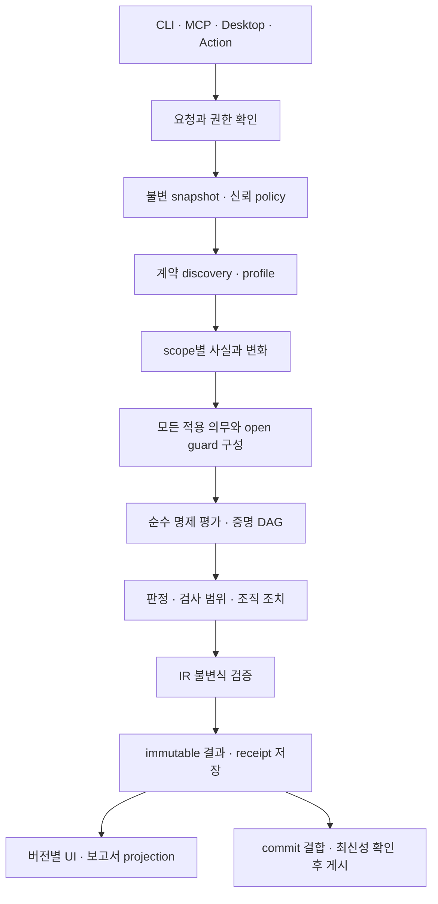

# Drift Gate 심화 구현 설계: 사실·의무·증명·실행 계약

2026-10-07 · 설계 상태: 제안 · 대상: `ver2`, `d262ec2` 위 미커밋 작업 트리

이 문서는 [전체 논리 설계](drift-gate-enterprise-logical-design-2026-10-07.md)의 후속이다. 전체 설계의 W05–W17을 구현에 착수할 수 있는 계약과 수락 조건으로 좁힌다. 기존 설계와 평가 입력을 덮어쓰지 않는다. 이번 작업은 설계 문서와 실행 가능한 참조 모델 작성이며 운영 코드 변경이 아니다.

목표는 계약 의무 누락과 근거 없는 확정 판정을 줄이는 것이다. 일반 버그 탐지, 모든 언어의 런타임 의미 증명, 실제 PR 정확도 보장은 범위 밖이다. 아래 파일명·타입·설정·JSON은 **미구현 제안**이다. 기존 CLI에 그대로 입력할 수 있는 옵션으로 읽지 않는다.

## 1. 설계 결정과 구현 순서

다음 다섯 가지를 먼저 고정한다.

1. 수집 상태, 분석 사실, 판정, 검사 범위, 조직 조치를 다른 타입으로 표현한다.
2. 자동 모드는 계약 종류 하나를 선택하지 않고 적용 가능한 의무 집합을 구성한다.
3. 알려진 위반은 미지원 영역이 함께 있어도 유지한다. 미지원 영역을 버리고 전체 검증 성공으로 승격하지 않는다.
4. 모든 의미 판정은 불변 입력과 프로필에 결합한다. 게시 최신성과 실행 완료 여부는 별도 상태다.
5. 이전 출력 호환은 명시 projection으로 유지한다. 새 모델이 만든 정보 손실을 문구로 숨기지 않는다.

| 묶음 | 작업 | 시작 조건 | 종료 조건 |
|---|---|---|---|
| S1 | W05·W06·W08 | 현재 반례·기존 결과 계약 확보 | typed facts, 의무 집합, 증명 DAG, legacy projection 대조 |
| S2 | W07·W09·W15 | S1 의미 계약 고정 | manifest, 신뢰 정책, 실행 영수증, 최신성·재시도 계약 |
| S3 | W10·W16 | S2 후보 아티팩트 고정 | 독립 평가 설계, 최종 설치본 다운로드·오프라인 대조 |
| S4 | W11–W14 | S1·S2 및 해당 기능의 평가 입력 | dependency closure·격리·typed trigger·schema 의미 확장 |
| 조건부 | W17 | 실제 조직 운영 요구 확인 | 격리·권한·보존·복구 수락 기준 충족 |

W10의 입력 검증은 이미 일부 구현됐지만 독립 정답 평가와는 다르다. 평가 입력·반례 작성은 S1부터 병행한다. S3 완료까지 모든 개발을 기다리는 순서를 뜻하지 않는다.

## 2. 현재 구현과 목표의 차이

이번에 읽은 실제 경계는 다음과 같다. 이전 테스트 숫자는 [운영 반영 보고서](../review/drift-gate-enterprise-update-2026-10-07.md)의 당시 결과이며 이번 설계 작업에서 전체 테스트를 재실행한 수치가 아니다.

| 현재 코드 | 현재 책임 | 목표 계약 | 이동 원칙 |
|---|---|---|---|
| [content_result.py](../../drift_gate/core/evaluation/content_result.py) | 문자열 판정·verification·이유, 세 값 결합 | FactOutcome와 PropositionOutcome 분리 | 호환 wrapper부터 도입 |
| [routes.py](../../drift_gate/core/evaluation/routes.py) | route 비교, 문서 요구, 자동 종류 선택 | profile discovery와 obligation planning 분리 | 의미 변경을 단순 리팩터링으로 보고하지 않음 |
| [environment.py](../../drift_gate/core/evaluation/environment.py) | 키 집합·uncertain bool | 서비스 범위가 있는 부분 사실 | legacy 새 키 의무를 별도 버전으로 유지 |
| [evaluator.py](../../drift_gate/core/evaluation/evaluator.py) | 적용성·그룹·relation·ignore | 계획된 의무 평가, waiver는 후처리 | parent/관계 source scope 계승 |
| [ChangedFile](../../drift_gate/core/models/changed_file.py) | patch와 선택 snapshot·route 필드 | SourceArtifact와 FactBundle 분리 | 실제 교체 경계만 추상화 |
| [inspection.py](../../drift_gate/adapters/inspection.py) | 공통 enrichment·core 호출·metadata | 단계 실행 application | 진입점은 유지하고 단계 계약을 추가 |
| [AnalysisSession](../../drift_gate/core/evaluation/analysis_session.py) | 실행별 bounded memo | 프로필·원문·문맥 결합 memo | 전역 캐시는 후속, 지금 도입하지 않음 |
| [result.py](../../drift_gate/core/models/result.py) | 기존 결과 schema와 집계 | canonical IR 및 legacy projection | 기존 결과 필드 즉시 제거 금지 |
| [execution.py](../../drift_gate/adapters/execution.py) | ID·digest·원자 출력 | 영수증·publication 상태 분리 | 파일 replace와 원격 CAS를 같은 보장으로 부르지 않음 |

현재 E01은 혼합 env/API를 unknown으로 보류한다. 이는 단기 안전장치다. S1의 목표는 env 의무가 적용되지 않아도 API 의무는 계속 평가하는 것이다. E02·E03의 AST 타입 전용 import와 숫자 유한성 검사를 약화하지 않는다. UTC 평가 날짜 입력도 계승한다.

## 3. 불변 입력과 범위 정체성

### 3.1 Subject와 Scope

```text
Subject
  repository_id       # URL 표시값과 분리한 검증 대상 ID
  base_oid, head_oid  # adapter가 해석한 Git 객체 ID
  comparison_mode    # merge-base | direct | captured-working-tree
  manifest_digest
  collection_mode    # immutable-git | local-capture

ContractScope
  scope_id
  service_id
  entrypoint_ids[]
  contract_family    # api-route | api-response | env-key | ...
  selectors[]
  before_artifact_ids[], after_artifact_ids[]
  dependency_boundary
  explicit_exclusions[]
```

`GET /health`만으로 route 정체성을 만들지 않는다. 서비스 A와 B의 같은 경로는 다른 사실이다. scope ID는 명시 서비스와 진입점, 계약 종류에 결합한다. 이를 추론할 수 없으면 `ambiguous_service_scope`다. 파일 경로 이동 자체가 서비스 변경인지 rename인지 adapter가 임의로 확정하지 않는다.

Route identity는 `(service_id, entrypoint_id, HTTP method, path template)`이다. 환경 키는 `(service_id, key name)`이며 값은 사실·보고서에 넣지 않는다. schema는 route identity 아래 status·media·direction·property location을 갖는다. 등록 순서, 경로 대소문자, slash 의미는 profile이 명시한다. 임의 정규화로 서로 다른 엔드포인트를 합치지 않는다.

### 3.2 수집 상태의 합 타입

```text
ArtifactState =
    Present(raw_digest, raw_size, encoding, immutable_locator)
  | Absent(version_identity, absence_witness)
  | Unavailable(reason_code, retryability)
  | Unsupported(reason_code)
  | Limited(limit_kind, observed_usage)
  | Excluded(policy_clause_id)
```

Present의 빈 bytes와 Absent는 다르다. Absent는 해당 Git tree의 조회 등 부재 증거가 필요하다. 권한 오류·timeout·원격 오류는 Unavailable이다. Excluded는 조직이 검사에서 제외했다는 뜻이며 사실이 없다는 뜻이 아니다.

경로는 원본 Git 경로 bytes와 표시용 문자열을 분리한다. 현재 UTF-8 문자열 경로만 처리하는 경계에서는 지원하지 않는 bytes를 `unsupported_path_encoding`으로 남긴다. 표시 문자열 변환 충돌을 같은 파일로 취급하지 않는다. symlink·submodule·파일 타입 변경은 독립 artifact kind로 두고 자동 따라가기 금지다.

### 3.3 로컬 수집의 실제 보장

CI에서는 OID의 blob을 읽고 manifest를 고정한다. 로컬 모드에서는 추적·미추적·미저장 버퍼 포함 여부를 request에 명시하고, 확보한 bytes를 불변 store에 넣어 manifest를 봉인한다.

로컬 사본은 확보된 bytes의 재현성을 보장한다. 여러 파일이 같은 순간에 존재했다는 보장은 일반 파일 읽기만으로 만들 수 없다. 이 모드는 `atomicity=per-artifact`를 표시한다. 전체 상태 재현이 필수인 작업에서는 커밋/OID 기반 입력을 요구한다. capture 전후 status 일치나 mtime 비교는 추가 진단이며 원자성 증명이 아니다.

## 4. W05: 타입화한 사실과 변화

### 4.1 분석 결과는 빈 집합 하나로 표현하지 않는다

```text
FactOutcome[Identity] =
    ExactFacts(scope_id, facts, witnesses, profile_ref)
  | BoundedFacts(scope_id, must, may, witnesses, open_reasons, profile_ref)
  | UnknownFacts(scope_id, retained_must, open_reasons, profile_ref)
```

- ExactFacts는 해당 scope의 정체성 집합이 완전하다는 주장이다. 정적 프로그램의 모든 런타임 의미를 이해했다는 주장이 아니다.
- BoundedFacts는 `must ⊆ 실제 facts ⊆ may`를 주장한다. `may`는 유한하고 지원 프로필이 범위를 닫았을 때만 쓴다.
- UnknownFacts의 may는 top이다. `None`을 빈 집합으로 변환하지 않는다.
- 확정 키가 일부 남더라도 바인딩이 깨져 그 키의 건전성까지 사라졌다면 retained_must를 비운다. 단순히 읽은 문자열을 확정 사실로 남기지 않는다.
- Limited/Unavailable은 artifact 상태이며 분석 결과에 reason을 전달한다. 파일 읽기 실패를 파서 미지원과 합치지 않는다.

모델 생성자는 scope/profile 불일치, `must ⊄ may`, 증거 없는 확정 사실, 중복 정체성 정책 위반을 거부한다. domain에서는 immutable dataclass·enum·tagged union으로 시작한다. Protocol은 artifact loader와 analyzer worker 등 실제 교체 경계에만 둔다.

### 4.2 변화의 하한과 상한

전후 사실 범위를 각각 `Lb ⊆ B ⊆ Ub`, `La ⊆ A ⊆ Ua`로 둔다.

```text
added.must   = La − Ub
added.may    = Ua − Lb
removed.must = Lb − Ua
removed.may  = Ub − La
```

각 변화는 동일 scope의 before/after와 profile 버전에서 계산한다. top이 포함되면 유한 set 연산으로 흉내 내지 않고 unknown upper를 유지한다. 이 규칙은 전후 해석의 상관관계를 보존하지 않는 보수적 근사다. 동일 불확실 표현이 전후에 반복되더라도 무변화로 확정하지 않는다. 상관관계를 활용하는 정밀화는 별도 증거와 프로필 변경이 필요하다.

```text
DeltaOutcome =
    ExactDelta(added, removed, basis_refs)
  | BoundedDelta(added_must, added_may, removed_must, removed_may, basis_refs)
  | UnknownDelta(retained_changes, open_reasons, basis_refs)
```

### 4.3 no-delta 인증

`NoDeltaCertificate`는 단순 결과 문자열이 아니라 다음 조건의 증거다.

1. before/after artifact 확보 또는 확인된 부재.
2. 같은 scope와 동일 profile 의미.
3. 계약 종류 discovery가 닫혔고 관련 dependency 경계가 닫힘.
4. `added.may = removed.may = ∅`, 또는 별도로 검증된 동일성 증명.
5. 순서·중복·서비스 정체성이 계약 의미에 포함된다면 그 비교도 충족.

비어 있는 must끼리 같다는 이유만으로 no-delta가 되지 않는다. discovery나 dependency가 open이면 known child에서 no-delta를 얻어도 전체 scope의 적용 대상 없음으로 승격하지 않는다.

### 4.4 이유 코드

초기 registry: `missing_source`, `source_unavailable`, `unsupported_binding`, `ambiguous_service_scope`, `open_dependency_scope`, `unsupported_numeric_range`, `resource_limit`, `snapshot_unstable`, `invalid_policy`, `stale_authorization`, `evidence_mismatch`, `profile_not_supported`.

코드는 API의 안정 값이다. reason detail은 제한된 구조 데이터로 두고 사용자 문장은 presentation에서 만든다. 원문·환경값·토큰·예외 traceback을 그대로 이유 문자열에 이어 붙이지 않는다. 같은 코드가 다른 의미로 바뀌면 버전 변경이다.

## 5. W06: 프로필 discovery와 의무 집합

### 5.1 Registry 계약

```text
ContractProfile
  id, semantic_version, implementation_digest
  families[]
  supported_languages, supported_framework_versions
  input_requirements
  scope_rules, identity_rules, duplicate_rules
  discovery_rules
  completeness_requirements
  analyzer_ref, comparison_ref
  resource_budget_class
```

초기 route, env, response-schema 프로필은 현재 지원 부분집합을 그대로 이름 붙인다. 새로운 registry를 추가했다고 Go/Java/Vite 등 지원을 늘렸다고 주장하지 않는다. response schema가 route identity를 사용해도 route 의무를 암묵적으로 대체하지 않는다. 대체하려면 문서 coverage까지 동일함을 명세하고 증명하는 profile subsumption 관계가 필요하다.

### 5.2 DiscoveryResult

```text
DiscoveryResult
  candidates[]: (scope_id, family, profile_id, activation_evidence)
  closed_domains[]
  open_domains[]: (scope_id, reason_code, retained_candidates)
  policy_exclusions[]
```

탐지 신호가 없다는 것과 탐지가 완전하다는 것은 다르다. 지원하지 않는 source 형식은 후보0개가 아니라 open domain이다. 미사용 FastAPI import는 route가 없다는 완전 분석 증거가 있으면 후보 의무를 만들지 않는다. 동적 등록, unresolved alias, 외부 router는 해당 domain을 open으로 남긴다.

### 5.3 Planner 알고리즘

```text
plan(request, policy, discovery, fact_bundles):
  resolve explicit rules and relation scopes
  for each rule scope:
    collect every activated contract family
    derive each family's delta and applicability
    bind each obligation to declared document alternatives
    retain known applicable obligations, even if siblings are unknown
    add mandatory discovery/dependency guards for open domains
    attach explicit exclusions as visible coverage records
  validate unique IDs, scope joins, policy coverage and guard presence
  return immutable ObligationPlan
```

하나의 auto group을 여러 계약으로 확장할 때 문서 배정도 계약으로 정의한다. 확장자만으로 배정하지 않는다. 첫 migration에서는 profile→문서 selector의 명시 대응을 추가한다. 대응 없는 후보는 `unmapped_contract_document`의 unknown 의무가 된다. 기존 auto-strict 설정을 새 의미로 임의 해석하지 않고 설정 schema 버전과 함께 도입한다.

### 5.4 혼합 범위의 기대 동작

| env 변화 | API 변화 | 문서 | 계획 결과 |
|---|---|---|---|
| 완전 분석·새 키 없음 | route 변화 있음 | API 이전 경로 | env N/A + API F → 전체 F |
| 새 키 있음 | route 변화 있음 | `.env.example`만 갱신 | env T + API F → 전체 F |
| 동적 getter로 U | API 불일치 확정 | API 이전 경로 | env U + API F → 전체 F, 범위 open |
| 동적 getter로 U | API 정합성 확정 | API 새 경로 | env U + API T → 전체 U |
| 둘 다 no-delta 증명 | 변화 없음 | 미변경 | 증명한 scope 안에서만 N/A |
| 미지원 언어 혼재 | 지원 API 정합 | API 새 경로 | API T + discovery guard U → 전체 U |

이 표는 새 IR의 제안이며 현재 혼합 unknown 동작을 보고하는 표가 아니다.

## 6. W08: 의무·세 값 논리·증명 DAG

### 6.1 의무의 명제

```text
Obligation
  id, rule_id, family, scope_id, profile_ref
  applicability_proposition_id
  requirement_proposition_id
  conditional_root_id
  document_binding_ids[]
  severity, enforcement_ref
```

적용 조건을 A, 요구를 R이라 두고 의무는 `¬A ∨ R`로 정의한다. A=F면 N/A다. A=U,R=T면 명제는 T여도 적용 범위는 open이다. waiver는 이 진리값을 바꾸지 않는다.

Strong Kleene에서 AND는 F가, OR는 T가 우선한다. A나 R의 unknown을 False로 처리하지 않는다. 빈 AND=T/빈 OR=F는 수학적 결합 규칙이며, 빈 policy·빈 group·의도치 않은 빈 plan을 받아들인다는 뜻이 아니다. policy validator와 discovery guard가 이를 거부하거나 보류한다.

### 6.2 판정 증명과 범위 완전성

```text
PropositionOutcome
  truth: T | F | U
  decision_proven: bool
  proof_ref: optional
  scope_coverage_ref
  reason_codes[]

ScopeCoverage
  declared_scope_ref
  analyzed_artifact_ids[]
  closed_domains[]
  open_domains[]
  excluded_domains[]
```

decision_proven은 고정된 명제가 모든 허용 해석에서 같은 T/F라는 증거를 가진다는 뜻이다. scope complete는 선언한 검사 범위의 필수 domain이 모두 닫혔다는 뜻이다. AND(F,U)는 F를 증명할 수 있지만 범위는 불완전하다. OR(T,U)도 T를 증명할 수 있지만 범위는 불완전하다.

unknown이 없다는 이유만으로 complete가 되지 않는다. 수집·discovery·dependency·analyzer의 완전성 근거가 필요하다. 명시 제외는 선언 scope에서 제외되지만 사용자에게 제외 범위도 보여 준다.

### 6.3 ProofNode

```text
ProofNode
  id, operator: atom | not | all | any | conditional
  proposition_ref
  children[]
  truth
  sufficient_witness_refs[]
  scope_coverage_ref
  assumptions[]
  reason_codes[]
```

NOT을 명시 노드로 둔다. 기존 전체 설계의 atom/all/any/conditional을 정밀화한 것이며 conditional을 `any(not(A),R)`로 검사하기 위한 선택이다.

| 노드 결과 | 충분한 판정 증거 |
|---|---|
| AND=T | 모든 자식의 T 증거 |
| AND=F | 한 개 이상의 F 증거 |
| OR=T | 한 개 이상의 T 증거 |
| OR=F | 모든 자식의 F 증거 |
| NOT=T/F | 자식의 반대 진리값 증거 |
| U | 확정 증거 없음, 알려진 자식과 open 원인 유지 |

충분한 판정 증거만으로 scope coverage를 만들지 않는다. OR의 미사용 대안이나 AND의 unknown 자식도 coverage에 남긴다. 충분한 증거가 여러 개라면 안정 ID 순서 등 결정적 규칙으로 고른다. 항상 최소 증명을 찾는 최적화는 필요하지 않다.

같은 원자는 같은 proposition ID로 공유한다. Kleene 모델에서 `U ∨ ¬U = U`이며 고전 논리의 항진식으로 임의 최적화하지 않는다. 해석 간 상관관계를 활용하는 정밀화는 별도 기능으로 취급한다.

### 6.4 문서 membership의 구간 평가

route 추가의 must/may를 `L+,U+`, 삭제를 `L−,U−`, 문서 route를 `Ld,Ud`라 둔다.

```text
R = 추가 route가 모두 문서에 있고 삭제 route는 문서에 남지 않는다.

T의 충분조건: U+ ⊆ Ld 그리고 U− ∩ Ud = ∅
F의 충분조건: L+ − Ud ≠ ∅ 또는 L− ∩ Ld ≠ ∅
그 외: U
```

유한하고 닫힌 identity universe에 대한 보수적 규칙이다. 문서 전체를 얻지 못하면 Ud를 빈 집합으로 만들지 않는다. 문서 선택·서비스 연결·완전성이 불명확하면 guard를 더한다. 현재 env 의무는 새 키의 기록이며 삭제 키 제거 의무가 아니다. route 식을 env에 기계적으로 적용하지 않고 family별 비교 명제를 고정한다.

### 6.5 결과 validator

최소한 다음을 거부한다.

- U에 decision_proven=true 또는 확정 proof가 붙음.
- 같은 ID의 fact/proposition에 모순된 내용이 있음.
- 자식·증거·profile ID 참조가 해결되지 않음.
- DAG에 순환이 있거나 깊이·노드 상한을 넘음.
- 진리값 재계산이 저장된 값과 다름.
- discovery가 open인데 필수 guard가 없음.
- 부재·부정 증거의 범위가 대상 명제보다 좁음.
- 원문 hash·byte range가 manifest와 맞지 않음.
- 현재 head가 아닌 결과가 최신 보장을 주장함.

validator 실패는 내부 오류로 종결하며 정상 pass 보고서를 만들지 않는다. 원문 byte range의 실제 hash 확인은 adapter가 수행하고, core validator는 검증된 참조와 명제 구조를 검증한다. 이 구분 없이 core에서 원문 파일을 읽지 않는다.

### 6.6 혼합 계약의 결과 예시

아래는 **제안 IR의 일부**다. 실제 CLI 출력이 아니다. 동적 env 분석은 U지만 API의 이전 문서가 알려진 위반을 입증하는 경우다. 축약했으므로 실제 저장에는 모든 child·evidence 참조가 해결되는 전체 DAG가 필요하다.

```json
{
  "schema_id": "drift-gate-ir-proposal-1",
  "subject_ref": "snapshot-1",
  "obligations": [
    {
      "id": "service-a.env",
      "family": "env-key",
      "truth": "U",
      "decision_proven": false,
      "reason_codes": ["unsupported_binding"]
    },
    {
      "id": "service-a.api",
      "family": "api-route",
      "truth": "F",
      "decision_proven": true,
      "proof_ref": "proof-api-conditional"
    }
  ],
  "root": {
    "operator": "all",
    "children": ["service-a.env", "service-a.api"],
    "truth": "F",
    "decision_proven": true,
    "sufficient_witness_refs": ["proof-api-conditional"]
  },
  "coverage": {
    "complete": false,
    "open_domains": ["service-a.env"]
  },
  "enforcement": {
    "action": "block",
    "confirmed_violation_ids": ["service-a.api"],
    "unresolved_obligation_ids": ["service-a.env"]
  }
}
```

API conditional의 F 증명은 적용성 A=T와 요구 R=F 양쪽 증거가 필요하다. 문서에 경로가 없다는 사실만으로 적용성을 증명하지 않는다. block은 예시의 조직 정책에 따른 결과이며 모든 정책에서 F가 곧 block이라는 규칙은 아니다.

## 7. 조직 조치와 기존 schema 호환

판정 truth와 조직 action을 구분한다. unknown에도 개발자용 warn을 허용할 수 있지만 그 정책상 pass/warn은 검증 완료 증명이 아니다.

```text
EnforcementOutcome
  action: allow | review | block
  confirmed_violation_ids[]
  unresolved_obligation_ids[]
  waived_obligation_ids[]
  policy_ref

ExecutionOutcome
  status: completed | rejected-input | aborted | internal-error
  partial_result_ref
  publication_state
```

부분 입력·미지원 구문을 Result 내부 unknown으로 다룰 수 있는 경우와 수집 자체가 성립하지 않은 aborted를 나눈다. completed 안에도 unknown이 존재한다. aborted를 정상 allow로 바꾸지 않는다. 조직에서 예외 허용한다면 별도 실행 예외로 표시한다.

목표 projection의 대응은 다음과 같다.

| 새 모델 | decision 표시 | verification 표시 |
|---|---|---|
| A=F 증명 | not-applicable | not-applicable |
| T/F 증명·선언 scope 닫힘 | satisfied/violated | verified |
| T/F 증명·scope open | satisfied/violated | partial |
| U | undetermined | unverified |
| waiver 존재 | waived | 기초 판정은 새 IR에 보존 |

현재 OR(T,U)의 verification을 verified로 취급하는 경로와 위의 전체 scope 표현은 의미 차이가 있다. 같은 필드의 뜻을 예고 없이 바꾸지 않는다. 첫 단계에서는 기존 의미를 유지한 legacy projection과 새 coverage 필드를 함께 내보내고 shadow 차이를 기록한다. CLI·MCP·Desktop·HTML이 따로 재판정하지 않는다.

## 8. W07·W15: manifest·digest·cache·receipt

### 8.1 Manifest protocol

manifest entry는 artifact ID, 원본 path identity, 버전, kind, state, raw digest, size, 불변 locator, 수집 출처를 가진다. 삭제 파일의 before도 보존한다. selector 대상 누락을 판단하려면 파일 내용과 별도로 대상 범위의 열거 근거를 가져야 한다.

무순서 collection만 안정 sort한다. policy group 순서, registration 순서, JSON 배열은 임의 정렬하지 않는다. 표시 경로를 원본 identity 대신 digest에 사용하지 않는다. schema·encoding 규칙·digest protocol version은 필수다.

### 8.2 Hash의 목적

```text
semantic_key = digest(
  digest_protocol,
  subject_manifest,
  policy_semantics_and_authority,
  engine_artifact,
  profile_versions_and_digests,
  parser_digests,
  evaluated_on_UTC,
  approval_envelopes,
  configured_resource_limits,
  semantic_feature_flags
)

attempt_key = (semantic_key, run_id)
```

parser package version만으로 binary 동일성을 보장하지 않는다. fallback 허용·자원 상한·filter·제외는 결과를 바꾸므로 semantic key에 넣는다. 경과 시간·UUID는 의미 hash에서 빼고 receipt에 둔다.

첫 구현은 단일 Python producer의 버전 있는 결정적 encoding과 적합성 vectors로 시작한다. 범용 canonical JSON 표준 준수를 주장하려면 별도 적합성 시험이 필요하다. 숫자·Unicode·중복 키 규약 없이 다른 언어 producer의 hash 일치를 요구하지 않는다.

### 8.3 Cache

초기에는 run-local memo만 쓴다. key는 profile ID/version/digest, artifact raw digest, scope context digest, 필요한 dependency digest다. complete source 분석과 patch heuristic은 다른 key다.

성공·미지원 구문은 같은 입력에서 memo할 수 있다. 네트워크 장애·worker timeout은 확정 unsupported로 영구 cache하지 않는다. 나중에 영구 cache를 도입하면 검증된 receipt와 완전성 조건을 대조한다. 과거 cache로 만료된 waiver를 현재 유효하게 만들지 않는다.

### 8.4 Receipt와 저장 commit

receipt는 manifest, policy/authority, engine/profile/parser, 평가 context, Result digest, attempt 종료 상태, 상한·사용량, artifact digest, 게시 대상·attempt ID를 가진다. hash만으로는 재현할 수 없으므로 원문 조회 위치와 보관 기한도 기록한다.

의미 Result 검증 뒤 immutable 저장을 수행한다. 단일 파일의 atomic replace는 여러 파일의 transaction이 아니다. manifest·result·receipt를 bundle directory에 쓰고 최종 index/commit marker를 한 번 원자적으로 공개한다. 중간 directory는 미완성으로 읽는다. crash 후 durability는 OS/filesystem의 쓰기·동기화 계약으로 별도 검증한다.

## 9. W09: 신뢰 검증기와 후보 변경

TrustedValidation과 CandidateTests를 나눈다.

| 항목 | TrustedValidation | CandidateTests |
|---|---|---|
| engine·parser | 승인된 digest | 후보 코드 검사에 필요하면 build |
| policy | protected ref 또는 승인 digest | 후보 policy도 변경 대상으로 비교 |
| source | PR head 불변 bytes | 후보 코드 |
| 실행 | 정적 분석, 명시 oracle만 | 후보 test·build |
| 권한 | 읽기 중심, 출력 위치 제한 | credentials 없이 host 권한 최소화 |
| 의미 | 고정 계약으로 후보 평가 | 후보 자체의 동작 증거 |

PR이 checker·workflow·policy를 동시에 바꿔도 후보가 약화한 checker의 pass만 merge 근거로 쓰지 않는다. 후보 engine 전용 회귀와 trusted engine의 shadow 결과를 함께 기록한다. 이전 engine이 새 기능을 이해하지 못하면 차이에 대한 리뷰 이유가 필요하다. 이전 unknown을 무조건 fail로 만들거나 자동 면제하지 않는다.

높은 권한 workflow에서 후보 코드·생성 shell·후보 action을 실행하지 않는다. action SHA 고정만으로 policy 신뢰나 후보 실행 분리가 해결되지 않는다. 고정 workflow는 외부 관리 또는 protected 권한이 필요할 수 있다. repository 안의 변경만으로 절대적 신뢰를 만들 수는 없다.

waiver envelope는 rule/scope/subject OID/policy digest/이유/UTC 유효일/승인 주체/authority 근거를 가진다. 텍스트 approved_by나 사용자 JSON의 verified=true는 승인 증거가 아니다. adapter가 허용 주체를 확인하고 core에 검증된 claim을 전달한다.

## 10. W15: 실행·취소·재시도·최신성

### 10.1 상태 기계

```text
requested → validated → captured → planned → analyzing
          → evaluated → result-validated → persisted → publish-pending → published

각 단계 → rejected-input / aborted / internal-error
publish-pending → publication-unknown / publication-stale / publication-rejected
```

의미 평가의 completed는 result-validated 시점이다. 게시 실패로 의미 결과를 삭제하지 않는다. 실행 process가 살아 있다는 이유로 completed를 만들지 않는다. cancel 이후 worker 응답은 generation/run ID로 버린다. 같은 run을 종결 상태에서 재개하지 않고 같은 semantic key의 새 attempt를 만든다.

### 10.2 게시 fencing

영구 Result는 subject OID에 결합하며 다른 head 결과로 덮어쓰지 않는다. 바뀌는 최신 pointer가 필요하다면 repository/PR generation과 compare-and-set을 사용한다.

```text
publish_latest(expected_head, expected_generation, completed_receipt):
  원자적으로 current head/generation == expectation 확인
  receipt의 subject와 authority가 expectation과 같은지 확인
  receipt completed와 result 검증 완료 확인
  latest pointer 저장
```

head A→B→A에서 OID만 확인하면 오래된 authority나 attempt가 되살아날 수 있다. generation/승인 digest도 확인한다. 실제 provider가 원자적 head 확인과 게시를 지원하지 않으면 이 보장을 구현했다고 말하지 않는다. commit에 결합한 check, 게시 전후 head 확인, stale 표시를 사용하며 남는 race를 명시한다.

이번 유한 모델은 atomic CAS와 head 변경 시 pointer 무효화를 가정한다. 현재 GitHub 게시 코드에 이 CAS가 구현됐다는 주장이 아니다.

### 10.3 결과를 모르는 쓰기

전송 timeout 뒤 같은 comment/check를 무조건 새로 만들지 않는다. idempotency key로 조회하고 존재하면 digest를 대조한다. provider가 idempotency를 제공하지 않으면 publication-unknown을 보존하며 조회·명시 재시도 경로로 넘긴다. 읽기에도 실패했다고 미전송을 확정하지 않는다.

## 11. W11: dependency closure와 서비스 비교

첫 closure는 같은 repository의 static import·router mount·model 참조에 한정한다. Python/Express 각각의 profile별 edge 인식을 쓰며 모든 언어를 일반 regex graph로 처리하지 않는다.

```text
Gbefore = base snapshot의 graph
Gafter  = head snapshot의 graph
impact seeds = changed artifacts and changed identities
affected = relevant reverse reachability in Gbefore UNION Gafter
analysis scope = affected + 등록/model 해석에 필요한 dependencies
```

삭제 edge를 Gafter에서만 찾으면 이전 consumer를 놓친다. cycle은 SCC 또는 visited로 종결한다. dynamic import·외부 dependency·복수 entrypoint·미지원 edge는 open boundary다. graph 상한은 limited로 기록하고 부분 facts를 complete로 만들지 않는다.

env의 신규 키는 service 전체 key set 변화와 consumer별 추가를 구분한다. legacy는 현재 의미를 보존한다. service 전체 신규를 주장하려면 미변경 consumer를 포함한 열거 근거가 필요하다. 파일 간 이동을 신규 의무로 오인하지 않되 다른 service에 추가되면 별개 의무로 처리한다.

## 12. W12: 전체 자원 예산과 worker

request 시 file count, 전체 raw bytes, 개별 bytes, dependency nodes/edges, AST nodes, proof nodes/depth, worker memory, wall deadline, report bytes를 고정한다. 수치는 현재 사용량과 부하 실험 뒤 결정한다. 추측 수치를 제품 SLA로 쓰지 않는다.

단계별 budget token을 소비하고 한도 초과를 resource_limit으로 반환한다. 개별 파일 상한만으로 많은 파일의 총량 초과를 막지 못한다. decoder는 할당 전 bytes 상한과 할당 중/후 구조 상한을 모두 확인한다.

native parser나 후보 oracle은 필요할 때 worker process로 격리한다. 입력은 immutable artifact bytes와 digest, 출력은 bounded schema다. 네트워크·임의 host file 읽기는 기본 차단한다. 부모가 worker 출력의 hash/profile/scope/schema를 대조한다. worker 종료와 자식 process·메모리 해제가 같은 보장이라고 말하지 않고 OS별 검증한다.

필수 시험은 timeout 직후 응답, 취소 직후 성공, 잘못된 출력, 과대 출력, crash, parser 초기화 실패, queue 포화다. 알려진 F witness가 있는 중간 결과도 partial로 보존할 수 있으나 정상 전체 completed로 만들지 않는다.

## 13. W13·W14: typed trigger와 schema 확장

### 13.1 Trigger 종류·크기·심각도

change kind, magnitude, severity를 분리한다. schema 변화가 route 변화보다 언제나 크다는 단일 순서를 부여하지 않는다.

```text
trigger:
  family: api-response
  predicate: response-shape-changed
  scope: declared-service
  on_unknown: review

enforcement:
  severity: major
```

새 설정안이며 현재 YAML 기능이 아니다. migration에서는 legacy intensity를 frozen policy corpus로 재현하고 shadow 차이를 검토한다. threshold의 U를 trigger F로 버리지 않고 conditional의 A=U로 전달한다.

### 13.2 Schema 정합성과 호환성

정합성은 구현 계약과 문서 계약의 일치, 호환성은 기존 consumer의 허용 입력/출력을 깨지 않는다는 별개 predicate다. request 제한과 response 제한은 방향이 달라질 수 있으므로 같은 subset 규칙을 양쪽에 적용하지 않는다.

primitive type·required·nullable·enum·status·media를 개별 profile로 정의한다. defaults는 값 집합과 실제 동작이 다르므로 별도다. $ref·allOf/oneOf·재귀 schema는 해결 depth·cycle·의미 규칙을 정한 뒤 지원한다. 모든 OpenAPI의 일반 포함 판정을 초기 목표로 두지 않는다.

FastAPI oracle은 실제 framework 생성 OpenAPI와 추출 결과를 비교한다. Express oracle은 실제 등록/HTTP 동작과 비교한다. source를 실행하는 oracle에는 후보 격리 규칙을 적용한다. profile 밖 사례의 정답을 U로 둘 수 있지만 대응 완료 사례 수로 계산하지 않는다.

## 14. W10: 독립 평가와 통계 계약

평가 단위는 subject × policy × scope × obligation이며 PR 단위 action 지표도 따로 낸다. case 수만으로 성능을 표현하지 않는다.

- development: 작성자가 수정에 사용할 수 있음.
- regression: frozen 반례·기능 보장. 과거 결과 유지.
- holdout: repository/source family별 분리, threshold 조정에서 격리.
- human adjudication: 제삼자가 정답과 불일치 이유를 리뷰함.

여러 AI의 같은 입력 평가는 검토 자료이며 사람 blind 정답이 아니다. 같은 generator의 이름만 바꾼 사례는 독립 사례로 세지 않는다. framework oracle은 해당 framework 계약의 근거이며 자연어 문서 의도에 대한 정답은 아니다.

confirmed violation precision/recall, 적절한 미지원 보류, verified coverage, false verified, known violation retained, PR action false block을 별도로 집계한다. U/skip/error를 분모에서 조용히 빼지 않는다. expected U에 U가 맞는 것은 실무 coverage 개선과 같은 수치가 아니다.

protocol·suite·네 기대 축·engine/profile/artifact·oracle version·실패/skip 이유를 receipt에 결합한다. 현재 suite 입력 검증이 있어도 facts 축이 운영 extractor를 재사용하는 부분은 독립성 한계로 남긴다.

## 15. W16·W17: 최종 설치본과 조직 운영

W16 증거는 후보 source → trusted 검증 → CI build → artifact digest → 다운로드한 설치본 → offline 분석 JSON을 연결한다. 로컬 frozen 모의실험으로 마지막 두 단계를 완료 처리하지 않는다.

빈 parser cache, 실제 network 차단 probe, UI 자원, bridge 호출, 선언 profile의 실제 분석, reason/verification, UI fallback 표시를 확인한다. 실행 가능과 분석 성공은 별개다. installer 서명·공증과 분석 정확성도 다른 항목이다.

OS matrix, build run ID, attempt, artifact SHA, JSON engine/profile, 실행 종료 상태를 receipt와 대조한다. 재시도 성공뿐 아니라 처음 실패 이유도 남긴다. CI artifact를 받지 못하면 해당 검증은 pending이다.

W17은 실제 조직 service를 제공할 때만 한다. tenant ID를 repository 이름으로 암묵 대체하지 않는다. cache/store/publication/access log에 authority 경계가 필요하다. scope 권한, 삭제·보관 기한, backup 복원, 감사 비밀 제거를 별도로 설계한다. 현재 로컬 app에 쓰지 않는 tenant 추상화를 추가하지 않는다.

## 16. 구현 모듈과 interface

최소 모듈 제안이다. 파일 수 증가 자체가 목표가 아니다.

```text
core/models/facts.py              # FactOutcome, DeltaOutcome, identity
core/models/proof.py              # proposition, proof node, coverage
core/contracts/profiles.py        # immutable profile definition/registry
core/contracts/planner.py         # pure discovery result -> obligation plan
core/contracts/delta.py           # sound set bounds and certificates
core/evaluation/propositions.py   # truth algebra and sufficient witnesses
core/evaluation/result_guard.py   # IR invariants
core/compat/legacy_result.py       # versioned old schema projection

adapters/snapshot.py              # Git/local immutable collection
adapters/analyzer_worker.py       # OS/native parser/process boundary
application/inspection.py         # request/lifecycle/budget coordination
application/receipts.py           # persistence and replay orchestration
adapters/publisher.py             # commit-bound checks and idempotency
```

처음에는 기존 inspection이 application 책임을 가져도 된다. 새 package 이동은 의존 확인 후 진행한다. core에서 I/O, 현재 시각, network, Qt, subprocess를 부르지 않는다.

```text
discover(snapshot_facts, registry, scope_policy) -> DiscoveryResult
plan(policy, discovery, fact_bundles) -> ObligationPlan
evaluate(plan, context) -> ProofEvaluation
enforce(proof_evaluation, verified_authority, gate_policy) -> EnforcementOutcome
validate(result, manifest, registry) -> ValidatedResult | InvalidResult
project(validated_result, target_schema) -> CLI/MCP/Desktop/report payload
```

application이 순서를 소유하고 profile은 gate action을 정하지 않는다. reporter가 의무를 만들지 않는다. authority 검증은 adapter에서 수행하며 core는 검증된 claim을 의미 조건으로 평가한다.



## 17. Migration과 rollout

1. 현재 frozen 결과·입력 digest를 보존하고 typed constructor만 도입한다.
2. 현재 analyzer를 새 facts로 변환하는 wrapper를 둔다. patch facts를 Exact로 승격하지 않는다.
3. 새 planner를 shadow 실행하여 기존 결과·새 truth·coverage·action을 따로 기록한다.
4. 혼합 반례, 신규 미지원 domain, service 혼재의 필수 guard를 확인한다.
5. explicit profile을 opt-in으로 도입하고 legacy projection 차이를 고지한다.
6. 독립 평가와 artifact 검증이 있는 후보에 한해 기본 profile 변경을 검토한다.

rollback은 이전 결과 보존과 profile version 고정으로 한다. 기존 receipt를 새 profile의 성공으로 덮어쓰지 않는다. unknown 증가는 안전성 개선일 수도 coverage 저하일 수도 있어 false verified와 verified coverage를 같이 보여 준다.

### 17.1 S1의 구체적인 변경 묶음

| 순서 | 구현 범위 | 변경 금지/호환 조건 | 합격 근거 |
|---|---|---|---|
| S1-a | facts/delta 생성자와 기존 analyzer wrapper | 기존 gate 기본값·YAML 의미 유지 | 기존 frozen 결과 대조, invalid state 거부 |
| S1-b | profile registry·discovery result | 지원하지 않는 언어를 완전 분석으로 표시 금지 | 미사용 import·동적 등록·미지원 domain 대조 |
| S1-c | obligation planner·문서 binding | 임의 profile 하나 선택 금지, unmapped 의무 유지 | 혼합 env/API 표의 모든 행, source relation 범위 대조 |
| S1-d | proof DAG·result validator | 알려진 F 유지, scope 누락 금지 | 세 값 전수표·중첩·witness sufficiency·순환/잘못된 참조 |
| S1-e | legacy projection·entrypoint 통합 | projection 자체가 pass를 새로 추론하지 않음 | CLI/MCP/Desktop/HTML 같은 fixture 의미 일치 |

새 기본값 적용 전까지 S1-b–d는 shadow 또는 명시 opt-in으로 실행한다. 변경 묶음마다 source·고정 입력·결과 receipt를 만들고, 새 결과가 기존 baseline 파일을 덮어쓰지 않게 한다.

## 18. 수락 시험 매트릭스

| ID | 대상 | 입력/반례 | 합격 조건 | 증거 |
|---|---|---|---|---|
| A01 | facts constructor | must가 may 초과 | 입력 거부, 성공 IR 없음 | unit·직렬화 |
| A02 | no-delta | 전후 must 공집합, may에 route | N/A 승격 금지 | finite oracle·회귀 |
| A03 | mixed planner | env 불변·route 변경·옛 문서 | API F 유지 | Git 전체 경로 |
| A04 | open scope | known API T·미지원 source | root U, coverage open | discovery snapshot |
| A05 | known violation | known F·unknown 자식 | F proven, coverage open | proof witness |
| A06 | OR alternative | T 문서·다른 대안 unavailable | T proven, 범위 open 유지 | projection 대조 |
| A07 | service identity | 두 service의 같은 method/path | identity 합치지 않음 | scope fixture |
| A08 | manifest absence | 읽기 권한 거부 | absent로 변환하지 않음 | adapter 장애 주입 |
| A09 | closure | 삭제 import·미변경 consumer | 전후 영향에 포함 | 두 Git snapshot |
| A10 | trusted checker | PR에서 checker/policy 약화 | 후보 pass만으로 통과 불가 | 격리 workflow |
| A11 | expiry/cache | 날짜·승인·profile 변경 | key 변경, 과거 waiver 미사용 | replay vectors |
| A12 | 취소 | cancel 뒤 worker 성공 | 종결 상태 유지 | 결정적 schedule |
| A13 | 게시 | head A→B→A, 과거 attempt | 최신 갱신 거부 또는 stale 명시 | provider 대조 |
| A14 | 쓰기 timeout | 전송 후 응답 소실 | unknown 유지, 무조건 중복 재전송 없음 | publisher 장애 주입 |
| A15 | schema 방향 | request/response 제약 변화 | 방향별 oracle 일치 | framework oracle |
| A16 | 설치본 | 빈 cache·network 차단 | 실분석과 artifact digest 일치 | 다운로드·OSmatrix |
| A17 | holdout | 새 repo·미지원·skip | 네 축과 모든 분모 보존 | 독립 정답 검토 |

유한 모델 pass로 A03–A17까지 완료 처리하지 않는다. 실제 adapter/provider/artifact가 필요한 항목에는 그 경로의 증거를 따로 만든다.

## 19. 이번 설계 모델 검증

[check_design.py](../assessment/enterprise-detailed-design-2026-10-07/check_design.py)는 운영 코드를 호출하지 않는 작은 참조 모델이다. 제안한 구간·proof witness·discovery guard·게시 generation의 모순을 검사한다.

| 검사 | 유한 범위 | 결과 |
|---|---|---|
| route 요구의 구간 건전성 | 2facts, 729 interval 상태, 4,096 구체 world | 확정 T/F 반례 0 |
| 중첩 회로 truth | 11회로, 297 세 값 할당, 704 구체 world | 반례 0 |
| 충분한 proof witness | 미사용 leaf를 임의 bool로 확장, 692 보완 | 반례 0 |
| scope guard | known T/F/U × open/closed, 6 | open에서 확정 T 없음, known F 유지 |
| 게시 상태 | 6event, 깊이6, 46,656 sequence | 가정한 atomic CAS 불변식 위반 0 |
| 기각한 설계 대안 | 4개 명시 반례 | 반례 조건 확인 |

상태 공간이 작고 구간은 상관관계를 버린다. 이 검사는 parser 건전성과 discovery 완전성을 증명하지 않는다. 게시 모델은 단일 진행 run의 참조이며 실제 DB·OS·provider 동시성이나 진행성을 증명하지 않는다. 유한 모델 합격을 전면 형식 검증이나 실제 PR 정확도로 표현하지 않는다.

기각한 대안은 전후 must가 같으면 no-delta라는 판단, open discovery를 버리고 pass, unknown 때문에 알려진 위반을 숨김, head OID만으로 ABA 방지가 가능하다는 판단이다. 정확한 가정과 반례를 결과 JSON에 보존한다.

## 20. 남는 설계 위험

| 논점 | 채택 판단 | 남는 위험 |
|---|---|---|
| auto 혼합 | obligation set·필수 guard | discovery 누락은 planner만으로 해결 못함 |
| exact facts | profile 한정의 강한 타입 | 잘못된 Exact는 타입만으로 방지 못함 |
| partial proof | 판정·coverage 분리 | action만 읽는 사용성 문제 검증 필요 |
| 전체 closure | 전후 graph·open boundary | 동적 해석에 한계, 보류 증가 가능 |
| trust | protected checker/policy·격리 | 실제 hosting 권한·운영 체계 필요 |
| digest | 버전 protocol·실제 bytes 결합 | 원문 소실·authority 위조를 hash만으로 못 막음 |
| 최신 게시 | generation fencing 또는 commit 결합·stale | provider 원자성 부족 가능 |
| 평가 | frozen 회귀·독립 holdout 분리 | reviewer 불일치·표본 선택 bias |

보장 대상과 가정을 명확히 하는 것이 목적이다. 다음 운영 구현은 S1의 facts 타입→planner→proof·projection 순서다. S1 완료로 원격 CI나 최종 설치본 검증을 완료했다고 말하지 않는다.

## 21. 재현과 자료

```sh
/private/tmp/driftgate-final-review-venv/bin/python \
  docs/assessment/enterprise-detailed-design-2026-10-07/check_design.py \
  --out /private/tmp/drift-gate-detailed-model-replay.json
```

기존 출력 파일이 있으면 덮어쓰지 않고 거부한다. 재실행 경로를 바꿔 과거 증거를 유지한다.

- [전체 논리 설계](drift-gate-enterprise-logical-design-2026-10-07.md)
- [직전 운영 반영과 당시 검증](../review/drift-gate-enterprise-update-2026-10-07.md)
- [최종 유한 모델 결과](../assessment/enterprise-detailed-design-2026-10-07/model-check-final.json)
- [참조 모델](../assessment/enterprise-detailed-design-2026-10-07/check_design.py)
- [이번 검증·내용 hash](../assessment/enterprise-detailed-design-2026-10-07/verification.json)

이번 설계 작업에서는 새 원격 CI, 실제 설치본, Windows/Linux 재검증, 제삼자 blind 평가를 수행하지 않았다. commit·push도 수행하지 않았다.
