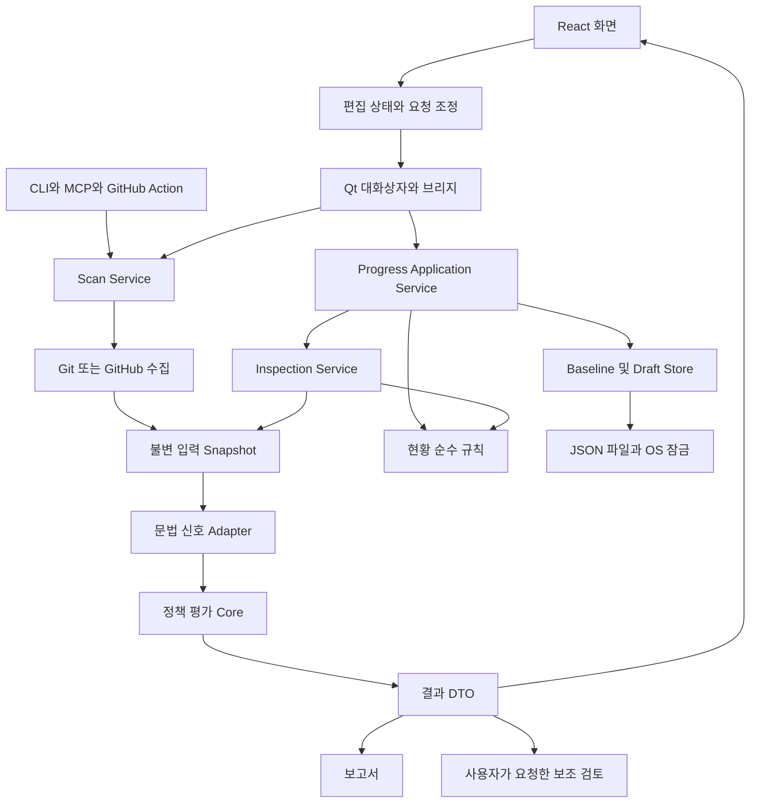
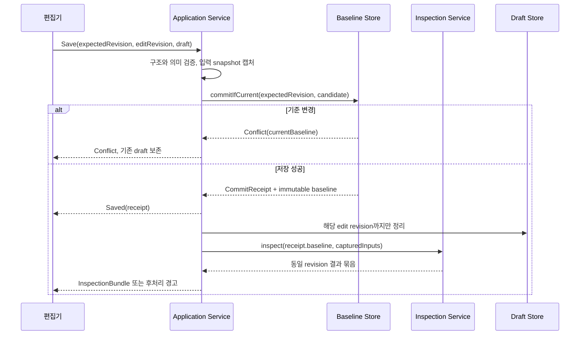

# Drift Gate 목표 아키텍처와 워크플로우

상태: **설계 제안, 미구현**. 2026-10-06, 코드 기준 `729a3cd`.
관련 근거: [코드 리뷰 R1–R6](../review/architecture-audit-2026-10-06.md).

이 설계의 목적은 무결함을 선언하는 것이 아니다. 지원 범위·불변조건·실패 의미·검증 방법을 명시해 구현과 리뷰에서 같은 기준을 쓰는 것이다. 가정 밖의 디스크 장애, OS 중단, 악의적인 동일 사용자 파일 변조까지 무조건 보장하지 않는다. 아래의 타입·모듈·상태 이름은 목표 계약이며 현재 존재하는 API로 오해하면 안 된다.

## 1. 제품의 두 결과를 구분한다

| 영역 | 질문 | 결과의 의미 | 자동으로 결론 내리지 않는 것 |
|---|---|---|---|
| 변경 정책 검사 | 이번 변경에 정책이 요구하는 문서·근거가 있는가? | 지정된 snapshot과 정책에서 pass/warn/fail | 코드가 올바름, 보안상 안전함, 실제 서비스 동작 |
| 프로젝트 현황 | 현재 목표의 항목에 유효한 코드 근거·수동 검증이 기록됐는가? | 근거 기반 상태와 재확인 필요 항목 | 실제 개발률, 테스트 통과만으로 기능 완성 |
| 선택적 LLM 검토 | 제공된 변경 자료에 추가 설명·의심 지점이 있는가? | 독립적인 의견과 한계 | core gate 변경, 파일 수정 승인 |

입력 수집의 성공 여부와 정책 판정을 분리한다. `ScanOutcome = Completed(Evaluation, Snapshot) | Failed(InputError) | Cancelled`로 표현한다. 분석 방법이 일부 heuristic인 경우에는 coverage/degradation을 Completed 안에 표시한다. 다만 요구한 분석 근거가 없는 규칙은 정책에 따라 미충족/판단 불가로 처리하며 근거가 없다는 이유로 통과시키지 않는다. `Failed`와 `Cancelled`에는 완료된 pass가 없다.

기존 JSON 소비자를 위해 최초 단계는 `execution_status`, `input_errors`, `coverage`를 추가하고 exit code를 고친다. 기존 `result` enum 변경은 별도 schema major 변경에서 한다. 호환 기간에 오류 결과를 내야 한다면 `result=fail`과 `execution_status=error`를 함께 주고, 이를 정책 위반 건수로 집계하지 않는다.

## 2. 지원 가정과 명시적 경계

- 한 기기의 로컬 저장소와 로컬 앱 데이터 폴더를 기본 지원한다. 여러 앱 프로세스는 같은 파일·잠금 규약을 사용하는 버전이어야 한다.
- 네트워크 파일시스템·클라우드 동기화 폴더의 원자 교체·잠금 의미는 별도 검증 전 보장 범위 밖이다.
- 현재 기준의 remote 공유 정책을 자동으로 바꾸지 않는다. 동일 remote의 checkout들이 공유 기준을 사용한다는 사실을 UI에 표시한다. branch별 독립 기준은 별도 사용 사례와 이관 설계를 거쳐 도입한다.
- remote URL은 그룹을 찾기 위한 식별값이지 소유권 인증 수단이 아니다. 외부 백업 신뢰를 remote 일치만으로 결정하지 않는다.
- 복구 사본 자동 삭제는 하지 않는다. 사용자의 명시적 선택, 사본 revision, 실행 여부를 모두 확인한다.
- 프로세스의 비정상 종료와 전원 장애 내구성을 구분한다. 저장 완료의 보장 수준은 §9에 따른다.
- 입력 크기·개수 제한을 둔다. 제한에 걸려도 원본과 이전 기준을 유지하며, 초과한 결과를 일부만 저장한 뒤 성공이라고 하지 않는다.
- 상태 수락·저장 규칙은 reducer/application/backend 경계에서도 검사한다. 버튼 비활성화는 보조 장치다.

## 3. 불변조건과 소유자

| ID | 불변조건 | 책임 계층 | 현재 상태·검증 |
|---|---|---|---|
| I1 | 실패한 입력 수집은 성공한 빈 diff와 구분된다 | ScanService, GitAdapter | R2 위반; 실패 주입·CLI/MCP 테스트 |
| I2 | Git 파일명은 수집부터 매칭까지 동일하다 | GitAdapter, PathCodec | R1 위반; 특수 파일명·rename 실제 Git 테스트 |
| I3 | 한 검사 결과는 하나의 입력·정책 snapshot에서 계산된다 | ScanService, InspectionService | working tree 변경 중 일관성 보강 필요 |
| I4 | 저장 요청은 기대 revision과 비교한 뒤 하나의 새 기준을 쓴다 | BaselineStore | 기존 version+lock 유지, generation/hash 보강 |
| I5 | 확정 저장 성공은 초안 삭제·이력 실패로 취소되지 않는다 | ProgressApplicationService | 기존 개선 유지, 예상 밖 오류도 receipt 기반 처리 |
| I6 | 수락한 dirty 편집에는 자동 보관 또는 수동 백업 경로가 있다 | DraftService, Editor | R3·크기 차이 보완 |
| I7 | 지원 범위의 export 결과는 같은 checkout에서 import 가능하다 | RecoveryCodec, IdentityResolver | R4·크기·검증 계약 차이 보완 |
| I8 | 다른 실행 중 사본, revision이 달라진 사본은 지우지 않는다 | RecoveryStore, LeaseRegistry | 기존 OS lease·revision 검사 유지 |
| I9 | 수락한 요청은 정확히 한 terminal outcome으로 끝난다 | TaskRunner, RequestCoordinator | R5 위반. 중복 응답 수신은 무해해야 함 |
| I10 | view의 report/tests/links/history는 동일 context를 가진다 | InspectionService, reducer | R6 부분 위반 |
| I11 | 오래된 근거·조건은 보존하되 최신 검증으로 집계하지 않는다 | ProgressRules, Merge | 기존 로직 유지, 다중 출처 fixture 보강 |
| I12 | LLM/외부 자료의 지시는 실행 권한이 아니다 | ReviewGateway, UI | 기존 격리 유지, 공급자 버전별 통제 실험 |
| I13 | 배포 자산·검증 결과·태그·소스의 SHA가 일치한다 | Release workflow | 현재 재사용 빌드 유지, manifest 검증 보강 |
| I14 | 평가 결과는 기준일·입력·엔진 버전으로 재현 가능하다 | EvaluationContext | core의 date.today 주입 필요 |

보장 범위 밖 입력도 성공으로 오인하지 않아야 한다. 예를 들어 지원하지 않는 경로 인코딩은 거부된 입력으로 기록한다.

## 4. 모듈 경계



의존성 방향은 UI/adapter → application → domain이다. domain은 Qt, subprocess, 파일, wall clock, 환경변수를 읽지 않는다. 문법 분석은 외부 라이브러리를 사용하는 adapter이며 순수 core로 억지로 이동하지 않는다.

| 목표 모듈 | 맡는 일 | 맡지 않는 일 | 기존 코드에서 이동할 부분 |
|---|---|---|---|
| `progress/domain` | scope, evidence freshness, validation, merge 규칙 | Git·JSON·Qt | progress_scope, service의 순수 검증 |
| `progress/application` | save/recover/import/export/inspect 사용 사례 조정 | widget·dialog | DesktopBridge의 work 클로저 |
| `progress/storage` | baseline CAS, draft gate·lease, 원자 쓰기 | 문서 의미·사용자 메시지 결정 | json_store, store_lock, drafts I/O |
| `inspection` | snapshot 캡처·결과 묶음 | 전역 최신 파일 암묵 재조회 | inspect_progress, test/link/history 조정 |
| `contracts` | 입력·출력 스키마와 codec | UI 상태·디스크 잠금 | Python 수동 validator, TS Zod 공통 fixture |
| `desktop/bridge` | dialog, typed command 제출, 이벤트 전달 | 저장 규칙 | web_app 축소 |
| `scan/application` | local/PR 입력 수집과 평가 연결 | 출력 렌더링 | CLI·desktop·MCP 반복 조정 |
| `release` | 같은 자산 검증·기록·승격 | 테스트 성공을 정확도 주장으로 전환 | 기존 workflows 유지·보강 |

실제 폴더 이동은 기능 수정 뒤 한다. 각 이동은 외부 인터페이스를 유지하는 작은 변경으로 분리한다. 단 한 번 호출하는 순수 함수에 interface를 만들 필요는 없다. 교체 가능한 외부 의존성(Git, clock, filesystem store, CLI gateway)과 테스트에서 실패 주입이 필요한 경계에만 port를 둔다.

## 5. 정체성·revision·snapshot 모델

### 5.1 정체성

- `ProjectId`: 앱이 사용하는 논리적 프로젝트 식별자. 기존 remote 기반 키와 매핑하지만 영구적으로 remote 문자열 자체를 신뢰 토큰처럼 사용하지 않는다.
- `CheckoutId`: canonical root에 대응하는 로컬 편집 위치. 같은 프로젝트의 worktree·clone을 구분한다.
- `BaselineScope`: 현재 shared-project 기본값을 명시한다. branch별 scope는 이후 선택 기능.
- `SessionId`: 앱 실행 UUID. `EditRevision`: 해당 checkout 편집의 단조 증가 번호.
- `BaselineRevision`: `{generation, version, content_hash}`. generation은 기준 계열을 새로 만드는 명시 동작 때 바뀐다. 파일이 사라졌다 다시 v1이 생기는 ABA를 숫자 버전만으로 동일시하지 않는다.
- `RecoveryRevision`: 파일 시간·크기뿐 아니라 저장 시 생성한 content hash 또는 불변 nonce. 현재 시간·크기 방식은 동일 사용자 악의적 변조를 방어하는 인증이 아니다.

원 작성 위치는 `origin_checkout`에 보관한다. 현재 checkout은 표시·파일 읽기에 사용한다. 같은 프로젝트의 기준을 새 위치에서 읽을 때 편집 DTO와 edit_base의 checkout 표현을 정규화한다. 외부 파일의 origin을 검증 없이 현재 프로젝트로 갈아 끼우지 않는다.

### 5.2 네 가지 계약

| 계약 | 허용 내용 | 검사 |
|---|---|---|
| `ConfirmedBaseline` | 문서 digest, 고유 항목, 유효한 근거·검증 기록 | 강한 의미 검증, 확정 상한 10문서·120항목 |
| `EditableDraft` | 미완성 경로·소수/null 줄 번호·충돌 표시 | 구조·안전한 숫자·고유 ID, 미완성은 허용 |
| `RecoveryEnvelope` | schema, identity, draft, edit_base, origin, checksum | 제한된 읽기, 구조, identity, 버전·이관 |
| `InspectionBundle` | baseline revision, input fingerprint, report, test/link 결과, history view | 동일 context, coverage, 생성 시각 |

중복 ID를 묵시적으로 Map에 덮어쓰지 않는다. `.passthrough()`로 받은 임의 필드를 통째로 다시 저장하지 않는다. 확정 의미 필드, 앱이 계산한 필드, 미래 확장 metadata의 경계를 정한다. 외부 `recovery_key`와 삭제 권한은 계속 버린다.

### 5.3 스키마 전략

첫 단계는 생성기 도입 없이 정상·비정상 JSON fixture를 Python과 Zod가 같이 검증하게 한다. `edit_base.repository` 누락, bool version, float/null evidence line, 누락·unknown field, 중복 ID, enum, 잘못된 duplicates를 포함한다. 이후 안정된 transport schema를 JSON Schema로 관리하고 타입 생성은 검증된 부분부터 도입한다. 타입 생성만으로 의미 검증·경로 보안까지 해결됐다고 보지 않는다.

`schema_version`은 transport/저장 형식, baseline version은 사용자 확정 기준 변경이다. 둘을 같은 필드로 쓰지 않는다. 지원하지 않는 새 schema는 원본 보존 후 명시적으로 거부한다.

## 6. 워크플로우 A — 정책 검사

1. 입력 모드(local worktree / staged / commit range / GitHub PR)를 명시한다. 현재 지원하는 worktree 모드를 기본으로 유지하되 untracked 포함 여부를 화면·보고서에 남긴다. 새 파일을 검사하지 않은 경우 “전체 작업 폴더 검사”라고 표현하지 않는다.
2. ref를 먼저 commit으로 해석한다. 오류면 수집 실패로 끝낸다. 임의 fallback이나 빈 목록 반환을 하지 않는다.
3. Git 이름 목록을 NUL 분리 바이트로 읽는다. rename의 두 경로, exact spelling, pathspec literal 의미를 보존한다. 옵션과 ref/path를 구분하고 외부 diff/textconv 실행 여부도 수집 정책으로 고정한다.
4. 파일별 diff와 필요한 문서 내용을 한 snapshot으로 캡처한다. 최대 바이트·파일 수를 넘어간 부분은 coverage에 남긴다. 전체 diff를 메모리에 받은 후 크기만 검사하는 구현에서 점진적으로 bounded subprocess output으로 옮긴다.
5. 로컬 worktree는 Git commit처럼 자동으로 불변이 아니다. 읽은 바이트의 hash, 시작·끝 HEAD/index 정보와 필요한 파일 검증을 사용하고 도중 변경이 감지되면 1회 재시도 후 입력 변경 오류로 끝낸다. 이 감지법도 모든 외부 동시 수정을 원자 snapshot처럼 보장하지는 않는다. 엄격한 gate에는 고정 commit snapshot을 권장한다.
6. 정책 파일은 한 번 읽은 바이트로 파싱하고 policy hash를 저장한다. 평가와 리포트에서 정책을 다시 읽어 서로 다른 내용을 보여 주지 않는다.
7. grammar adapter가 method/reason/coverage와 신호를 생성한다. frozen 번들 실패를 다운로드로 우회하지 않는다. 필요한 근거가 unavailable이면 false pass로 흘리지 않는다.
8. `run(policy, changed_files, context)`는 순수 평가를 수행한다. context에 평가일·엔진 버전·정책 hash를 포함한다. 만료일은 문서화한 UTC 날짜 기준으로 계산하고 재현 실행에서는 저장된 평가일을 사용한다.
9. Completed/Failed/Cancelled를 전달한다. CLI exit는 정책 fail=1, 실행·입력 오류=2, 정상 pass/warn=0을 목표 계약으로 고정한다. GitHub Action의 job 차단과 주석 표현도 이 의미를 보존한다.
10. 보고서와 LLM에는 같은 snapshot을 전달한다. 모델 응답은 별도 `advisory_review`이고 gate는 불변이다.

MCP 도구별 schema에는 required 인자, 기본값, enum, 크기·경로 제한을 제공한다. 무한 timeout, 무한 출력, root JSON 타입 미검증도 entrypoint 검증 대상으로 둔다. 공개 CLI/MCP/desktop 경로가 같은 ScanService의 실패 의미를 사용한다.

## 7. 워크플로우 B — 편집과 자동 보관

상태 하나에 모든 가능성을 늘어놓기보다 세 축을 분리한다.

- 편집: `clean | dirty | conflict | recovery-choice`.
- 명령: `idle | running(operation, request_id) | uncertain(command_id)`.
- 보관: `none | pending(edit_revision) | writing(edit_revision) | cached(edit_revision) | failed(edit_revision)`.

| 사건 | 전제 | 전이·부작용 | 금지 |
|---|---|---|---|
| edit | 편집 허용 상태 | edit revision 증가, dependent proof 무효화, autosave 예약 | 이전 캐시 ACK로 최신 편집 보관 완료 표시 |
| add | 현재 목표 문서 존재, count<120 | 신규 항목 추가 | 121개 수락, 자동 절단 |
| autosave tick | 최신 pending revision | 최신 DTO 1개만 제출 | 이미 확정/폐기된 generation 재전송 |
| cache ACK r | 현재 r과 일치 | cached(r) | 더 오래된 r로 현재 편집을 cached 처리 |
| cache failure | 요청 일치 | failed, retry/export 안내 | dirty 제거 |
| repository switch | 언제나 | 최신 pending flush, 세션 보존 | dirty 세션 pruning |
| process close | 아래 종료 절차 충족 | lease release | 최근 편집 미보관을 완료로 안내 |

디바운스 650ms는 현재 동작을 유지하는 초기값이다. 사용자 체감 성능 수치는 별도로 측정한다. 한 checkout에서 오래된 autosave가 아직 실행 중이면 다음 최신 상태 하나만 대기하도록 합친다. 단순히 모든 키 입력을 FIFO에 넣지 않는다.

입력 상한은 UI 버튼뿐 아니라 reducer/domain guard에 있다. 이미 초과한 legacy draft는 read-only 복구 화면에서 원본을 유지하고 필요한 항목 선택·백업을 제공한다. 마지막 직접 추가 취소는 그 항목과 연결된 편집만 제거하며 이전 편집을 유지한다.

보관 오류에는 재시도 버튼과 백업 경로가 있어야 한다. 사용자가 의미 없는 문자를 입력했다 지우는 행위를 재시도 방법으로 요구하지 않는다. 종료 경고는 frontend의 cached 표시뿐 아니라 backend가 확인한 edit revision과 대조한다.

## 8. 워크플로우 C — 저장·충돌·검사



### 저장 원칙

- baseline gate 안에서 load → expected revision 검사 → 변경 여부 판단 → replace를 한다.
- 시간이 긴 Git 수집·분석은 gate 밖에서 수행한다. 준비 단계와 commit 사이에 입력이 바뀌면 재확인하거나 저장된 입력 fingerprint에 따른 stale 상태를 명시한다.
- 동일 내용 재시도는 revision을 올리지 않는다. version이 낮아도 내용을 완전히 동일하게 저장하는 기존 멱등 동작은 유지하되 잘못된 version 타입은 먼저 거부한다.
- `CommitReceipt`에 baseline revision, command ID, 확정 시각을 포함한다. 프로세스가 commit 직후 죽어 응답을 잃어도 재시작 후 receipt 또는 동일 내용으로 결과를 확인할 수 있게 한다.
- 저장 성공은 분석 완료까지 기다리지 않아도 알 수 있어야 한다. Save라는 요청의 terminal은 Saved/Conflict/Error 하나이고 후속 Inspection은 별도 child request로 보낸다. UI는 “저장 완료·검사 중”을 표현할 수 있다.
- 저장 실패면 원래 초안·edit_base·dirty를 유지한다. 후처리 실패면 저장 성공은 유지하고 warning을 보낸다.
- draft 삭제는 owner뿐 아니라 세대/edit revision까지 비교한다. commit 이후 작성된 새 편집을 이전 save의 cleanup이 지우지 못하게 한다. 현재 단일 worker에 의존한 순서를 스키마 계약으로 강화한다.

### 충돌 합치기

현재 base/local/latest 3자 비교와 근거·조건·검증을 원자 묶음으로 다루는 규칙을 유지한다. source/provenance와 assessment를 다른 쪽에서 채택하면 최신 출처 hash와 reviewed_documents가 일치하는지 다시 평가하고 필요하면 재확인 상태로 둔다. 자동 검증 완료로 승격하지 않는다.

독립 변경은 자동 합치되 겹치는 변경은 선택을 요구한다. 항목별 선택 UI는 사용 빈도와 실제 충돌 규모를 보고 추가한다. 초기에는 현재의 전체 local/latest 선택을 유지할 수 있지만 잃는 쪽 편집을 확인할 수 있어야 한다. 상한 초과 시 silent truncation을 금지하고, 백업 확인 후 최신 기준 사용 및 명시적인 항목 정리를 제공한다.

### 검사·이력

`InspectionBundle`의 모든 부분은 동일 baseline revision과 inspection ID를 갖는다. 문서·코드 byte snapshot, 테스트 결과 파일 hash·시간, parser 상태를 context에 기록한다. 이전 report를 버리면서 tests/history만 받는 상태는 금지한다.

이력의 “저장 시점 상태”는 해당 commit receipt에서 계산한 상태다. 다른 앱이 나중에 저장한 기준을 다시 읽어 붙이지 않는다. 이력 append는 별도 잠금·멱등 snapshot ID를 사용한다. concurrent 결과의 순서는 단순 append 도착 시각이 아니라 baseline version과 해당 검사 시각을 구분한다. 이력 실패는 재시도할 수 있고 baseline을 되돌리지 않는다. 앱 전체의 최신 이력을 보여 주는 별도 화면을 만들 경우 편집 중 baseline과 다를 수 있음을 명시한다.

## 9. 워크플로우 D — 파일·잠금·종료

### 잠금 소유와 순서

| 잠금 | 키 | 수명 | 보호 대상 |
|---|---|---|---|
| baseline gate | ProjectId+scope | 짧은 commit | revision 비교·쓰기 |
| draft gate | CheckoutId | 짧은 보관·목록·삭제 | 사본 revision과 lease 판별 |
| session lease | CheckoutId+SessionId | 앱 실행 중 | 다른 실행의 사본 보호 |
| history gate | ProjectId+scope | append 동안 | 이력 중복·병합 |

baseline/history gate를 잡고 draft gate를 기다리지 않는다. 저장→각 gate 해제→후처리 순서로 간다. draft gate 내부에서 lease를 비차단 취득·검사·정리하는 기존 규약을 유지한다. lease를 생명주기 동안 보유한 프로세스도 draft gate를 오래 기다리며 종료하지 않는다. gate 파일의 inode는 유지한다. session lease 파일은 gate 아래에서만 inactive 여부를 확인한 뒤 정리한다.

모든 사용자 명령에는 제한 시간과 typed 오류가 있다. read 취소는 응답 무효화와 실행 취소를 구분한다. write가 시작됐다면 UI가 timeout을 표시해도 실패했다고 단정하지 않고 command receipt를 조회한다. 검증 중 취소와 commit 이후 취소는 의미가 다르다.

### JSON 저장 보장

현재 `write_json`은 동일 디렉터리 임시 파일과 replace를 사용한다. 이는 정상 실행/프로세스 중단에서 반쯤 쓴 JSON 노출을 줄이는 장치다. 디스크·전원 장애까지 저장 완료를 보장하려면 파일 flush/fsync 및 플랫폼별 replace·디렉터리 동기화 정책을 별도 검증해야 한다. Python의 `flush` 후 `fsync` API는 [공식 문서](https://docs.python.org/3/library/os.html#os.fsync)에 설명돼 있다.

목표 순서: 구조 검증 → 제한된 직렬화 → 같은 디렉터리 temporary → flush/fsync → replace → 지원 플랫폼의 디렉터리 내구성 처리 → receipt 반환. 교체 후 내구성 확인이 실패했다면 commit 여부를 모호하게 재시도하지 않고 `committed, durability_unconfirmed` 상태를 지원한다. OS·파일시스템별 의미가 달라 Windows/macOS/Linux 실패 주입과 검증 없이 내구성을 보장한다고 쓰지 않는다.

### 종료

1. 새 편집 명령의 수락을 멈추고, pending debounce를 최신 상태로 flush한다.
2. 마지막 accepted edit revision이 cached 또는 baseline에 commit됐는지 확인한다.
3. 실패·대기면 창을 유지하고 재시도·백업·명시적 폐기 선택을 제공한다. 종료 자체가 보관 성공을 뜻하지 않는다.
4. 작업 종료 확인은 UI thread에서 길게 block하기보다 timer/signal 기반으로 한다. 현재 3초 대기는 이후 사용자 경험 개선 대상이다.
5. worker가 더 쓰지 않는다는 사실을 확인한 뒤 lease를 비차단 해제한다. 정리 못 한 inode는 다음 gated lookup으로 넘긴다.
6. crash에서는 OS lease 해제 후 다음 실행이 사본을 제시한다. 시간만으로 미저장 사본을 지우지 않는다.

## 10. 워크플로우 E — 백업·복구·삭제

### 지원하는 왕복의 정의

`decode(encode(draft))`는 지원하는 identity·schema·용량 범위에서 편집 의미를 보존해야 한다. 내부 삭제 토큰과 UI 임시 상태는 예외다. `save`에서 유효하지 않은 소수/null evidence line도 editable draft에서는 보존한다.

2MB 초안 상한을 무작정 없애지 않는다. 확정 기준과 복구 형식의 상한은 별도로 정의하되 **UI가 받아들인 편집이 모두 복구 가능한 형식 안에 들어오도록** 한다. 초기 구현은 현 상한을 공통 capability로 노출하고, 편집 중 직렬화 예상 크기·export 가능 여부를 함께 검사한다. 이미 초과한 legacy 데이터에는 별도 bounded recovery format 또는 선택 분할 export를 먼저 마련하고 크기를 이유로 이전 편집을 버리지 않는다. 새로운 상한 숫자는 최대 120항목+edit_base 실제 최대 fixture의 메모리·지연 측정 후 결정한다.

### import

1. 사용자가 고른 파일을 bounded read, UTF-8/BOM, JSON 깊이·유한 숫자로 검사한다.
2. envelope와 draft/edit_base를 같은 계약으로 검증한다. receipt와 deletion authority 등 내부 필드는 버린다.
3. 현재 checkout과 같은 프로젝트임을 검증한다. 지원하는 내부 clone 재사용은 §5 규칙으로 처리한다. 다른 폴더/PC로의 외부 이관은 별도 명시 동작이며 코드 근거를 모두 재확인한다.
4. 새 inactive recovery copy를 원자 저장한다. 확정 기준과 원본은 유지한다.
5. “불러오기 완료”와 “복구 후 저장 완료”를 구분한다. 사본 선택→복구→검토→명시 save 순서다.
6. UI로 전달할 DTO를 사본 저장 전에 검증해 “저장 성공, UI에서 읽기 실패”를 예방한다.

### export 후 최신 기준 사용

현재 edit revision과 export receipt의 revision/hash가 같아야 한다. 파일 존재와 hash만 확인하는 조건에 edit revision을 추가한다. `useLatest`가 성공해도 보존한 파일의 형식·identity가 import 가능해야 한다. export가 그 사이 편집보다 오래됐으면 전환을 거부하고 다시 백업한다.

### 삭제

선택 snapshot의 key+revision, inactive lease, 프로젝트 귀속을 gate 안에서 전부 검사한다. 실제 unlink 도중 OS 오류로 일부만 삭제될 수 있으므로 “검증을 모두 끝냈다”와 “여러 파일 삭제가 원자적이다”를 혼동하지 않는다. 부분 성공이라면 삭제된 키·남은 키를 반환하고 목록을 새로 읽는다. v2에서 tombstone/trash가 필요하면 보존 기간보다 복원 계약을 먼저 정한다.

UI에는 사본 시각·출처 checkout·항목 수·최신 기준과의 차이·실행 여부를 보여 준다. 마지막 사본 또는 다중 삭제에는 개수와 미저장 편집 제거를 명시해 확인한다. 자동 시간/개수 정리는 도입하지 않고 경고와 명시 정리를 유지한다.

## 11. 비동기 프로토콜

목표 command envelope:

```typescript
type CommandContext = {
  protocolVersion: number;
  requestId: string;
  commandId: string;       // 재시도 시 같은 작업을 식별
  projectId: string;
  checkoutId: string;
  sessionId: string;
  editRevision?: number;
  expectedBaseline?: { generation: string; version: number; hash: string };
};
```

각 응답은 context와 operation을 되돌려 준다. terminal outcome은 `Succeeded | Rejected | Failed | Cancelled` 중 하나다. 진행 알림과 후속 검사 결과는 별도다. 일괄 작업에서 아무 결과가 없더라도 terminal 응답이 필요하다. 직렬화도 runner의 오류 경계 안에 둔다.

UI 수락 순서: protocol/schema 검증 → checkout/session 확인 → 최신 request 확인 → 필요한 baseline/edit revision 확인 → reducer 적용 → terminal이면 pending 해제. request ID 없이 받아들이는 호환 경로는 실제 wire에는 사용하지 않는다. fixture도 점진적으로 실제 metadata를 쓰게 한다.

deadline을 넘긴 요청은 무한 spinner 대신 오류/상태 조회를 제공한다. backend가 죽으면 정확히 한 응답을 전달할 수 없으므로 I9의 전달 보장은 연결이 살아 있을 때다. 연결 상실 시 write는 `uncertain`, read는 재시도 가능으로 표현하고 저장 여부를 조회한다. 분산 시스템식 exactly-once 실행을 약속하지 않는다. command receipt와 멱등 처리가 중복 실행을 무해하게 만든다.

현재 전역 1-thread queue는 먼저 유지한다. per-checkout queue/동시 read는 스냅샷·fencing·잠금 계약이 통과한 뒤에만 검토한다. 분석 속도를 높이려고 먼저 thread 수를 늘리면 기존 autosave/save 순서 가정이 깨진다.

## 12. 보안·분석 품질·배포

- 로컬 trusted UI만 bridge를 가진다는 현재 제한을 유지한다. 문서/LLM 문자열은 HTML로 직접 실행하지 않는다. 파일 열기·외부 프로세스 실행은 명시된 입력과 allowlist를 사용한다.
- 파일 경로 제한은 resolve 이후 root 포함, suffix, symlink, byte cap을 적용한다. stat 뒤 read 사이 교체 가능성은 동일 사용자 공격 경계와 정상 파일 변경 경계로 구분한다. 보장이 필요하면 열린 descriptor 대상으로 검사·읽는다.
- 파서는 source pin→다운로드 검증→패키지 조립 후 hash→실행 시 검증 흐름을 유지한다. 캐시는 신뢰 근거가 아니다. 변환·서명된 파일은 source hash와 packaged hash를 구분한다. 번들에 함께 있는 hash 파일은 배포자의 서명을 대체하지 않는다.
- 보조 모델 검토는 opt-in, payload preview, 허용된 파일·길이, 민감 파일 제거, tool 비활성화, 계정 자격 증명 분리, timeout을 유지한다. 현재 필터가 모든 코드 내 비밀을 탐지한다고 광고하지 않는다. 실제 모델 호출은 별도 비용·계정 승인 범위다.
- 테스트 이름 매칭은 보조 정보다. 통과 기록으로 완료 상태를 올리지 않는다. 결과 파일 hash와 코드 snapshot이 연결되지 않으면 heuristic freshness라고 표시한다.
- CI 동작 테스트와 정확도 평가는 다르다. 고정 합성 fixture를 유지하고 독립적인 실제 PR holdout을 별도 관리한다. 지원/경계/미지원 언어·diff 조각·오탐/미탐·판단 불가를 분리하고 threshold를 holdout 결과에 맞춰 사후 변경하지 않는다.

배포 흐름은 `commit 고정 → 테스트 → UI 빌드 → dependency/version manifest → parser pin 검증 → native 패키지 → 오프라인 검사 → installer 검사 → checksum → draft release → 실제 설치 검증·명시 게시`다. 같은 저장소의 reusable workflow가 caller와 같은 commit을 사용한다는 [GitHub 문서](https://docs.github.com/en/actions/how-tos/reuse-automations/reuse-workflows)를 기준으로 현 구조를 유지한다.

새 release manifest에는 source SHA, tag, OS/arch, dependency 목록, parser source/packaged hash, artifact hash, test run ID를 포함한다. 수동 실행에서 이미 존재하는 tag가 다른 SHA를 가리키면 업로드 전에 거부한다. release metadata에 적힌 SHA와 실제 tag가 일치하는지 별도로 검사한다. 서명·공증·OS의 최초 실행 승인은 CI의 process success와 구분한다.

## 13. 검증 행렬

아래는 **구현 후 요구할 테스트**이며 이번에 모두 실행한 목록이 아니다. 이번 실행 결과는 별도 리뷰 문서에만 기록한다.

| 경계 | 필수 반례·통제 | 기대 결과 |
|---|---|---|
| Git | 한글/탭/개행/quote/rename/literal pathspec | 원래 경로 보존, 같은 정책 판정 |
| 수집 실패 | invalid ref, unborn, shallow ref missing, timeout, 권한 오류 | 빈 성공과 구분, base 자동 대체 없음 |
| baseline CAS | 프로세스 2개 동시 저장, 같은 내용 재시도, generation 재생성 | 한쪽 conflict 또는 멱등, 덮어쓰기 없음 |
| 편집 상한 | 119/120/121, 더블 클릭, legacy 초과 | 마지막 정상 상태 유지·회복 경로 |
| 보관 | edit→ACK 역순, debounce 중 save/switch/close | 최신 revision만 cached, 저장 후 부활 없음 |
| 복구 왕복 | clone A/B, edit_base, partial input, 경계 크기 | 지원 형식은 의미 보존, 타 프로젝트 거부 |
| 외부 데이터 | 중첩 타입 오류, NaN/null, oversized, malformed UTF-8 | terminal 오류, 원본·기준 보존 |
| commit 후 장애 | history·cleanup 실패, 응답 전 crash | 저장 성공 조회 가능, 파생 작업만 재시도 |
| 스냅샷 | save/inspect/record 사이 다른 앱 write | 같은 context 또는 명시 stale |
| 삭제 | 선택 후 편집, 실행 중 사본, 빈 revision, 중간 unlink 실패 | 새 편집 보호, 부분 성공 정직하게 보고 |
| 원자 파일 | temporary/flush/replace 각 단계 실패 | 완전한 이전/새 파일, 실제 보장 수준 표시 |
| 프로토콜 | duplicate, late, wrong checkout, malformed response, disconnect | 잘못된 세션 변경 없음, 무한 busy 없음 |
| UI 접근성 | keyboard-only, 오류 포커스, modal 복귀, 삭제 안내 | 다음 행동을 키보드로 완료 |
| 패키지 | 3플랫폼×배포 전/설치 후, 빈 캐시·차단망·잘못된 hash | 실제 UI/bridge/8언어/gate, 실패 시 이유 |
| 정확도 | 기존 고정 fixture + 독립 holdout | FP/FN·coverage 공개, 수치 악화 숨기지 않음 |

성질 기반 테스트 후보: merge가 원본 인자를 변형하지 않음, 독립 변경 합치기의 보존, 동일 내용 저장 멱등, export/import 왕복, 동일 snapshot의 결정론, count 합과 total의 일치. 무작위 테스트의 seed와 최소 실패 사례를 보존한다. 원하는 답을 직접 복사한 테스트보다 실제 adapter 입력·역순 이벤트·실패 주입을 우선한다.

## 14. 변경 순서와 이전 형식 이관

1. **P1 수정:** Git 경로·오류 및 직접 추가 제한. 기존 관찰 fixture를 원하는 동작을 단언하는 회귀 테스트로 전환. 먼저 동작을 고치고 모듈 이동은 최소화한다.
2. **복구·요청 계약:** malformed 입력, terminal outcome, 내부 clone 정규화, export/import 제한 일치. schema fixture를 함께 적용한다.
3. **스냅샷:** 저장 receipt 기반 inspection을 추가하고 구 response를 adapter로 유지한다. frontend는 새 context가 있는 경우 엄격히 검사한다. 양쪽 전환이 완료된 뒤 구 응답을 제거한다.
4. **역할 분리:** 검증된 순수 규칙과 ApplicationService를 옮긴다. 각 단계에서 저장된 v1 fixture를 읽고 편집·저장하는 테스트를 유지한다.
5. **저장 형식 v2:** v1 읽기는 보존한다. 이관 전 원본을 보존하고 typed decode→의미 검증→새 key에 atomic write→readback 검증을 한다. 실패하면 v1을 변경하지 않는다. 구버전 앱과 동시 실행의 쓰기 권한은 version handshake 또는 명시 차단으로 해결한다. 구 앱이 모르는 v2 파일을 읽게 만들지 않는다.
6. **릴리스 후보:** 같은 commit에서 전체 검사와 플랫폼 증거를 묶는다. 실제 사용자 데이터 이관은 복제본으로 먼저 검사한다. 공개 버전 승격은 별도 명시 작업으로 한다.

새 형식에 쓴 뒤 구버전이 자동 덮어쓰지 못하도록 한다. rollback은 구 실행 파일만 되돌리는 것이 아니라 저장 형식 호환성을 포함한다. export 가능한 백업과 원본 v1 보존을 rollback 조건으로 둔다.

## 15. 완료 기준과 남은 결정

설계가 구현됐다고 말하려면 I1–I14의 해당 테스트, 현재 공개 계약 호환성, 저장된 과거 fixture의 복구, 세 플랫폼 패키지 검사가 동일 commit에서 통과해야 한다. 단지 디렉터리를 나누거나 타입 오류를 없앤 것으로 완료 처리하지 않는다.

구현 전에 측정·선택이 필요한 것은 새 recovery byte 상한, baseline 공유 범위를 사용자가 어떻게 이해하는지, 전원 장애 내구성 보장 수준, 문서 삭제·프로젝트 이관 UX, 실제 PR holdout의 라벨링 기준이다. 지금은 거대한 DB·분산 큐·자동 정리 기능을 추가할 근거가 없다. 위 계약을 작은 패치와 반례로 닫아 가는 것이 현재 규모에서 가장 검증하기 쉬운 경로다.
