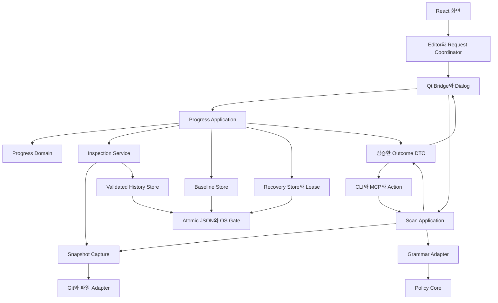
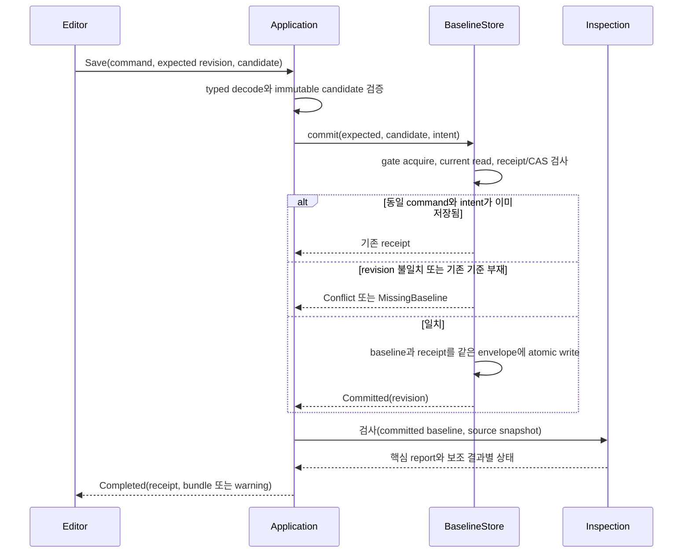

# Drift Gate 아키텍처·워크플로우 설계 v2

2026-10-06. **목표 설계이며 구현 완료 보고가 아니다.** [첫 설계](target-architecture-2026-10-06.md)를 계승하되 [두 번째 리뷰 S1–S6](../review/architecture-second-audit-2026-10-06.md)의 반례와 현재 구현 상태를 반영한다. 이전 리뷰·반례 자료는 그대로 둔다.

## 1. 목적, 가정, 보장 경계

목적은 입력 실패를 통과로 오인하지 않고, 편집과 근거를 보존하며, 사용자가 실패 뒤에도 작업을 마칠 수 있게 하는 것이다. ‘완벽함’은 문서의 선언으로 증명할 수 없다. 아래 계약·가정·실패 시험을 만족한 구현만 해당 보장을 주장한다.

지원 가정:

- 동일 기기의 로컬 파일시스템, 원자 replace와 OS 잠금 지원, 동일 규약의 호환 앱 프로세스. 네트워크 드라이브·클라우드 동기화·같은 사용자에 의한 악성 파일 교체는 별도 보장이다.
- Git 경로는 검증 가능한 UTF-8 바이트 경로다. 철자·공백을 보존하며 정체성 판단을 위해 임의의 Unicode 정규화를 하지 않는다.
- 작업 폴더는 외부에서 바뀔 수 있다. baseline 내용의 불변성과 source bytes의 불변성을 별도로 취급한다. 현재 구현의 baseline_id를 전체 소스 snapshot이라고 부르지 않는다.
- 문서·테스트·모델 문자열은 데이터다. 실행 권한이나 검증 완료를 부여하지 않는다. 모델은 보조 검토이며 gate 결과를 바꾸지 않는다.
- 고정 용량 안의 입력만 수락한다. 수락 전 제한을 검사하고, 거부·실패 때 원본과 이전 기준을 유지한다. 저장 공간 부족을 복구 가능성의 무조건 보장으로 덮지 않는다.

현재 확인된 보장과 목표를 구분한다.

| 항목 | 현재 | v2 완료 의무 |
|---|---|---|
| 정확한 Git 경로·없는 ref 거부 | R1/R2 회귀 통과 | 모든 진입점의 같은 오류 의미, bounded output |
| 일반 CAS·멱등 재시도 | 숫자 version+OS gate | generation/hash까지 검사, 기준 부재를 create와 구분 |
| 저장 성공·cleanup 실패 분리 | 구현·시험됨 | durable receipt와 후속 작업 상태까지 분리 |
| 초안 복구·backup | 120 확정/240 복구, 2MB 자동/16MB 파일 | 엄격한 공통 codec, 출처 철회·이관 계약 |
| terminal 결과 | 끝난 work의 예외·직렬화 처리 | deadline·disconnect·uncertain·늦은 쓰기 fencing |
| inspection context | baseline version/hash와 UUID | 실제 input fingerprint, history comparison anchor |
| 문서 생명주기 | 기존 binding과 보존 출처가 같은 map | S1의 rename/detach/archive 분리 |
| 정책 core | I/O 분리, 날짜 의존과 미사용 API 인자 남음 | context의 날짜 주입, unsupported call 거부 |
| 배포 | parser pin·native offline workflow 유지 | 같은 SHA의 manifest·tag·installer·검증 증거 연결 |

## 2. 책임과 의존성

- domain: scope, freshness, 항목 검증, 충돌 병합의 순수 규칙. Qt·파일·subprocess·wall clock을 읽지 않는다.
- application: 명령 순서, commit receipt, 핵심/보조 결과, 오류 종류를 결정한다. dialog를 열지 않는다.
- storage: 제한된 decode, CAS, 원자 쓰기, history sequence, gate/lease를 담당한다. 사용자 메시지와 문서 의미는 application/domain 책임이다.
- adapter: Git/파일/Qt/CLI/MCP의 외부 의미를 내부 계약으로 바꾼다. core에 I/O를 다시 넣지 않는다.
- UI: 조작 가능성, 명시적 선택, 결과 수락, 다음 행동을 보여 준다. 저장 성공 여부를 추측하지 않는다.

`DesktopBridge`의 save/inspect/recovery 클로저부터 application으로 옮긴다. `progress_service`는 codec, store, validation, capture 순으로 분리한다. 외부 함수 signature는 초기 adapter로 유지한다. 단일 호출 순수 함수마다 interface를 만들지 않는다. 실패 주입·교체가 필요한 store/Git/clock/task runner 경계에만 port를 둔다.

## 3. 정체성과 불변 데이터

| 이름 | 의미 | 쓰임 |
|---|---|---|
| ProjectId | 논리적 기준 공유 그룹. 기존 normalized remote 정책 유지 | 저장 그룹 찾기; 보안 인증 수단 아님 |
| CheckoutId | canonical root에 대응하는 로컬 작업 폴더 | 소스 조회·초안·로컬 이력 partition |
| BaselineRevision | generation, version, content_hash | 저장 기대 조건과 결과 수락 |
| EditRevision | 실행/편집기 내 단조 증가 번호 | 자동 보관 ACK, 백업 이후 변경 탐지 |
| RecoveryRevision | 사본 nonce 또는 content digest | 선택 후 갱신된 사본 삭제 방지 |
| CommandId | 하나의 쓰기 의도 ID와 intent_hash | 중복 제출·응답 분실 조회 |
| InputSnapshotId | 실제 관측 파일·정책·환경 context의 fingerprint | 같은 검사의 입력을 식별 |
| InspectionId | 실행 한 번의 UUID | 중복·역순 응답 식별; 입력 동일성의 증거 아님 |
| HistoryAnchor | checkout, generation, captured_sequence | 검사 시작 전에 관측한 이력 범위 |

숫자 version은 generation 안에서만 단조 증가한다. content_hash는 정의된 의미 필드의 canonical JSON 바이트로 계산한다. 표시 경로·작성 시각·UI 파생 필드는 제외하고 항목 순서의 의미는 명시한다. 외부에서 전달한 hash를 신뢰하지 않고 다시 계산한다.

새 기준 생성·명시적 확정 기준 복원은 generation을 새로 만든다. 기준이 없어진 기존 편집은 Save로 재생성하지 않는다. CreateBaseline의 `expected=absent`와 SaveBaseline의 `expected=revision`을 구분한다. Draft import는 확정 기준 복원이 아니므로 generation을 변경하지 않는다.

## 4. 전송·저장 계약

1. ConfirmedBaseline: 활성 문서 binding, 보관 출처, 고유 요구사항, 근거 snapshot, BaselineRevision.
2. EditableDraft: 위 내용에 미완성 입력, edit_base, EditRevision을 더한다. 유한 float/null 줄 번호는 허용하되 확정 근거의 줄 번호는 양의 정수다.
3. RecoveryEnvelope: schema, project/checkout identity, origin, draft, 사본 revision, 저장 시각. 외부 recovery_key를 삭제 권한으로 받지 않는다.
4. InspectionBundle: baseline revision, input fingerprint, inspection ID, 관측 시작/종료, history anchor, report, 보조 결과별 상태.
5. CommandReceipt: command/intent, committed revision, commit 상태, inspection/history/cleanup의 독립 상태.

Python/Zod는 같은 계약 자료를 검증한다. 추가 fixture에는 중복 ID, bool version, 잘못된 enum, missing base path, finite/nonfinite/null 수, unknown 필드, 중복 출처, 크기 경계, 손상 history row, unsupported schema를 포함한다. 구조 검증 뒤 경로·source ownership·revision·scope 의미를 별도 검증한다.

`passthrough` 값이 확정 의미 필드로 다시 저장되지 않도록 한다. 호환 확장은 명명된 metadata 영역에서만 허용한다. schema_version과 baseline version을 혼용하지 않는다. 구 저장 파일의 임의 필드를 제거하기 전에 원본을 보존하고 사용자 근거 필드인지 확인한다.

## 5. 문서 생명주기: S1의 해결

문서 종류(current/future/past/reference), 파일 존재(present/missing), 출처 역할(active binding/archived provenance)을 독립 축으로 둔다.

- 활성 binding은 현재 읽을 수 있는 문서와 hash에 연결한다.
- 보관 출처는 path, hash, line, excerpt, 원래 역할·binding ID를 보존한다. ‘현재 파일 존재’ 조건으로 저장을 막지 않는다. 전체 원문을 보관하지 않았다면 화면도 excerpt 보관이라고 명시한다.
- 현재 요구사항의 근거가 보관 출처에만 연결돼 있으면 완료 집계에 사용하지 않는다. 새 문서 연결과 재확인이 필요하다.
- 문서 철회와 기능 삭제는 별개 명령이다. 철회 시 기능·근거는 보존하며 출처를 보관 상태로 옮긴다. 기능 삭제는 사용자가 확인한 항목만 제거한다.
- 활성 문서 제한은 10개, 확정 기능은 120개다. 보관 출처 개수는 현재 항목의 source/duplicates 제한과 envelope byte cap으로 별도 제한한다. 활성 문서 수에 보관 출처를 섞어 rename마다 상한을 소진하지 않는다.
- 없는 파일을 다시 선택하라는 반복 오류 대신 ‘새 경로 연결’, ‘현재 목표에서 철회하고 출처 보관’, ‘원본 파일 복원’ 동작을 제공한다.

Rename 과정:

1. 이전 binding과 새 파일을 제안한다. Git rename 신호·내용 hash는 후보 근거이며 확정 권한이 아니다.
2. 사용자가 mapping을 확인한다. 출처의 내용·항목 대응이 달라지면 미리 보여 준다.
3. 기존 항목 ID·근거·검증 기록을 유지하고 새 출처를 연결한다. 달라진 조건은 stale/unverified로 둔다.
4. 해소되지 않은 source를 조용히 새 항목에 붙이지 않는다. 모호하면 보관 출처와 새 후보를 함께 제시한다.
5. 새 draft를 전부 검증한 뒤 저장한다. 실패·상한 초과 때 이전 draft를 그대로 둔다.

다른 checkout에서 파일이 안 보이는 것만으로 shared baseline을 자동 철회하지 않는다. 로컬 availability와 공유 문서 철회의 영향 범위를 UI에 구분한다. 프로젝트 이동도 외부 백업 경로를 무조건 현재 경로로 바꾸지 않고 명시적 이관으로 처리한다.

## 6. 편집·보관·명령 상태

편집 상태: clean / dirty / conflict / recovery-choice.
명령 상태: idle / running(command) / uncertain(command).
보관 상태: pending(revision) / writing(revision) / cached(revision) / failed(revision).

| 사건 | 전제 | 처리 | 원본 보존 |
|---|---|---|---|
| edit | busy 규약이 편집 허용 | edit revision 증가, 파생 결과 무효화, 650ms 예약 | 기존 확정 기준 유지 |
| cache ACK | session와 최신 edit revision 일치 | 해당 revision만 cached | 늦은 ACK는 최신 편집의 보관 증거 아님 |
| extract/rebase | 사본 선택·쓰기 잠금 상태가 아님 | 원본을 변형하지 않는 전체 후보 생성 | 상한 초과·모호성 때 기존 draft 유지 |
| save | expected revision과 candidate 보유 | autosave 예약 취소·writes 순서 보장 | 성공 receipt 전 dirty 해제 금지 |
| switch | 진행 명령이 있음 | 읽기 요청 무효화, 쓰기 editor/session 유지 | 다른 checkout의 응답이 현재 편집을 바꾸지 않음 |
| export | 현재 edit revision snapshot | 파일 write+readback+digest, revision에 receipt 연결 | 실패·취소는 편집 유지 |
| latest 사용 | 내보낸 현재 revision 검증 | 내 편집 폐기 의도를 확인하고 최신 기준 사용 | export 파일과 남길 사본 정책을 명시 |
| close | queue drain·보관 상태 확인 | 새 제출 중단 후 기다림, 이후 lease 해제 | timeout이면 닫기 보류 또는 uncertain 설명 |

직접 추가는 UI와 reducer/application에서 120개를 검사한다. 121–240개의 복구 초안은 import·export·정리를 허용하되 확정 저장하지 않는다. 240개를 넘는 외부 초안은 원본을 그대로 두고 거부한다.

백업 16MB와 자동 보관 2MB는 현재의 별도 계약이다. 큰 초안의 import 성공을 자동 보관 성공이라고 표시하지 않는다. 상한과 저장 상태를 구분하고, 내보낸 뒤 편집하면 백업 receipt를 무효화한다. 자동 보관 실패·디스크 부족에서 안전한 종료를 무조건 약속하지 않는다.

## 7. 확정 저장: S2와 장애 의미

commit의 선형화 지점은 잠금 안의 atomic replace다. read→receipt/expected 비교→write 전체가 같은 gate 안에 있어야 한다. 서로 다른 revision의 변경은 모두 허용하지 않는다. 동일 내용 재시도는 변경을 새로 적용하지 않고 AlreadyApplied 또는 기존 receipt로 끝낸다.

commit receipt는 baseline과 같은 원자 envelope에 들어간다. 별도 파일을 먼저/나중에 쓰고 이를 동일 transaction이라고 부르지 않는다. receipt 보관 기간 이후 CommandId 조회가 없으면 미확정이라고 답하며 현재 CAS로 안전하게 재시도한다. 영구 exactly-once를 약속하지 않는다.

commit 후 inspection/history/draft cleanup은 독립적인 후속 작업이다. 이 단계 실패가 Committed를 Failed로 바꾸지 않는다. 응답 전 종료 시 receipt 조회로 저장 여부를 확인한다. 최신 편집을 가진 다른 실행의 사본은 지우지 않는다.

## 8. 검사와 이력: S4/S5의 해결

SnapshotCapture는 baseline을 한 번 읽고 해당 snapshot의 정책·문서·필요 소스·테스트 결과 바이트와 hash를 묶는다. 후속 분석에 Path만 넘겨 다시 읽게 하지 않는다. 현재 수집 cache가 파일별 반복 읽기를 줄인다는 사실만으로 전체 원자 snapshot이라고 하지 않는다.

working tree 모드는 읽은 파일 hash, 시작/끝 HEAD/index·경로 목록을 비교한다. 변경 감지 시 한 번 재시도한 뒤 InputChanged를 반환한다. 완전한 원자성을 요구하는 gate는 고정 commit/index snapshot을 사용한다. 이 검증도 동일 바이트로 되돌리는 외부 ABA까지 탐지하는 파일시스템 transaction은 아니다.

report는 필수 결과다. tests/links/history는 각각 available / unavailable / not_requested 상태와 error code를 가진다. 보조 결과가 실패해도 report를 전달하고 해당 기능의 재시도·원본 이력 내보내기 안내를 제공한다. 보조 결과 실패를 ‘문제 없음’으로 표현하지 않는다.

HistoryStore:

1. history envelope와 row를 제한된 codec으로 검증한다. malformed root·필드·순서·숫자는 unavailable이며 원본을 유지한다.
2. checkout+generation partition별 history sequence를 gate 안에서 단조 증가시킨다.
3. 일반 inspection은 시작 시 history anchor를 캡처한다. 비교 후보는 그 anchor 이전이며 같은 checkout/generation에 속해야 한다. 미래·다른 checkout·legacy 출처 불명 row는 현재 회귀의 기준으로 쓰지 않는다.
4. save의 후속 검사 이력은 자신의 report/input ID와 record receipt를 연결한다. 저장 직후의 비교 기준이 자신의 row인지 명확히 한다. 이후 다른 앱의 row를 ‘내 마지막 저장’으로 선택하지 않는다.
5. 과거 baseline 버전의 row는 표시 가능하지만 comparison_baseline_revision을 명시한다. 단지 응답에 현재 baseline_id를 붙인 것으로 과거 계산이 정합하다고 보지 않는다.
6. 동일 시각과 clock 역행의 순서는 저장 sequence로 판단한다. wall clock은 표시와 관측 구간 설명에 사용한다.
7. 최대 50개 표시 기록은 유지하되 오래된 레거시 파일을 자동 덮어쓰기 전에 검증·이관·원본 보존을 한다.

UI는 묶음에 들어가는 report/tests/links의 baseline와 input fingerprint를 검사한다. 별도 명령으로 다른 시점에 읽은 tests/links는 독립 관측으로 표시하거나 report를 함께 새 snapshot으로 갱신한다. 같은 UUID를 재사용해 서로 다른 바이트의 결과를 한 검사처럼 꾸미지 않는다.

## 9. 정책 검사·MCP·날짜

- Scan Application이 policy bytes를 한 번 읽고 parse/hash한다. core에는 Policy 객체와 EvaluationContext를 넘긴다.
- `run(policy_path=..., policy=None)`는 UnsupportedArgument다. 지원하지 않는 옵션을 무시하고 no_policy/pass로 내려가지 않는다. 현재 공식 adapter의 객체 전달을 유지하며 API 이관 후 인자를 제거한다.
- 명시된 정책의 부재/불완전 입력과 실제 규칙 위반은 다른 결과다. CLI 정책 fail=1, 실행/입력 오류=2, 완료 pass/warn=0을 계약으로 둔다. no-policy legacy 결과를 실제 정책 검증 성공으로 표시하지 않는다.
- EvaluationContext는 UTC 평가일·엔진 버전·정책 hash를 포함한다. core는 date.today를 호출하지 않는다. 같은 context의 재현은 같은 ignore 만료 판단을 내린다.
- 수집 모드(tracked worktree/staged/fixed commit/PR)와 untracked·생략된 바이트의 coverage를 보고한다. 현재 Git diff가 untracked를 검사했다고 말하지 않는다.
- 문법 입력의 method/reason/coverage를 유지한다. heuristic fallback을 AST 성공과 동등하게 표시하지 않는다. 규칙에 필요한 입력이 unavailable이면 inconclusive/execution error를 선택하고 거짓 pass를 생성하지 않는다.

MCP는 프레임 크기·root object·jsonrpc/method/id·params/arguments 타입을 입구에서 검사한다. 미지원 batch는 명시 오류로 처리한다. 한 잘못된 요청은 서버 전체를 종료하지 않는다. schema에는 실제 도구별 required/default/enum/범위를 기록한다. unknown tool·오류·notifications·정상 응답을 분리하고 stdout에는 프로토콜만 보낸다. read loop가 무한 대용량 한 줄을 먼저 메모리에 올리지 않도록 제한된 framing을 사용한다.

## 10. 작업 종료·동시성·잠금

현재 단일 progress queue는 우선 유지한다. 분석을 빠르게 하려고 thread 수부터 늘리지 않는다. 쓰기 순서·autosave/save fencing·immutable snapshot을 검증한 후 per-checkout read 병렬화를 검토한다.

잠금 규칙:

- baseline gate와 recovery gate를 동시에 오래 잡지 않는다. baseline commit 후 해제하고 recovery cleanup을 수행한다.
- recovery probe/start/remove는 같은 checkout gate 안에서 수행한다. lifetime lease를 transaction gate로 쓰지 않는다.
- persistent gate inode는 제거하지 않는다. 미사용 lifetime lease inode의 정리만 gated probe 뒤 허용한다.
- history gate 안에서 UI/외부 프로세스를 기다리지 않는다. row 검증·sequence·원자 write만 수행한다.
- lock wait와 Git child 호출에는 deadline을 전달한다. OS 네이티브 blocking I/O를 언제나 안전하게 취소할 수 있다고 가정하지 않는다.

작업 결과는 Completed / FailedBeforeCommit / CancelledBeforeCommit / Uncertain으로 구분한다. timeout이 곧 미저장을 뜻하지 않는다. 이미 commit 가능 지점을 지난 작업은 receipt를 조회한다. 새 제출의 fencing token보다 오래된 작업은 뒤늦게 쓰지 못하도록 commit 직전에 검사한다. 안전한 취소가 불가능한 작업은 uncertain으로 유지하고 충돌 위험이 있는 명령을 막는다.

전송은 at-least-once 수신 가능성으로 설계하고 command/request ID·event sequence·terminal 수락으로 중복을 무해하게 만든다. 연결이 끊긴 동안에도 terminal 응답이 사용자에게 반드시 전달된다고 약속하지 않는다. reconnect는 receipt/state 조회를 수행한다. 구 wire 호환은 명시 adapter로만 유지하고 전환 완료 후 context 없는 production 응답을 제거한다.

## 11. 내구성·삭제·이관

atomic replace는 완전한 이전/새 파일의 가시성 보장이다. 전원 장애 뒤 성공 보존은 file fsync와 OS별 directory flush·설치 경로·파일시스템 시험이 필요하다. 확인하지 않은 OS에서 durable 완료라고 표시하지 않는다. durability 수준을 결과와 문서에 명시한다.

복구 삭제는 모든 selection의 ownership/revision/lease를 먼저 검증한다. 여러 unlink는 원자 transaction이 아니다. 중간 실패 시 removed/remaining/failed를 반환하고 목록을 새로고침한다. 성공·실패를 한 Boolean으로 표현해 부분 삭제를 숨기지 않는다. 원본을 지우는 자동 나이·개수 정리는 도입하지 않는다.

v1→v2 이관:

1. baseline gate 안에서 기존 v1을 제한된 reader와 의미 검증으로 읽는다. unsupported·손상·상한 초과이면 원본을 변경하지 않는다.
2. 원본 bytes와 hash를 별도 backup으로 보존한다. legacy draft의 edit_base를 새 revision으로 연결하는 migration mapping도 기록한다.
3. typed v2에 generation·provenance·receipt를 만들고 검증한 뒤 같은 authoritative 경로에 atomic write한다.
4. 구 앱은 schema 2를 명시적으로 거부하도록 한다. v1/v2를 동시에 authoritative로 dual write하지 않는다.
5. legacy draft의 anchor를 확실히 연결할 수 없으면 복구 편집은 보여 주되 최신 기준과 명시 rebase하기 전 저장하지 않는다. 숫자 version 일치로 generation을 추측하지 않는다.
6. rollback은 파일 포맷과 v2 이후 편집을 포함한다. v1 backup만 복원해 v2 작업이 보존됐다고 말하지 않는다. v2 draft export와 새 generation의 명시 복원을 제공한다.

이관·path 이동·기준 복원은 보통 Save와 다른 명령이다. 같은 사용자에 의한 직접 저장 파일 편집·동기화가 규약을 어긴 경우 원본 보존과 오류 진단을 제공하며 협조적 프로세스 보장을 확대하지 않는다.

## 12. 배포와 제품 정확도

배포는 깨끗한 고정 commit에서 테스트→UI build→dependency manifest→parser source pin→native build→packaged hash→빈 캐시/차단망 검사→installer 검사→artifact hash→draft release 순으로 수행한다. 검증 JSON과 파일이 같은 commit/run/OS/arch에 속하는지 manifest로 확인한다.

manual tag가 이미 존재하면 실제 resolved SHA가 build SHA와 같은지 preflight에서 검사한다. 기존 release 존재 검사만으로 tag 일치를 보장하지 않는다. source SHA, workflow run/attempt, artifact SHA, parser source/packaged hash, 설치 증거를 연결한다. Actions SHA pin과 parser pin은 유지한다. 서명·공증·최초 실행은 CI 프로세스 성공과 구분한다. 공개 게시·실제 PC 설치 검증은 별도 작업이다.

제품 정확도는 편집 안전성·CI 성공과 별개다. 고정 fixture를 변경하지 않고 지원/경계/미지원 입력을 분리한다. 독립 실제 PR holdout, FP/FN, inconclusive, coverage를 보고하며 평가 입력을 본 뒤 threshold를 맞춘 결과를 일반화 점수로 쓰지 않는다. 이번 설계는 정확도 향상의 실측 결과가 아니다.

## 13. 검증 의무와 반례

| 의무 | 필수 실패·통제 | 통과 조건 |
|---|---|---|
| 입력 정확성 | 특수 경로/rename, invalid ref, Git hang, 생략 입력 | 정확한 경로 또는 명시 오류, false pass 없음 |
| API 계약 | policy 객체, path만, 명시 부재 | unsupported path는 오류, 정상 adapter 동일 판정 |
| CAS | 두 프로세스, 기준 재생성/복원/부재, 같은 내용 재시도 | 조건부 덮어쓰기 없음, 재시도 멱등 |
| 문서 생명주기 | 삭제/rename/복귀/다른 checkout 부재/중복 출처 | 근거 보존, 명시 연결, 저장 가능한 탈출 경로 |
| 초안 | 119/120/121/240/241, float/null, byte 경계 | 수락 범위 보존, 거부 범위의 원본 유지 |
| ACK·전송 | edit와 ACK 역순, duplicate, switch, disconnect | 최신 편집에만 보관 표시, 다른 세션 변경 없음 |
| commit 장애 | write/replace/receipt 이후 종료, cleanup/history 실패 | 기존 또는 새 완전한 기준, 성공 상태 조회 가능 |
| 보조 결과 | 손상 history row/root, 결과 파일 부재, link 실패 | report 전달과 unavailable 이유 |
| 검사 일관성 | 외부 코드 수정, 동일 version 역순, 미래 row/clock 역행 | 입력 변경 오류 또는 정확한 anchor, 거짓 회귀 없음 |
| MCP | 배열/null/string/잘못된 args 뒤 정상 요청 | 요청별 오류, 서버 계속 처리 |
| 삭제 | active/revision 갱신, 두 번째 unlink 실패 | 실행 중 보호, 부분 성공 정직한 receipt |
| 이관 | legacy anchor 누락, 구 앱, schema/hash 오류, 큰 파일 | 원본 보존, 미지원 쓰기 차단, 무손실 export |
| native UX | 키보드 복구/확인/에러 포커스/종료 | 사용자가 명시 상태로 작업 완료 |
| 배포 | tag SHA 불일치, wrong hash, 3 플랫폼 설치·차단망 | 출처 일치와 실제 bridge/parser/gate 증거 |

보존 성질은 merge 인자 불변, 선택하지 않은 근거의 유지, export/import 지원 형식 왕복, count 합과 total 일치다. 동시성 성질은 동일 revision의 서로 다른 두 변경이 둘 다 무조건 성공하지 않는 것이다. 결정론 성질은 동일 입력 bytes·정책·평가 context의 core 결과가 같다는 것이다. 무작위 시험을 쓰면 seed와 최소 실패 사례를 저장한다.

이 표는 요구 사항이지 이번에 전부 실행한 시험 목록이 아니다. 현재 실행 결과는 두 번째 리뷰와 assessment 폴더에만 기록한다.

## 14. 구현 순서와 완료 판정

A. 작은 경계: S3 unsupported API + S6 MCP root/args 검증. 기존 adapter 통제와 오류 뒤 정상 요청 시험.
B. 쓰기 보호: baseline_id 기대값과 missing baseline 거부부터 적용. generation/receipt는 schema v2 단계로 분리.
C. 검사: S4 typed history와 독립 보조 결과, S5 sequence/anchor를 함께 적용. 시각 필터만 추가해 완전한 순서 보장이라고 하지 않는다.
D. 문서: binding/provenance 계약과 명시 rename/detach를 구현. 저장 포맷 이관·초안 복구·공유 checkout 영향을 함께 시험.
E. 역할 분리: 검증한 application/codec/store/capture를 작은 변경으로 옮기고 public facade를 유지.
F. 내구성·배포: OS별 실패 주입과 동일 SHA native/installer 검증으로 보장 수준을 확정.

각 단계 완료는 관련 반례의 제거, 정상 통제 유지, legacy 데이터 보존, Python/React/type/build/lint, 명령의 terminal/uncertain 의미 확인을 요구한다. 배포 완료는 같은 commit의 remote matrix와 설치 증거까지 요구한다. 디렉터리 분리·타입 검사·테스트 개수만으로 논리적 완전성을 선언하지 않는다.
