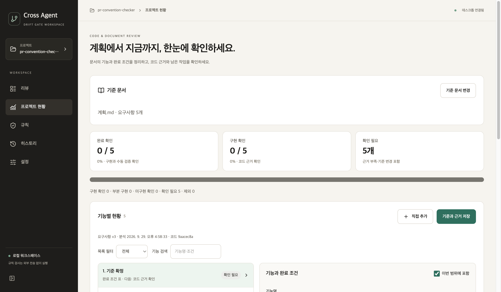

# Drift Gate 데스크톱 앱

명령어 없이 **로컬 Git 저장소를 선택하고 규칙별 판정을 읽는** 데스크톱 앱입니다. Windows와 macOS에서 같은 화면을 사용합니다. 기존 Python 정책 엔진을 그대로 호출하므로 CLI 및 GitHub Actions와 판정 기준이 같습니다.

## 사용 흐름

1. `.drift-gate.yml`이 있는 Git 저장소 폴더를 선택합니다.
2. 비교 기준을 입력합니다. `HEAD`는 마지막 커밋 이후의 작업 트리 변경, `main`은 해당 브랜치 이후의 변경을 비교합니다.
3. **검사 시작**을 누르고 통과·경고·실패와 규칙별 근거를 확인합니다. 필요한 경우 HTML 또는 JSON 보고서를 저장합니다.
4. **전송 내용 확인**에서 로그인한 Codex 또는 Claude Code를 선택하면 구독 계정으로 추가 검토를 받을 수 있습니다. 연결 방법과 실제 응답 기록은 [구독 LLM 안내](subscription-llm-review.md)에 있습니다.

검사 자체는 읽기 전용입니다. 새로 만든 파일은 Git에 추가해야 diff에 포함됩니다. 현재 화면은 **로컬 저장소 검사**를 지원합니다. GitHub PR 검사는 기존 CLI나 Action을 사용하세요.

## 실행

소스 빌드에는 Node.js 22, Python 3.10 이상과 Git이 필요합니다. 프로젝트 루트에서 다음을 실행합니다.

```bash
npm ci --prefix desktop-ui
npm run build --prefix desktop-ui
python -m pip install -e '.[desktop]'
drift-gate-desktop
```

Windows PowerShell에서도 설치 명령은 같으며, Python 실행 명령이 `py`라면 `py -m pip install -e '.[desktop]'`를 사용합니다. 정책 파일이 없다면 먼저 `drift-gate init --preset api`로 만들고 프로젝트 경로에 맞게 수정하세요.

## 독립 실행 앱 만들기

`ver2`의 데스크톱 앱 코드가 바뀌면 [Desktop app build](../.github/workflows/desktop-build.yml) 워크플로가 운영체제별 압축 파일을 CI 실행 결과의 아티팩트로 보관합니다. macOS 아티팩트는 `.app`, Windows 아티팩트는 `.exe`와 필요한 파일이 든 폴더입니다. 각 운영체제에서 별도로 빌드합니다. 실행 대상 컴퓨터에도 **Git은 설치되어 있어야** 합니다.

[현재 Cross Agent UI의 Windows·macOS 빌드와 다운로드](https://github.com/cres17/pr-convention-checker/actions/runs/36540953698)에서 두 아티팩트가 생성된 것을 확인할 수 있습니다.

로컬에서 빌드할 때는 다음 명령을 사용할 수 있습니다.

```bash
python -m pip install -e '.[desktop]' pyinstaller
npm ci --prefix desktop-ui
npm run build --prefix desktop-ui
pyinstaller --noconfirm --clean --windowed --onedir --name DriftGate --collect-all tree_sitter_language_pack --add-data "drift_gate/desktop/web:drift_gate/desktop/web" drift_gate/desktop/web_app.py
```

현재 macOS에서는 앱 번들 생성과 실행 시작, 합성 Git 저장소 검사와 diff 표시를 확인했습니다. Windows에서는 CI의 화면 테스트와 패키지 빌드·업로드를 확인했으며, 실제 사용자 PC에서의 실행은 아직 검증하지 않았습니다. 서명·공증, 설치 프로그램, 자동 업데이트도 아직 제공하지 않습니다. 서명되지 않은 개발 빌드는 OS 보안 안내가 표시될 수 있습니다.

## 화면에서 읽는 방법

상단은 **현재 판정과 비교 기준**, 가운데는 **변경 파일·평가된 규칙·차단 항목**입니다. 아래 목록의 각 규칙을 선택하면 변경 파일, 필요한 문서, 엔진 근거와 코드 diff를 볼 수 있습니다. `통과`는 **설정된 정책을 이 입력에서 충족했다**는 뜻이며 코드와 문서의 모든 의미가 같다는 보장은 아닙니다.

## 프로젝트 현황: 문서에 적힌 기능을 얼마나 만들었나

사이드바의 **프로젝트 현황**은 이번 Git 변경 검사와 별개의 화면입니다. 저장소의 Markdown을 선택해 기능 후보를 추출하고, 기능명·완료 조건과 이번 범위에 포함할지를 확인해 저장합니다. 체크 항목이 있으면 이를 후보로 사용합니다. 없으면 `완료 조건` 열이 있는 표의 행을 읽고, 그마저 없으면 문서의 2~3단계 제목을 후보로 사용합니다. 후보가 실제 요구사항인지 사용자가 확인해야 합니다.

각 기능에 코드 경로·줄과 완료 조건을 충족하는 이유를 기록하면 ‘부분 구현’ 또는 ‘구현 확인’으로 표시합니다. 코드를 실제로 검토하기 전에는 파일 후보만으로 구현 확인을 하지 않습니다. 수동 검증의 방법과 결과까지 적은 항목만 ‘완료 확인’에 포함합니다. 코드·기준 문서가 바뀌면 이전 확인을 현황 수치에서 제외합니다. 기준은 저장소 밖의 앱 데이터 폴더에 보관되며 앱을 다시 열어도 복원됩니다.

현재는 **사용자가 근거를 검토하고 확인하는 방식**입니다. 자동 의미 판정, 테스트 실행, CI 기록 연결, 이전 분석과의 비교는 [계획](../계획.md)에 남은 후속 작업입니다. 따라서 화면의 비율은 ‘확정한 기능 목록 중 근거를 기록한 항목 비율’이며 제품 전체 품질이나 출시 준비도를 뜻하지 않습니다.



위 화면은 이 저장소의 `계획.md`에서 다섯 개 개발 단계를 추출해 **근거를 아직 입력하지 않은 상태**입니다. 표시된 0/5는 개발이 전혀 진행되지 않았다는 평가가 아니라, 해당 기준에 확인된 근거가 아직 없다는 뜻입니다.


## 새 Cross Agent 화면

React + tool-ui 화면을 Qt WebEngine 안에 넣었습니다. [개편 내용과 실제 컴포넌트 사용 기록](design/tool-ui-integration-2026-09-29.md)을 확인하세요.

브라우저 개발 미리보기는 `npm run dev --prefix desktop-ui`로 실행합니다. 브라우저에서는 로컬 검사 버튼이 비활성화되며, 실제 검사는 데스크톱 앱에서 실행합니다.
