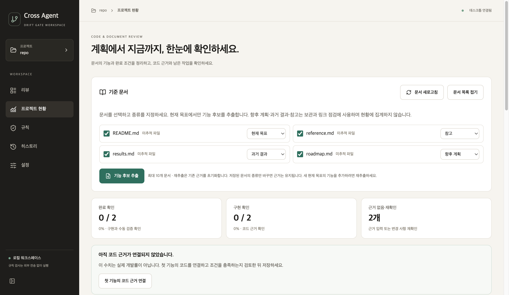

# Drift Gate 데스크톱 앱

명령어 없이 **로컬 Git 저장소를 선택하고 규칙별 판정을 읽는** 데스크톱 앱입니다. Windows와 macOS에서 같은 화면을 사용합니다. 기존 Python 정책 엔진을 그대로 호출하므로 CLI 및 GitHub Actions와 판정 기준이 같습니다.

## 사용 흐름

1. `.drift-gate.yml`이 있는 Git 저장소 폴더를 선택합니다.
2. 비교 기준을 입력합니다. `HEAD`는 마지막 커밋 이후의 작업 트리 변경, `main`은 해당 브랜치 이후의 변경을 비교합니다.
3. **검사 시작**을 누르고 통과·경고·실패와 규칙별 근거를 확인합니다. 필요한 경우 HTML 또는 JSON 보고서를 저장합니다.
4. **전송 내용 확인**에서 로그인한 Codex 또는 Claude Code를 선택하면 구독 계정으로 추가 검토를 받을 수 있습니다. 연결 방법과 실제 응답 기록은 [구독 LLM 안내](subscription-llm-review.md)에 있습니다.

검사 자체는 읽기 전용입니다. 새로 만든 파일은 Git에 추가해야 diff에 포함됩니다. 현재 화면은 **로컬 저장소 검사**를 지원합니다. GitHub PR 검사는 기존 CLI나 Action을 사용하세요.

저장소 루트에 `.drift-gate.yml`이 없으면 검사 결과 대신 **정책 파일이 아직 없습니다** 안내가 나옵니다. 저장소의 파일 구조와 프레임워크를 살펴 `drift-gate init`과 같은 규칙으로 시작용 정책(`api`, `db`, `ci`, `env`, `auth`, `fullstack`)을 추천하고, 만들어질 파일 내용을 미리 보여줍니다. 다른 정책을 고르면 미리보기가 바뀝니다. **`.drift-gate.yml` 만들고 검사**를 눌러야만 파일이 만들어지며, 이미 파일이 있으면 덮어쓰지 않습니다. 만든 파일은 Git에 추가해야 커밋됩니다.

## 실행

### 설치 파일로 사용하기

앱을 빌드하지 않고 사용하려면 [데스크톱 미리보기 배포](https://github.com/cres17/pr-convention-checker/releases/tag/desktop-v1.0.1-preview.20261001)에서 운영체제에 맞는 파일을 받습니다. 설치 파일에는 Python·Qt와 앱 화면이 포함되어 있어 Python이나 Node.js를 별도로 설치할 필요가 없습니다. **저장소 검사에는 Git**, 구독 LLM 검토에는 해당 CLI 설치·로그인이 필요합니다.

| 컴퓨터 | 다운로드 | 설치 방법 |
|---|---|---|
| Windows Intel·AMD 64비트 | [DriftGate-Windows-Setup.exe](https://github.com/cres17/pr-convention-checker/releases/download/desktop-v1.0.1-preview.20261001/DriftGate-Windows-Setup.exe) | 실행 후 설치, 시작 메뉴의 Cross Agent로 실행 |
| Apple Silicon Mac | [DriftGate-macOS-arm64.dmg](https://github.com/cres17/pr-convention-checker/releases/download/desktop-v1.0.1-preview.20261001/DriftGate-macOS-arm64.dmg) | DMG를 열고 앱을 Applications 폴더로 드래그 |
| Intel Mac | [DriftGate-macOS-intel.dmg](https://github.com/cres17/pr-convention-checker/releases/download/desktop-v1.0.1-preview.20261001/DriftGate-macOS-intel.dmg) | DMG를 열고 앱을 Applications 폴더로 드래그 |

Windows 설치는 기본적으로 현재 사용자 영역에서 진행됩니다. 설치 중 바탕 화면 바로가기를 선택할 수 있으며, 삭제는 **Windows 설정 → 앱 → Cross Agent (Drift Gate) → 제거**에서 합니다. 앱 버전을 올릴 때는 새 설치 파일을 실행해 덮어 설치합니다. Windows ARM PC의 실제 동작은 검증하지 않았습니다.

현재는 **공식 코드 서명·Apple 공증 전 미리보기**입니다. 다운로드 후 실행할 때 Windows SmartScreen 또는 macOS Gatekeeper가 경고하거나 기기의 정책에 따라 차단할 수 있습니다. 공개 배포는 실제 사용자 컴퓨터의 모든 환경에서 동작한다는 보장이 아닙니다. [검증 범위와 배포 절차](ops/desktop-ci.md)를 확인하세요.

### 소스에서 실행하기

소스 빌드에는 Node.js 22, Python 3.10 이상과 Git이 필요합니다. 프로젝트 루트에서 다음을 실행합니다.

```bash
npm ci --prefix desktop-ui
npm run build --prefix desktop-ui
python -m pip install -e '.[desktop]'
drift-gate-desktop
```

Windows PowerShell에서도 설치 명령은 같으며, Python 실행 명령이 `py`라면 `py -m pip install -e '.[desktop]'`를 사용합니다. 정책 파일이 없다면 먼저 `drift-gate init --preset api`로 만들고 프로젝트 경로에 맞게 수정하세요.

## 독립 실행 앱 만들기

`ver2`의 데스크톱 앱 코드가 바뀌면 [Desktop app build](../.github/workflows/desktop-build.yml) 워크플로가 운영체제별 파일을 CI 실행 결과의 아티팩트로 보관합니다. macOS는 Apple Silicon·Intel용 DMG를 각각 생성하고, Windows는 설치 EXE와 포터블 ZIP을 생성합니다. 각 운영체제에서 별도로 빌드합니다. 실행 대상 컴퓨터에도 **Git은 설치되어 있어야** 합니다.

[현재 Cross Agent UI의 Windows·macOS 빌드와 다운로드](https://github.com/cres17/pr-convention-checker/actions/runs/36540953698)에서 두 아티팩트가 생성된 것을 확인할 수 있습니다.

로컬에서 빌드할 때는 다음 명령을 사용할 수 있습니다.

```bash
python -m pip install -e '.[desktop]' pyinstaller
npm ci --prefix desktop-ui
npm run build --prefix desktop-ui
pyinstaller --noconfirm --clean --windowed --onedir --name DriftGate --collect-all tree_sitter_language_pack --add-data "drift_gate/desktop/web:drift_gate/desktop/web" drift_gate/desktop/web_app.py
```

현재 macOS에서는 앱 번들 생성과 실행 시작, 합성 Git 저장소 검사와 diff 표시를 확인했습니다. [설치 파일 빌드 기록](https://github.com/cres17/pr-convention-checker/actions/runs/36558685569)에서는 macOS DMG 생성·마운트와 Windows 설치 EXE 생성·설치·실행 시작·제거 단계가 통과했습니다. Windows의 실행 확인은 CI에서 화면 없이 12초 동안 프로세스가 유지되는지 보는 검사이며, 실제 사용자 PC에서의 전체 기능 검증은 아직 하지 않았습니다. 공식 코드 서명·Apple 공증과 자동 업데이트는 아직 제공하지 않습니다.

## 보고서 파일 이름

HTML·JSON 저장 창의 기본 파일 이름은 선택한 저장소에 따라 달라집니다. 기본 형식은 `{project}_{branch}_{version}_{kind}_{timestamp}`입니다.

```text
pr-convention-checker_ver2_v1.0.0_drift-report_20260929-173012.html
```

- `project`: 저장소 폴더 이름
- `branch`: 현재 브랜치. 분리된 HEAD에서는 생략
- `version`: 현재 커밋에 정확히 붙은 태그. 없으면 `package.json` 또는 `pyproject.toml`의 버전(`v` 접두사 추가). 둘 다 없으면 생략
- `kind`: 보고서 종류(현재 `drift-report`)
- `timestamp`: 저장 시각(`YYYYMMDD-HHMMSS`). 같은 날 여러 번 저장해도 덮어쓰지 않음

값이 없는 항목은 구분자와 함께 빠지고, 파일 이름에 쓸 수 없는 문자는 `-`로 바뀝니다. 저장소별로 형식을 바꾸려면 `.drift-gate.yml`에 다음을 추가합니다. 사용할 수 있는 자리표시자는 `project`, `branch`, `version`, `commit`, `kind`, `date`, `timestamp`이며, 그 밖의 값이 있으면 기본 형식을 사용합니다.

```yaml
report:
  filename: "{project}-{version}-{kind}-{date}"
```

## 화면에서 읽는 방법

상단은 **현재 판정과 비교 기준**, 가운데는 **변경 파일·평가된 규칙·차단 항목**입니다. 아래 목록의 각 규칙을 선택하면 변경 파일, 필요한 문서, 엔진 근거와 코드 diff를 볼 수 있습니다. `통과`는 **설정된 정책을 이 입력에서 충족했다**는 뜻이며 코드와 문서의 모든 의미가 같다는 보장은 아닙니다.

규칙을 선택하면 엔진이 이미 계산한 수정 안내가 함께 표시됩니다. 표시되는 항목은 바뀐 계약 요약, 문제 이유, 고치는 방법(체크리스트), 문서 초안이며 값이 없는 항목은 숨깁니다. 필요한 문서가 구체적인 파일이면 `파일 열기`로 기본 편집기를 열 수 있습니다. 앱에서는 저장소 안의 `.md`, `.rst`, `.txt`, `.yml`, `.yaml`, `.json`, `.toml` 파일만 열고, glob 패턴(`docs/api/**`)은 열지 않습니다. 파일을 수정한 뒤 `문서 수정 후 다시 검사`로 전체 검사를 다시 실행합니다.

## 프로젝트 현황: 문서에 적힌 기능을 얼마나 만들었나

사이드바의 **프로젝트 현황**은 이번 Git 변경 검사와 별개의 화면입니다. 저장소의 Markdown을 선택해 기능 후보를 추출하고, 기능명·완료 조건과 이번 범위에 포함할지를 확인해 저장합니다. 체크 항목이 있으면 이를 후보로 사용합니다. 없으면 `완료 조건` 열이 있는 표의 행을 읽고, 그마저 없으면 문서의 2~3단계 제목을 후보로 사용합니다. 후보가 실제 요구사항인지 사용자가 확인해야 합니다.

문서별로 **현재 목표·향후 계획·과거 결과·참고**를 선택합니다. 종류를 파일 이름으로 추측하지 않으며 처음 선택한 문서는 현재 목표로 시작합니다. 현재 목표에서만 기능 후보를 추출하고 집계합니다. 나머지 문서는 문맥과 링크 점검 대상으로 보관합니다. 문서 종류 정보가 없는 이전 기준은 모두 현재 목표로 읽습니다.

저장된 문서의 종류만 변경한 뒤 **기준과 근거 저장**을 누르면 기존 기능과 코드 근거를 보존합니다. 현재 목표를 향후 계획 등으로 옮긴 항목은 **제외** 필터에서 확인할 수 있고, 다시 현재 목표로 바꾸면 근거가 유효한 경우 집계에 돌아옵니다. 같은 기능이 여러 문서에 있으면 출처 중 하나라도 현재 목표인 동안 집계합니다. 같은 내용을 다시 저장하면 기준 버전은 올라가지 않습니다. 새 문서를 추가하거나 이전에 추출하지 않은 목표를 읽으려면 **기능 후보 추출**을 다시 실행해야 합니다.

재추출은 항목 ID 기준으로 기존 초안과 합칩니다. 기존 기능명·완료 조건·범위 선택·구현 상태·코드 근거·검증 기록·관련 테스트 이름을 유지하고, 새 ID의 후보만 추가합니다. 저장 전 편집과 직접 추가한 기능도 보존하며, 추출에서 다시 발견되지 않은 기존 항목을 자동 삭제하지 않습니다. 선택 해제한 기존 문서는 참고로 보관해 해당 항목을 집계에서 제외합니다. 합친 결과가 문서 10개 또는 기능 120개를 넘으면 기존 초안을 유지하고 오류를 표시합니다.

문서가 변경되면 기록을 보존하되 해당 항목을 **재확인 필요**로 처리합니다. **변경된 문서와 완료 조건 확인**을 누르면 새 문서 기준을 적용하며 수동 검증 상태는 미검증으로 돌아갑니다. 출처의 줄·제목이 바뀌면 ID도 달라질 수 있어 새 후보와 기존 항목을 직접 비교해야 합니다. 삭제된 문서 출처를 임의로 새 위치에 연결하지 않습니다. 코드가 변경된 기존 근거도 단순 저장으로 갱신하지 않으며, 코드를 다시 검토한 뒤 근거를 편집해 저장해야 합니다.

현황의 **근거 없음**은 아직 판단 근거가 없다는 뜻이며 미구현을 단정하지 않습니다. 저장한 기준이나 코드가 바뀌면 **재확인 필요**, 리뷰 규칙의 `warn`은 **주의**로 구분합니다. 모두 근거가 비어 있는 경우 회색 막대 대신 **첫 기능의 코드 근거 연결**을 표시하고 첫 항목의 입력칸으로 이동합니다. 모두 재확인이 필요한 경우에는 **재확인할 기능 보기**를 표시합니다. 집계 대상이 없으면 ‘대상 없음’과 기준 설정 안내를 보여줍니다.

요약 카드는 목록 필터입니다. **완료 확인**은 구현 확인과 수동 검증을 모두 갖춘 항목, **구현 확인**은 코드 근거가 확인된 항목을 모읍니다. **근거 없음**은 아직 확인된 근거가 없는 항목, **재확인 필요**는 문서나 코드가 바뀌어 이전 확인을 다시 해야 하는 항목입니다. 두 상태는 각각 별도 카드와 목록 필터로 표시하며 현재 목표의 항목만 셉니다. 상태 막대와 범례도 두 상태를 나누어 안내합니다.

카드 선택은 검색어를 지워 해당 수치와 목록을 맞추고, 선택한 카드는 테두리로 표시합니다. 선택된 카드를 다시 누르면 필터가 풀리고 현재 목표 전체 목록으로 돌아갑니다. 0개 카드도 같은 방식으로 해제할 수 있습니다. 키보드로 이동하고 Enter·Space로 선택·해제할 수 있습니다. 두 상태가 함께 있으면 다음 행동 안내에서 근거 입력 대상과 재확인 대상을 각각 볼 수 있습니다. 큰 데스크톱 창에서는 카드 네 개를 한 줄에, 좁은 창에서는 두 줄에 표시합니다.

**제외** 필터에서 보는 항목은 다음 할 일을 “현재 목표 집계에서 제외 (기존 근거 유지)”로 안내합니다. 문서 범위 밖이거나 사용자가 포함을 해제한 항목에는 테스트 이름 힌트와 결과 연결을 적용하지 않습니다. 관련 테스트 이름과 기존 근거는 지우지 않으며, 같은 기능의 출처 중 하나라도 현재 목표이면 테스트 연결을 유지합니다. 문서 종류를 편집해 현재 목표 범위 밖으로 옮긴 항목은 저장 전에도 기존 테스트 연결 표시를 숨깁니다.



*현재 목표 2개와 향후 계획·과거 결과·참고 문서를 둔 임시 저장소로 캡처했습니다. 실제 제품 완성도 측정 결과가 아닙니다. 이 변경은 `ver2` 후속 소스에 있으며 `desktop-v1.0.1-preview.20261001` 설치 파일에는 포함되지 않습니다.*

각 기능에 코드 경로·줄과 완료 조건을 충족하는 이유를 기록하면 ‘부분 구현’ 또는 ‘구현 확인’으로 표시합니다. 코드를 실제로 검토하기 전에는 파일 후보만으로 구현 확인을 하지 않습니다. 수동 검증의 방법과 결과까지 적은 항목만 ‘완료 확인’에 포함합니다. 근거 코드·현재 목표 문서가 바뀌면 이전 확인을 현황 수치에서 제외합니다. 향후 계획·과거 결과·참고 문서의 변경은 따로 알리고 현재 목표 수치는 유지합니다. 기준은 저장소 밖의 앱 데이터 폴더에 보관되며 앱을 다시 열어도 복원됩니다.

기능 후보를 추출할 때 코드 블록(```` ``` ````, `~~~`) 안의 체크 항목·제목·표는 예시로 보고 건너뜁니다. 여러 문서에 같은 이름의 항목이 있으면 하나로 합치되, 다른 문서의 위치를 목록과 상세에 “같은 항목”으로 남깁니다. 기준을 저장할 때 잘못된 입력이 있으면 모든 항목을 검사해, 오류가 있는 항목마다 경고 표시와 해당 입력칸의 설명을 보여주고 **첫 항목으로 이동**으로 바로 갈 수 있습니다.

저장한 기준은 앱 데이터 폴더에 저장되며, 저장소의 `origin`(없으면 첫 번째) 원격 URL로 찾습니다. https·ssh·`git@host:path` 형식과 `.git` 접미사, 인증 정보는 같은 저장소로 취급하므로 폴더를 옮기거나 다시 클론해도 기준이 유지됩니다. 같은 원격을 여러 폴더에 클론했다면 그 폴더들이 하나의 기준을 공유하고, 마지막 저장이 적용됩니다. 원격이 없거나 로컬 경로·`file://` 원격이면 이전처럼 폴더 경로로 찾습니다. 원격 키 도입 전에 저장한 기준은 그대로 열리고, 다음 저장 때 새 키로 다시 저장됩니다(이전 파일은 지우지 않습니다). 저장 파일에는 인증 정보를 뺀 `host/owner/repo` 형태의 원격 주소가 함께 기록됩니다.

편집한 현황은 확정된 기준과 별도로 이 기기의 앱 데이터 폴더에 **복구용 초안**으로 자동 보관합니다. 재시작 후 **초안 복구** 또는 **보관된 초안 삭제**를 선택할 수 있습니다. 복구는 미확정 편집 상태를 되살리며, **기준과 근거 저장**이 성공하면 초안을 제거합니다. 자동 보관 상태·실패는 화면에 표시합니다. 다른 작업 폴더의 초안은 서로 분리하며, 보관이 끝나기 전 강제 종료한 마지막 입력까지 복구한다고 보장하지 않습니다.

문서에서 `[x]`로 표시한 항목은 그 표시를 구현 근거로 쓰지 않습니다. 현재 코드 근거가 없거나 근거 파일이 바뀐 경우 “문서는 완료 표시, 근거 없음”으로 따로 알려 주고, 목록 필터 **문서와 불일치**로 모아 볼 수 있습니다.

**문서 링크 점검**은 기준 문서 안의 상대 링크·이미지와 백틱 경로(`폴더/파일.확장자`)가 실제로 있는지 확인합니다. 없는 링크 대상과 저장소 밖을 가리키는 링크는 확실한 문제로, 백틱 경로는 다른 프로젝트의 예시일 수 있어 “확인이 필요한 파일 경로”로 나누어 접어서 보여줍니다. 코드 블록 안, 웹 주소, `#제목` 앵커는 검사하지 않습니다. 대소문자만 다른 경로는 Linux·GitHub에서 열리지 않으므로 함께 알려 줍니다.

**Markdown 저장**·**JSON 저장**은 현재 현황(요약, 기능별 상태, 근거 위치, 불일치)을 파일로 내보냅니다. 기본 파일 이름은 보고서 파일 이름 규칙을 따릅니다(예: `pr-convention-checker_ver2_v1.0.0_progress_20260929-173012.md`). 내보내기는 저장된 기준과 현재 코드로 다시 계산한 값을 사용합니다.

**리뷰 화면과의 연결**: 프로젝트 현황의 기준이 저장돼 있으면, 검사가 끝난 뒤 이번 변경 파일 중 코드 근거로 기록된 파일(이름이 바뀐 경우 이전 경로 포함)을 “프로젝트 현황에 미치는 영향”으로 알려 줍니다. 저장한 근거와 현재 파일 내용이 다르면 **근거 무효**(현황에서 재확인 필요로 집계), 내용이 같으면 **근거와 동일**로 표시하고, 기준 문서가 변경 목록에 있으면 함께 알려 줍니다. `현황에서 보기`를 누르면 해당 기능이 선택된 현황 화면이 열립니다. 이 확인은 읽기 전용이며 현황 수치나 규칙 판정을 바꾸지 않습니다. 기준이 없거나 영향받는 항목이 없으면 아무것도 표시하지 않고, 확인 중 오류가 나도 현황 화면에 오류를 띄우지 않습니다. 과거 기록 화면에는 표시하지 않습니다.

**진행 이력**: 기준과 근거를 저장할 때마다 그 시점의 상태(항목별 상태, 완료·구현 확인 개수, 코드 위치)를 앱 데이터 폴더에 기록하고, 최근 50개를 보관합니다. 상태가 이전 기록과 같으면 새로 기록하지 않습니다. 화면에는 두 가지가 표시됩니다. ① **진행 이력** 목록은 저장할 때마다 직전 저장 대비 새로 구현 확인, 회귀, 범위에서 제외·다시 포함, 추가·삭제된 항목 수를 보여줍니다. ② **마지막 저장 이후 변화**는 저장 뒤 코드나 문서가 바뀌어 상태가 달라진 항목을 알려 줍니다(예: 근거 파일이 바뀌어 회귀). 회귀는 “구현 확인이었다가 아니게 된 항목”만 뜻하며, 계속 미구현 확인인 항목은 회귀가 아닙니다. 이력은 기준과 같은 위치 규칙(원격 URL, 없으면 폴더 경로)으로 찾고, 이력 파일이 손상돼도 현황 자체는 정상 동작합니다. Markdown·JSON 내보내기에도 이력이 포함됩니다.

**테스트 결과 연결(읽기 전용)**: **테스트 결과 불러오기**로 JUnit XML(`pytest --junitxml=결과.xml` 등) 또는 Jest/Vitest JSON(`vitest run --reporter=json`) 파일을 고르면, 기능별로 연결된 테스트의 통과·실패·건너뜀을 “자동 검증” 기록으로 보여줍니다. 앱은 테스트를 실행하지 않으며, 이 기록은 완료·구현 확인 수치에 반영하지 않습니다(통과한 테스트가 완료 조건을 충족한다는 뜻은 아니기 때문입니다). 연결 규칙은 두 가지입니다. ① 기능 상세의 **관련 테스트 이름**에 적은 문자열(쉼표로 구분, 최대 5개)이 테스트 이름에 들어 있으면 연결합니다. ② 테스트 이름에 상세 화면에 표시된 `req-<8자>`가 들어 있으면 별도 입력 없이 연결합니다. 입력한 이름과 일치하는 테스트가 없으면 오타를 알 수 있도록 표시하고, 수동 확인으로 기록된 항목의 연결 테스트가 실패했으면 경고합니다. 고른 결과 파일의 경로는 이 컴퓨터의 앱 설정에 기억하고, 프로젝트 현황을 열 때마다 그 파일을 다시 읽습니다(파일이 없어졌거나 읽을 수 없으면 조용히 건너뜁니다). **파일 기억 해제**로 지울 수 있습니다. 결과 파일이 만들어진 뒤 근거 코드 파일이 더 나중에 수정됐으면(수정 시각 기준의 추정) 결과가 코드보다 오래됐다고 알려 주니, 그때는 테스트를 다시 실행해 결과 파일을 새로 만들어 주세요. 또 결과 파일이 없어도, 입력한 관련 테스트 이름이 저장소의 테스트 파일(`test_*.py`, `*.test.ts`, `*.spec.*`, `tests/` 폴더 등) 어디에도 없으면 오타 가능성을 알려 줍니다. 이 확인은 이름이 파일 안에 있는지만 보며, 그 이름의 테스트가 실제로 있다는 증명은 아닙니다. DTD가 든 XML과 20MB를 넘는 파일은 읽지 않습니다.

현재는 **사용자가 근거를 검토하고 확인하는 방식**입니다. 자동 의미 판정, 테스트 실행, CI 기록 연결, 이전 분석과의 비교는 [계획](../계획.md)에 남은 후속 작업입니다. 따라서 화면의 비율은 ‘확정한 기능 목록 중 근거를 기록한 항목 비율’이며 제품 전체 품질이나 출시 준비도를 뜻하지 않습니다.


위 화면은 이 저장소의 `계획.md`에서 다섯 개 개발 단계를 추출해 **근거를 아직 입력하지 않은 상태**입니다. 표시된 0/5는 개발이 전혀 진행되지 않았다는 평가가 아니라, 해당 기준에 확인된 근거가 아직 없다는 뜻입니다.


## 새 Cross Agent 화면

React + tool-ui 화면을 Qt WebEngine 안에 넣었습니다. [개편 내용과 실제 컴포넌트 사용 기록](design/tool-ui-integration-2026-09-29.md)을 확인하세요.

브라우저 개발 미리보기는 `npm run dev --prefix desktop-ui`로 실행합니다. 브라우저에서는 로컬 검사 버튼이 비활성화되며, 실제 검사는 데스크톱 앱에서 실행합니다.

### 현황 화면의 상태·이벤트 분리

현황 화면의 상태·편집·Qt 이벤트 처리는 `useProjectProgress.ts`에서 담당한다. 문서 선택·요약·목록·상세·테스트 결과와 링크 점검 표시는 각각의 컴포넌트가 담당하며, 연결 계층과 화면이 `events.ts`의 종류별 이벤트 타입을 공유한다. 화면 동작과 저장 데이터는 유지한다. [검증 기록](review/progress-event-refactor-2026-10-01.md)을 참조한다.

### 현황 상태 전이와 Qt 연결 정리

누적 변경 리뷰 후 상태 전이를 `progressState.ts`에 모았고, Qt 명령·응답 연결은 `useProjectProgress.ts`로 캡슐화했다. 응답이 한 번에 들어와도 앞 응답의 근거와 항목을 이어서 사용한다. 테스트 파일 선택을 취소하면 화면의 읽기 잠금이 풀리며 이전 파일 기억은 유지된다. 입력을 바꾼 뒤 과거 테스트 연결을 다시 표시하지 않고, 저장 후 재연결한다. 현재 문서에서 사라진 중복 출처는 갱신하되 참고 출처와 기존 근거는 보존한다. [리뷰·검증 기록](review/progress-structure-review-2026-10-01.md)을 참조한다.
