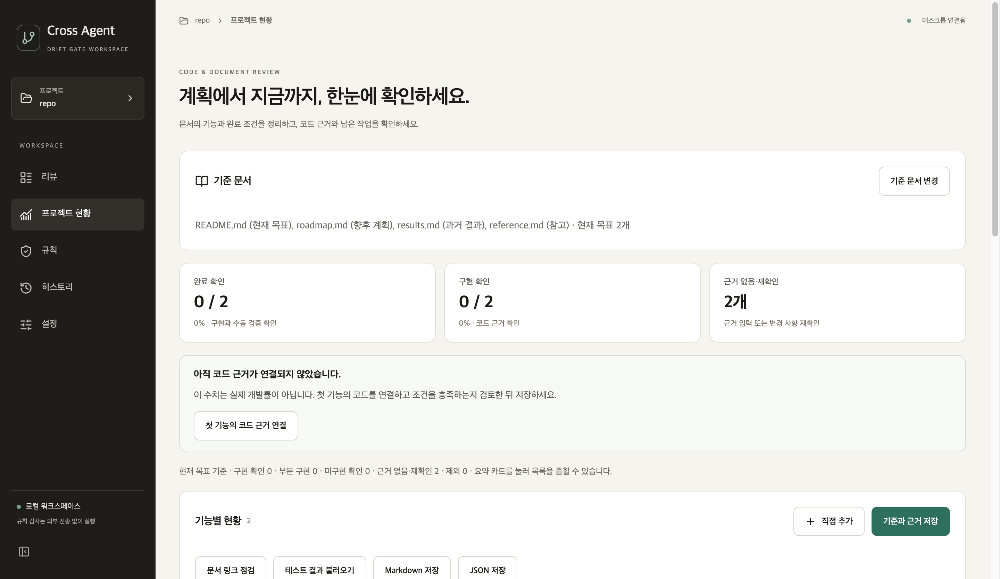

# 문서 종류 구분과 V5·V6·V7 구현·검증

2026-10-01 · `ver2` · 변경 전 기준 `2a038aa` · macOS, Python 3.11.15

## 사용자에게 달라지는 점

| 항목 | 변경 전 | 변경 후 |
|---|---|---|
| 문서 범위 | 선택한 MD 모두 기능 후보·현황 대상 | 현재 목표·향후 계획·과거 결과·참고를 사용자가 지정. 현재 목표에서만 추출·집계 |
| 문서 종류 변경 | 별도 종류 정보 없음 | 기존 기능·코드 근거 보존. 현재 목표 밖의 항목은 제외 필터에서 확인 |
| V5 상태 용어 | 리뷰 `warn`과 현황 `unknown` 모두 확인 필요 | 리뷰는 주의, 현황은 근거 없음. 변경된 기준·코드는 재확인 필요 |
| V6 전부 판단 불가 | 회색 막대만 표시 | 근거가 비어 있으면 첫 코드 근거 입력으로 이동. 오래된 근거라면 재확인 목록 안내 |
| V6 상태 설명 | 막대 구간에 영어 상태 키 표시 | 한국어 상태와 항목 수 표시. 집계 대상 0개는 대상 없음으로 안내 |
| V7 요약 카드 | 클릭 동작 없음 | 완료 확인·구현 확인·근거 없음·재확인 목록 필터. 검색어 초기화, 선택 테두리와 키보드 포커스 표시 |

현황은 **저장한 요구사항과 사용자가 확인한 근거의 상태**다. 실제 프로젝트 개발률이나 자동 코드 의미 판정의 정확도가 아니다. 이번 작업으로 API·DB 규칙 판정의 성능이 개선됐다고 주장하지 않는다.

## 범위와 저장 규칙

- 문서 이름만 보고 종류를 추측하지 않는다. 이전 기준에 종류 정보가 없으면 현재 목표로 읽어 기존 사용자의 상태를 유지한다.
- 모든 선택 문서의 해시와 종류를 저장한다. 링크 점검은 네 종류 모두 수행한다.
- 향후 계획·과거 결과·참고 문서가 바뀌면 별도 안내만 보여준다. 현재 목표 문서나 코드 근거가 바뀌면 이전 구현 확인을 집계하지 않는다.
- 저장된 문서의 종류만 변경하면 기능 ID·근거·수동 검증 기록은 보존한다. 동일 기능의 문서 출처 중 하나라도 현재 목표라면 집계한다.
- 종류 변경은 기준 버전을 올린다. 같은 내용을 재저장하거나 이전 기준에 기본값인 현재 목표 정보를 보완하는 것은 버전을 올리지 않는다.
- 현재 목표 밖으로 이동한 항목의 이력은 회귀가 아니라 범위 제외다. 다시 현재 목표로 옮겼을 때 근거가 유효하면 집계에 돌아온다.
- **재추출은 기존 편집 내용과 근거를 초기화한다.** 새 문서를 추가하거나 추출하지 않았던 현재 목표의 후보를 읽을 때 사용한다. 종류만 수정하려면 기준과 근거 저장을 사용한다.
- 향후 계획·과거 결과·참고만 저장해도 오류가 아니다. 집계 대상 0개이며 직접 추가 버튼은 사용할 수 없다.

## 통제 검증

임시 Git 저장소에 현재 목표 2개와 나머지 종류의 독립 항목을 배치했다. 파일 내용·역할·코드 근거를 하나씩 바꿨으며 외부 LLM은 호출하지 않았다. 아래는 자동 회귀 검증 결과이며, 실사용 평가가 아니다.

| 통제 조건 | 기대 결과 | 확인 결과 |
|---|---|---|
| MD 네 종류를 함께 선택 | 현재 목표 2개만 추출. 문서 4개의 해시·종류 보존 | 통과 |
| 과거 결과 MD 내용만 변경 | 현재 목표의 구현 확인 1개 유지. 참고 범위 변경 안내 | 통과 |
| 리뷰에서 과거 문서·제외된 기능의 근거 코드 변경 | 전체 기준 재확정 안내 없음. 제외된 근거는 현재 현황 영향으로 집계하지 않음 | 통과 |
| 현재 목표 MD 내용 변경 | 이전 구현 확인을 제외하고 재확인 필요 | 통과 |
| 구현 근거가 있는 문서를 과거 결과로 이동 | 분모 2 → 0, 제외 2, 근거 그대로, 회귀 0 | 통과 |
| 같은 저장 재실행 후 현재 목표로 복귀 | 재저장은 버전 유지. 복귀 후 구현 확인 1개 복원 | 통과 |
| 종류 정보 없는 이전 저장 파일 | 기존 분모 2 유지. 기본 종류 보완만으로 버전 증가 없음 | 통과 |
| 중복 목표의 첫 출처만 과거로 이동 | 다른 현재 목표 출처가 남아 있어 분모 2 유지 | 통과 |
| 참고 문서만 선택 | 기준 저장·앱 재조회 성공, 분모 0, 가짜 완료율 없음 | 통과 |
| 잘못된 종류·중복 선택·잘못된 경로 구조 | 설명 가능한 오류로 거부 | 통과 |
| 구현 2개·완료 1개·판단 불가 2개·과거 1개 | 카드별 목록 2·1·2개. 오래된 구현과 과거 항목 제외 | 통과 |
| 검색어를 입력한 뒤 카드 선택 | 검색어 지움. 카드 수와 목록 수 일치, 선택 상태 표시 | 통과 |
| 모든 근거가 비어 있음 / 모두 재확인 대상 | 각각 첫 근거 입력 포커스 / 재확인 안내. 회색 막대 생략 | 통과 |
| 리뷰 결과 `warn` | 주의로 표시해 현황 상태와 구분 | 통과 |
| Markdown 내보내기 | 문서 종류·범위 안내 포함. 오래된 제외 항목을 재확인으로 잘못 표시하지 않음 | 통과 |

검증 파일: `test_progress_service.py`, `test_progress_report.py`, `test_desktop_web.py`, `desktop-ui/src/App.test.tsx`.

- Python 전체 테스트: **662개 통과**. 문서 범위와 보고서·Qt 연결 검증을 추가했다. 테스트 수 증가는 판정 정확도 향상을 뜻하지 않는다.
- React 화면 테스트: **21개 통과**. 기존 16개에 분류·카드 필터·빈 근거 안내·용어 구분·리뷰 연결 흐름을 추가했다.
- TypeScript 검사와 배포용 UI 빌드: 통과. 기존 큰 번들 경고는 남아 있다.
- 실제 macOS Qt WebEngine 렌더링: 문서 4개 / 현재 목표 2개를 읽는 로컬 예제 화면 확인. 아래 캡처는 실제 사용자 프로젝트가 아닌 합성 저장소다.

## 화면 확인

기존 색·글꼴·사이드바 구성을 유지했다. `ui-ux-pro-max` 스킬의 UX 검색에서 빈 상태의 다음 행동, 선택 상태, 키보드 포커스 원칙을 적용했다. React 검색에서는 중복 상태 대신 파생 값을 사용하는 원칙을 적용해 범위와 필터를 계산했다. 검색어 `button keyboard pressed state`는 React 결과가 없어 `usestate derived state`로 다시 검색했다. 새로운 디자인 시스템을 생성하거나 사용하지 않은 스킬을 적용했다고 기록하지 않는다.

## 배포 범위와 한계

이번 변경은 `ver2` 후속 소스다. 기존 `desktop-v1.0.0-preview.20261001` 릴리스는 `03d1195`에서 만들어져 이 기능을 포함하지 않는다. 새 설치 파일로 제공하려면 이번 소스로 별도 릴리스를 만들어야 한다.

문서 충돌의 자동 해결, 코드 의미의 자동 판정, 테스트 자동 실행, 기록 삭제·분석 취소, V4 헤더 축소와 E6 컴포넌트 분리는 이번 범위에 포함하지 않았다. 문서 종류는 사용자 선택이므로 잘못 지정한 범위까지 자동으로 바로잡지는 않는다.

### 후속 반영 · 2026-10-01

위 내용은 최초 기능 구현 시점의 기록이다. 이후 `6445879`에서 현황 화면의 문서·요약·상세 표시를 분리하고 상태 응답 문제를 수정했다. E6의 표시 컴포넌트 분리는 반영됐지만 전체 화면·이벤트 관리 분리는 남아 있다. 이 기능은 [데스크톱 1.0.1 미리보기](https://github.com/cres17/pr-convention-checker/releases/tag/desktop-v1.0.1-preview.20261001)에 포함됐다. [후속 검증 보고서](release-readiness-2026-10-01.md)를 함께 확인한다.
