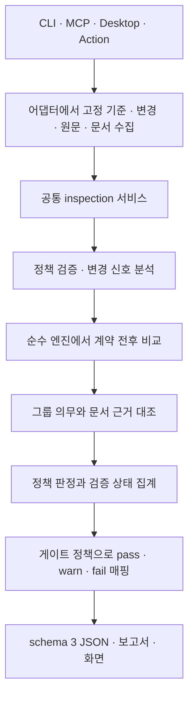

# Drift Gate 논리 구조 구현과 검증

작성일: 2026-10-07  
기준: ver2의 d262ec2 + 이전 다자 검토 수정 + 이번 미커밋 논리 구조 수정  
설계 근거: [제품 로직 발전안](drift-gate-logical-development-2026-10-07.md)

## 구현한 흐름



외부 파일·Git·GitHub 호출은 core 밖에 둔다. source 파일을 import하거나 실행하지 않는다. 결과 식별값에는 실제 비교 원문의 해시를 포함하고 원문 사본은 보고서에 넣지 않는다.

## 설계 항목별 반영

| 발전안 | 실제 변경 | 확인 기준 |
|---|---|---|
| A 정책 결정성 | 중복/빈 그룹 이름, 교차 조건 중복, any/all 동시 지정·빈 조건 거부. core 직접 호출도 검증 | 순서를 뒤집은 중복 정책 모두 거부, 독립 그룹 순서 변경의 판정 동일 |
| B 내용 검사 상태 | ContentCheck와 명시적 satisfied/violated/undetermined/paths. auto의 호환 대체에는 미검증 표시 | 입력 없음·문서 부재·실제 불일치 구분, 엄격 모드의 경로 대체 없음 |
| C 계약 비교 | api-schema: 한정된 FastAPI 응답 선언의 전후 구조와 해당 OpenAPI JSON 대조 | 같은 URL의 필드 삭제·타입·필수 여부·기본값 변경, 동일 구조 모델 이름 변경 정상 대조 |
| D 결과 축 분리 | 판정과 verified/partial/unverified/not-applicable 분리, schema3·unknown 게이트 설정 | 알려진 위반을 유지하면서 미검증 병기, 확인 불가만으로 위반 수 증가 없음 |
| E 실행 공통화 | inspection에서 분석·엔진·실행 기록 공유. 수집은 각 어댑터에 유지 | 실제 임시 Git의 CLI/MCP/Desktop, GitHub 수집을 대체한 Action 비교 |

정책 설명 도구도 그룹의 내용 모드·교차 조건·미검증 처리 설정을 출력한다. glob 포함 관계 전체를 증명하거나 모든 정책 완화 관계를 완전 판정하는 도구는 아니다.

## 중요한 호환성 선택

1. 기존 auto의 파일 조건 대체는 유지한다. 대신 그룹과 규칙 verification=unverified 및 이유를 출력한다. 기존 pass가 의미 검증 성공으로 보이는 문제를 표시에서 바로잡는다. 엄격한 검사가 필요한 정책은 api-schema/api-routes/env-keys를 명시한다.
2. gate.on_unverified는 기본 fail, 선택 warn이다. 기존 엄격 검사에서 확인 불가를 차단하던 동작을 유지한다. 위반을 새로 입증한 것으로 집계하지 않으며, warn 전환을 정확도 향상으로 표시하지 않는다.
3. 기존 pass/warn/fail과 종료 코드 0/1/2 계약은 유지한다. JSON에 schema_version=3, verification과 미결정·미검증 수가 추가된다. status=undetermined를 소비할 수 있도록 외부 소비자를 갱신해야 한다.
4. 기존 any/all 동시 지정 정책은 이제 입력 오류다. 의도에 맞는 하나로 정리해야 한다.

## 새 모드의 사용 예

```yaml
rules:
  - id: response-schema-sync
    when:
      any_changed: ['src/api/**']
    require:
      groups:
        - name: OpenAPI response schema
          all_changed: ['openapi.json']
          content: api-schema
    severity: blocker
gate:
  on_unverified: fail
```

지원하는 필드 구조가 바뀌면 같은 HTTP 메서드·URL의 현재 응답 스키마를 문서에서 대조한다. 이미 올바른 문서는 수정하지 않아도 인정한다. 각 all 문서는 전체 계약을 만족해야 하며 any는 하나의 완전한 문서로 충족한다. 문서의 부분 정보를 모아 하나의 올바른 문서인 것처럼 처리하지 않는다.

모델 이름 자체는 계약 식별값이 아니다. 이름이 달라도 필드 구조·필수 여부·기본값이 같으면 갱신 의무가 없다. 응답 필드 변경이 실제 사용자에게 호환성을 깨뜨렸다는 판단은 하지 않는다.

## 범위와 한계

- 직접 FastAPI/APIRouter 선언, 같은 파일의 직접 BaseModel, str/int/float/bool 직접 필드와 단순 상수 기본값만 지원한다. 상속·별칭·동적 경로·prefix/라우터 조합·외부 모델·Field/validator·중첩/nullable/container 표현은 판단 보류다.
- OpenAPI 3 JSON의 200/application-json 단순 객체 또는 직접 로컬 component 참조만 지원한다. YAML, 요청 스키마, 다른 응답·미디어 타입과 전체 OpenAPI 유효성 검사는 구현하지 않았다.
- 모듈의 정적 선언을 비교한다. 실제 서버 실행·전체 저장소 심볼/의존성 해석·배포·클라이언트 호환성 검증은 아니다. 특히 트리거 밖의 외부 모델 변경은 분석하지 않으므로 해당 구조를 지원으로 주장하지 않는다.
- 원문/문서 읽기는 크기를 제한하고 식별값을 기록하지만 작업 트리 전체를 원자적으로 잠그지는 않는다. 실행 중 편집 후 즉시 원복되는 모든 경합을 검출하는 기능은 아니다.
- 네 진입점 비교에서 GitHub 네트워크는 대체했다. 실제 원격 PR·원격 CI·새 설치 파일·Windows/Intel Mac 실행 검증은 이번 검사 결과에 포함하지 않는다.
- 기존 합성 지원/경계 평가 입력은 변경하지 않는다. 새 모드 회귀 테스트의 통과를 실제 PR 정확도나 기존 경계 사례 해결로 일반화하지 않는다.

## 재현·검증 자료

| 검사 | 이번 실행 결과 |
|---|---|
| Python 전체 | 1,019 통과, 실패·skip 없음 |
| React | 125 통과 |
| 타입 검사·ruff E9,F·화면 빌드 | 통과. 기존 큰 번들 경고는 남음 |
| 대표 재현 | 10/10 기대 결과 일치 |
| 자체 정책 | PASS, 적용 그룹은 기존 auto 경로 검사로 내용 미검증(unverified) |
| 기존 고정 합성 사례 | 21/21, FP 0·FN 0 |
| 기존 일반화 합성 평가 | 지원 24/24, 경계 1/8 유지 |

새 논리 회귀 테스트 66개가 추가됐다. 새 테스트의 통과나 미결정 차단을 탐지 정확도 향상으로 집계하지 않는다. 소스 231개와 근거 17개의 해시를 대조해 기록과 현재 후보가 일치하는 것을 확인했다. 일반화 감사 도구가 기존 출력 경로 덮어쓰기를 거부하여 최종 실행은 별도 파일로 만들었다.

- [새 논리 회귀 테스트](../../drift_gate/tests/test_logical_contracts.py)
- [진입점 비교 테스트](../../drift_gate/tests/test_logical_entrypoints.py)
- [제품 입력·출력 계약과 이전 안내](../contracts/gate-and-inputs.md)
- [새 실행 근거 폴더](../assessment/logical-contracts-2026-10-07/README.md)

실행 수치는 근거 폴더의 verification.json과 로그를 기준으로 확인한다. 이전 평가·설치본 결과를 덮어쓰지 않는다. 이번 변경은 미커밋 상태이며 원격에 반영된 것으로 표시하지 않는다.
