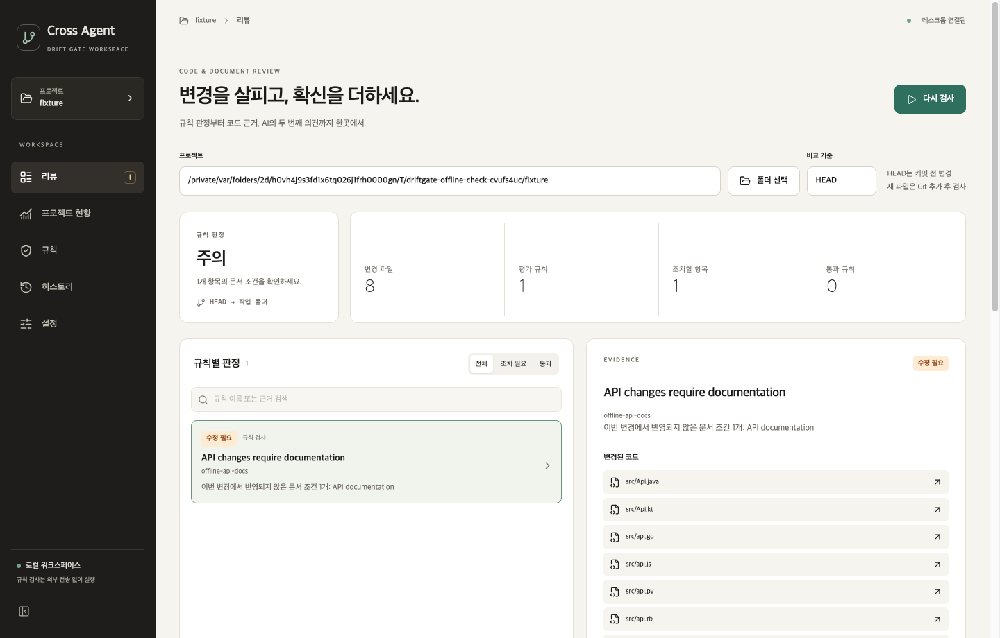
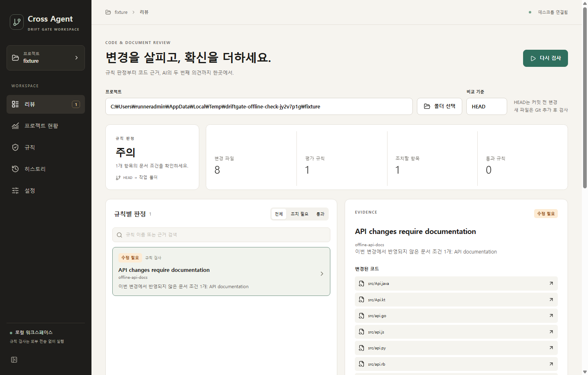

# 설치본 화면 경로·동봉 파서·오프라인 실제 분석

## 문제와 수정

공개 1.0.2 미리보기는 화면 파일이 설치 파일에 들어 있어도 실행 진입점이 다른 위치에서 찾았다. 또한 `tree-sitter-language-pack` 1.20.0의 연결 라이브러리만 묶었고, 첫 사용에 다운로드되는 언어별 파서는 묶지 않았다. 이전 CI의 프로세스 생존 검사는 오류 대화상자에서도 성공할 수 있었다.

- `desktop/resources.py`에서 패키지 위치를 기준으로 화면을 찾는다. 일반 소스 실행과 PyInstaller 실행에서 같은 위치 규칙을 사용한다.
- `packaging/prepare_parsers.py`가 Python·TypeScript·TSX·JavaScript·Go·Java·Kotlin·Ruby 파서를 빌드할 때 준비한다. 파서 버전·언어·파일명·서명 전 원본 체크섬을 manifest에 기록한다. Windows의 DLL 파일명에는 `lib` 접두사가 없으므로 플랫폼별 이름을 분리했다.
- 설치본은 첫 파서 조회 전에 번들 내 라이브러리 검색 위치를 설정한다. manifest 버전·지원 언어·필수 파일이 맞지 않으면 외부 다운로드를 시도하지 않고 기존 휴리스틱 전환 사유를 남긴다. 소스 CLI의 첫 파서 다운로드 방식은 이번 변경의 범위 밖이다.
- 일반 테스트 CI도 파서를 미리 준비하고 OS·아키텍처·언어팩 버전별 캐시를 재사용한다. 다운로드 자체는 두 번 재시도하고 최종 실패하면 검사를 중단한다. 이전 CI 실패가 반드시 다운로드 때문이었다고 확정하지는 않는다.

## 강화한 설치본 검사

`packaging/verify_package.py`가 매 실행마다 새 Git 저장소·빈 파서 캐시를 만들고 실제 설치본을 실행한다. `--verify-package` 진단 모드는 실제 React UI가 QWebChannel을 연결해 `ready`를 보낸 뒤 원래 `DesktopBridge.startScan`과 정책 엔진을 사용한다. Python 소스 검사나 번들에서 추출한 모듈의 대체 실행이 아니다.

검사 조건은 다음과 같다.

1. 번들의 파서 manifest와 필수 파일이 존재한다.
2. macOS는 `sandbox-exec`로 network-outbound 전체를 거부한다. Windows는 앱과 Qt WebEngine에 임시 outbound 차단 규칙을 만들고 `finally`에서 제거한다. Windows CI의 방화벽 설정에는 관리자 권한이 필요하다.
3. 실행된 앱 내부에서 숫자 IP 두 곳에 TCP 연결을 시도해 차단을 확인한다.
4. 실제 UI 렌더링·Qt 연결·검사 완료를 확인한다. 타임아웃·오류 대화상자·소스 실행은 통과로 보지 않는다.
5. 8개 언어의 완전한 코드 입력이 모두 `grammar+heuristic`으로 분석돼야 한다. 파서 사용 불가·부분 구문 fallback은 실패다.
6. 코드 변경에 필요한 API 문서를 일부러 누락해 `offline-api-docs` 위반과 `warn` 판정까지 확인한다. 파서 테스트만 통과하고 정책 엔진을 건너뛰어도 실패다.
7. 검사 후 사용자 파서 캐시에 라이브러리가 생성되지 않았는지 확인한다.

PyInstaller 결과에 먼저 적용하고, Mac은 DMG 안의 앱, Windows는 Setup.exe로 설치된 앱에서 다시 적용한다. 결과 JSON·화면 캡처·앱 로그·파서 목록은 `Offline-check-*` CI 아티팩트에 남는다.

## 로컬 결과

- Python 712개, React 77개 통과. TypeScript와 UI 빌드, Ruff `E9,F` 통과.
- Mac ARM 실제 설치본에서 UI·QWebChannel·8개 언어 오프라인 분석과 API 문서 누락 `warn` 판정 통과. 외부 송신은 거부됐고 새 사용자 파서 캐시의 파일 수는 0이다.
- Mac ARM DMG 안의 앱도 같은 검사에 통과했다. [로컬 앱 결과](../assessment/offline-packaged-analysis-2026-10-01/local-package.json)와 [DMG 결과](../assessment/offline-packaged-analysis-2026-10-01/local-dmg.json), [변경 전 원본](../assessment/offline-packaged-analysis-2026-10-01/)을 별도로 보존한다. 원격 결과도 아래처럼 확인했다.

## 한계와 배포 상태

고정 합성 저장소의 패키지 연결·문법 분석·정책 흐름을 확인한다. 32개 반례·12개 통제 사례를 다시 평가하지 않았고, 실제 프로젝트의 판정 정확도나 전체 UI 흐름을 증명하지 않는다. 파서는 지원하는 8개 언어만 포함하며 새 언어를 지원하려면 준비 목록·검증 입력도 확장해야 한다.

공개 `desktop-v1.0.2-preview.20261001` 설치 파일은 그대로이며 이 수정은 새 CI 산출물에 적용한다. 기존 태그·릴리스를 덮어쓰거나 새 공개 릴리스를 게시하지 않는다. 공식 인증서 서명·공증과 사용자 PC 전체 환경 검증은 포함하지 않는다.

## 원격 CI와 설치본 결과

제품 수정 커밋은 `ac87685bad8cfe1d2140479ad52bbe32c34a9c6b`이며 `ver2`에 푸시했다.

- [일반 push CI 36850803003](https://github.com/cres17/pr-convention-checker/actions/runs/36850803003), [PR CI 36850807424](https://github.com/cres17/pr-convention-checker/actions/runs/36850807424): 모두 attempt 1 성공. 9개 OS·Python 조합의 테스트, 린트와 기존 고정 벤치마크가 통과했다. Qt 없는 일반 검사에는 682개 통과·3개 파일 건너뜀이며 로컬 Qt 포함 712개와 범위가 다르다.
- [Desktop build 36850803111](https://github.com/cres17/pr-convention-checker/actions/runs/36850803111): 세 플랫폼 모두 attempt 1 성공. 각 플랫폼에서 React 77개·데스크톱 170개 검사와 빌드가 통과했다.
- 성공 아티팩트의 JSON을 실제로 내려받아 여섯 결과 모두 `frozen=true`, `bridge_ready=true`, 8개 `grammar+heuristic`, API 문서 누락의 `warn`, 파서 캐시 파일 0개임을 대조했다. 화면 텍스트에도 `offline-api-docs`와 `docs/api.md`가 있어 결과 표시를 확인했다.

| 플랫폼 | 첫 번들 실행 | 배포·설치 후 실행 | 네트워크 차단 관측 |
|---|---|---|---|
| Mac ARM | 8개 언어·warn 통과 | DMG 안의 앱 동일 통과 | 두 연결 모두 errno 1 |
| Mac Intel | 8개 언어·warn 통과 | DMG 안의 앱 동일 통과 | 두 연결 모두 errno 1 |
| Windows x64 | 8개 언어·warn 통과 | Setup.exe로 설치된 앱 동일 통과 | 두 연결 모두 WinError 10013 |

같은 합성 입력을 플랫폼과 패키지 단계별로 반복한 것이며 여섯 번을 독립 정확도 평가로 세지 않는다. Windows 방화벽은 앱과 Qt WebEngine의 enabled outbound block 규칙 두 개를 기록했고 검사 후 제거했다.

[CI 원본 결과](../assessment/offline-packaged-analysis-2026-10-01/ci/summary.json), [실행·아티팩트 정보](../assessment/offline-packaged-analysis-2026-10-01/ci/run.json), 플랫폼별 JSON·manifest·검사 로그를 보존한다. 실제 Windows 설치본 화면도 확인했지만 CI의 offscreen 실행이며 사용자 PC 실사용 검증은 아니다.

