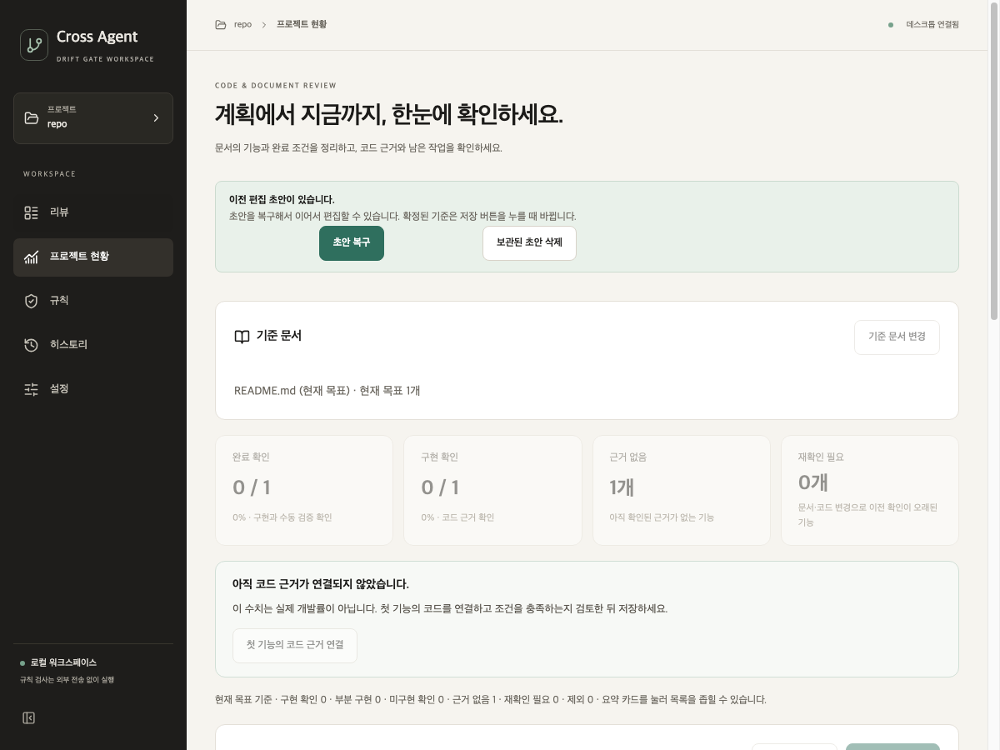

# 재시작 후 초안 복구·전체 F 린트·미리보기 릴리스

2026-10-01 · 변경 전 `637fe13` · `ver2`

## 초안 복구

편집한 현황을 확정된 기준과 별개의 복구용 JSON에 자동 보관한다. 위치는 앱 데이터 폴더의 `progress/drafts/`이며 Git 저장소에 쓰지 않는다. 원격이 같아도 다른 작업 폴더의 초안은 별도 파일로 구분한다. 파일을 임시 경로에 쓴 뒤 교체해 이전 유효한 초안이 반쯤 쓴 파일로 바뀌지 않게 한다.

재시작하면 **초안 복구**와 **보관된 초안 삭제**를 표시한다. 선택 전에는 기준을 읽기 전용으로 보여 준다. 복구를 선택하면 미확정 상태로 이어서 편집하며 확정 저장 전에는 현황을 다시 승인하지 않는다. 기준 버전이 달라졌으면 경고한다. 잘못된 완료 조건·코드 줄 등 덜 끝난 입력도 보존하며, 확정 저장 시 기존 검증을 다시 적용한다.

확정 저장이 성공하면 복구 파일을 지운다. 검증 실패·자동 보관 실패는 기존 초안을 지우지 않는다. 자동 보관 상태와 오류는 화면에 표시하고, 자동 보관 응답은 다른 저장 작업의 잠금을 해제하지 않는다. 요청 ID로 이전 응답을 거부한다. 초안 크기는 2MB로 제한하며, 손상된 파일은 확정 기준을 유지한 채 삭제·재편집 안내를 표시한다.

이 기기에 문서·코드 발췌가 포함된 편집 데이터를 보관한다. 다른 폴더로 이동하거나 다시 클론한 작업 폴더의 초안을 자동 이전하지 않는다. 프로세스 중단 직전 아직 Qt에 전달되지 않았거나 파일 기록이 끝나지 않은 마지막 입력까지 복구한다고 보장하지 않는다. 화면에서 **이 기기에 보관했습니다**를 확인한 내용이 복구 대상이다.

## 린트 정리

전체 `drift_gate`의 Ruff `F` 지적은 35건이었다. 테스트 파일 28건과 기존 코드 7건을 합한 값이다. 미사용 import·변수만 정리하고 테스트를 삭제하지 않았다. Qt 애플리케이션 객체는 수명을 유지해야 하므로 참조를 없애지 않고 `_app`으로 보존했다. 이후 `E9,F`는 0건이며 CI도 전체 F 검사를 수행한다.

## 검증

- Python 전체 **693 통과**, React **77 통과**, TypeScript·UI 빌드·Ruff `E9,F` 통과.
- 서로 다른 Qt 프로세스 3개에서 실제 편집 → 종료 → 복구 선택 → 확정 저장 → 다시 실행 시 복구 안내 없음 확인.
- 별도 백엔드 입력으로 덜 끝난 편집, 다른 폴더 분리, 확정 버전 충돌, 손상 파일, 상한 초과 시 이전 파일 보존을 확인.
- 화면에서 복구 선택 전 편집 차단, 명시적 삭제, 자동 보관 오류가 저장 잠금을 풀지 않는 흐름을 확인.

[재현 스크립트·로그·환경](../assessment/progress-draft-recovery-2026-10-01/README.md)을 보존한다. 통제된 상태 처리 검증이며 엔진의 일반 판정 정확도나 실기기 사용성 평가가 아니다. 큰 diff chunk 경고는 유지한다.

## 릴리스 범위

[desktop-v1.0.2-preview.20261001](https://github.com/cres17/pr-convention-checker/releases/tag/desktop-v1.0.2-preview.20261001)을 게시했다. 제품 소스와 태그는 `916c4ba2a2f1537b02fc6fbc366d7d16388fcd67`이다. [릴리스 실행 36832261072](https://github.com/cres17/pr-convention-checker/actions/runs/36832261072)의 세 플랫폼에서 각각 화면 77개·데스크톱 151개 검사와 앱 실행, 두 Mac DMG 마운트 및 Windows 설치·실행·제거가 성공했다.

초안 릴리스에서 네 설치 파일과 체크섬을 전체 다운로드해 파일 크기·SHA-256을 `SHA256SUMS.txt`와 GitHub asset digest에 대조했다. 게시 후에는 공개 주소 5개의 HTTP 200·크기, 공개 메타데이터의 digest가 내려받은 파일과 동일함을 확인했다. 공개 주소에서 파일 전체를 다시 다운로드한 것은 아니다. [다운로드 검증 원본](../assessment/progress-draft-recovery-2026-10-01/release-downloads.json)에 각 단계와 결과를 구분해 보존했다.

[푸시 CI 36832235190](https://github.com/cres17/pr-convention-checker/actions/runs/36832235190)·[PR CI 36832240778](https://github.com/cres17/pr-convention-checker/actions/runs/36832240778)는 성공했으며, 9개 OS·Python 조합 각각 664개 통과·3개 건너뜀이다. Qt 포함 로컬 전체와 검사 범위가 다르다.

개발용 [Desktop app build 36832235133](https://github.com/cres17/pr-convention-checker/actions/runs/36832235133)의 첫 Intel Mac 시도에서 기존 화면 테스트 하나가 기본 5초 제한을 넘겨 76개 통과·1개 시간 초과였다. 같은 커밋의 릴리스용 Intel 검사에서는 77개가 통과했고, 실패한 개발 작업만 같은 커밋으로 재실행하여 세 플랫폼 개발 빌드도 성공했다. 제품 코드·테스트 제한을 변경해서 통과시킨 것은 아니다. 최초 실패 로그를 별도로 보존했다. 간헐적인 검사 시간 초과의 가능성이 완전히 없어진다고 주장하지 않는다.

README·설치 안내의 고정 다운로드 링크를 1.0.2로 갱신했다. 기존 릴리스와 GitHub Action 버전 태그는 유지한다. 이번 설치 검증은 CI에서 수행했으며 실제 사용자 Windows·Mac에서 전체 사용성을 평가한 것은 아니다.

게시 후 추가 [CI 36833865274](https://github.com/cres17/pr-convention-checker/actions/runs/36833865274)의 첫 Ubuntu/Python 3.11 시도에서 문법 분석기가 초기화되지 않아 기존 3개 검사가 실패했다(661개 통과·3개 실패·3개 건너뜀). 실패한 작업만 같은 커밋으로 재실행한 결과 성공했다. 예외의 상세 원인이 로그에 남아 있지 않아 특정 외부 원인으로 단정하지 않는다. 최초 실패 로그를 보존하며, 초기화가 간헐적으로 실패할 가능성까지 해결했다고 주장하지 않는다. 게시 후 Benchmark와 기존 릴리스 중복 빌드 방지 실행도 성공했다.
