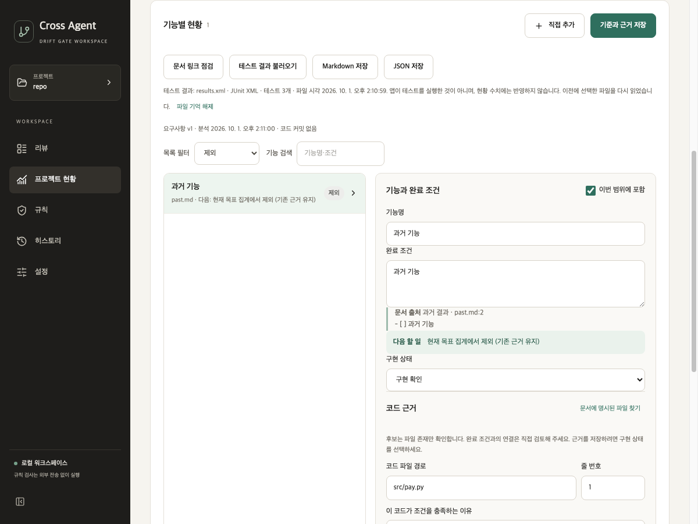

# 프로젝트 현황 화면·이벤트 분리 · 2026-10-01

## 반영한 범위

평가 권고 1~3의 재추출 합치기, 근거 없음·재확인 카드 분리, 범위 조건과 카드 해제는 앞선 로컬 수정에서 완료했다. 이번에는 E6 중 현황 화면의 상태·편집·Qt 응답 처리를 `useProjectProgress.ts`로 옮겼다. 목록은 `RequirementList.tsx`, 테스트 결과·문서 링크 점검 표시는 `ReferenceChecks.tsx`로 분리했다. `ProjectProgress.tsx`는 화면 구성과 표시 컴포넌트 연결을 담당한다.

`events.ts`에 데스크톱 이벤트와 현황 이벤트의 종류별 데이터 계약을 정의했다. `App.tsx`의 큐, 연결 콜백, 현황 처리에서 같은 타입을 사용한다. `App.tsx`의 이벤트 큐·메뉴 타입, 현황 이벤트와 연결 콜백의 명시적 `any`를 제거했다. 이벤트 응답의 강제 형변환도 제거했다. 테스트의 이벤트 주입 함수도 같은 계약을 사용한다. 런타임 JSON 데이터 전체를 검증하는 구현은 아니다.

재추출 중 편집 보존, 저장 중 입력 잠금, 저장보다 먼저 온 분석 응답의 잠금 유지, 수정 후 오래된 분석 무시, 다른 저장소 응답 무시, 근거 후보 초기화와 범위 판정은 유지했다. 새 테스트는 추가하지 않았다.

## 검증

| 확인 | 분리 전 | 분리 후 |
| --- | --- | --- |
| React 전체 | 47개 통과 | 47개 통과 |
| Python 전체 | 이번 기준 비교에서는 미실행 | 677개 통과 |
| TypeScript·UI 빌드 | 앞선 작업에서 통과 | 통과 |
| `ProjectProgress.tsx` | 695줄 | 186줄 |
| 현황 화면·App·연결 콜백의 명시적 `any` | 4곳 | 0곳 |

줄 수는 구조 위치를 설명하는 값이며 품질이나 판정 정확도 지표가 아니다. 다섯 테스트 모듈의 TypeScript를 JavaScript로 변환한 입력이 분리 전후 바이트 단위로 같았다. 테스트 타입 주석만 수정했고 실제 시나리오와 기대값은 유지했다. 검사 원본은 [평가 기록](../assessment/progress-event-refactor-2026-10-01/summary.json)에 보존했다. UI 테스트의 기존 `act` 경고와 Vite의 큰 번들 경고는 남았다.

Qt WebEngine 오프스크린 앱과 별도 설정·합성 저장소에서 네 카드의 활성화·재클릭 해제 후 현재 목표 3개로 복귀, 과거 항목의 테스트 링크·힌트 없음, 제외 안내와 입력한 테스트 이름 보존을 확인했다. 캡처도 확인했다.

## 남은 범위

`App.tsx`의 다른 화면 전체 분리, 상태 전체를 단일 reducer로 통합하기, 런타임 이벤트 데이터 검증은 이번 변경에 포함하지 않았다. 기존 32개 반례·12개 통제 사례의 판정 정확도 재평가도 하지 않았다. Windows·macOS 설치 패키지, 원격 CI·릴리스 검증은 실행하지 않았다. 기존 수정과 이번 변경은 미커밋 상태이며 푸시·릴리스하지 않았다.
