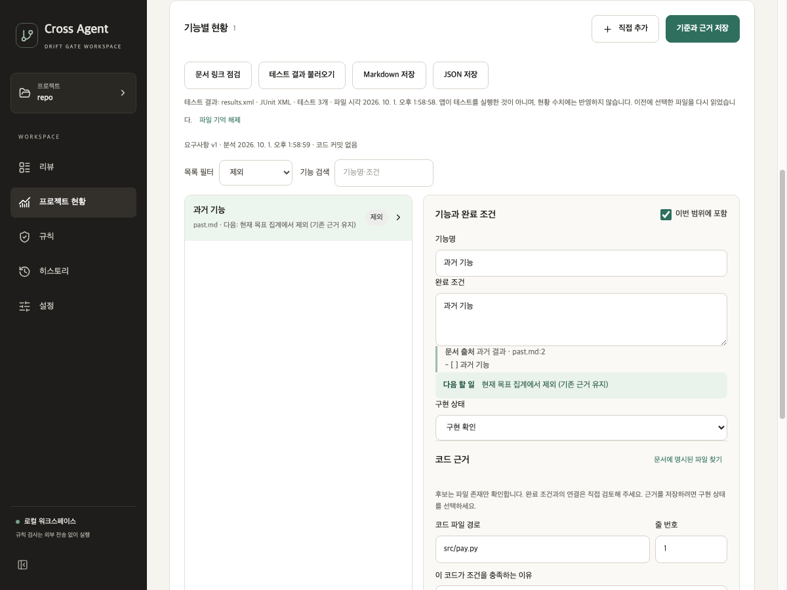

# 현황의 범위 판정과 요약 카드 해제

2026-10-01 · 앞선 재추출 보존·요약 카드 분리 로컬 소스를 기준으로 비교

## 수정한 동작

- 테스트 이름 힌트와 결과 연결은 사용자의 포함 여부와 문서 종류를 함께 확인한다. 과거 결과·향후 계획·참고로 옮긴 항목은 연결 대상에서 제외하며 입력한 테스트 이름은 보존한다. 출처가 여러 개인 기능은 하나라도 현재 목표이면 대상에 남긴다.
- `inspect_progress`, `link_test_results`, `find_unmatched_patterns`, `link_tests`는 같은 백엔드 범위 기준을 사용한다. 문서 종류 정보가 없는 이전 기준은 계속 현재 목표로 처리한다. 이미 분석된 항목의 `in_current_scope=false`나 제외 상태도 존중한다.
- 저장 전 문서 종류를 바꿨을 때도 화면의 기존 테스트 연결·힌트를 숨긴다. 범위 밖 항목의 다음 할 일은 목록과 상세 모두 “현재 목표 집계에서 제외 (기존 근거 유지)”다. 공통 `nextAction`에 기준 문서를 전달하여 문서 범위와 중복 출처까지 확인한다. 화면의 일부 호출에는 이미 보호 조건이 있었지만 공통 함수 자체에는 문서 범위 판정이 없었다.
- 네 요약 카드를 다시 누르면 전체 필터로 돌아간다. 검색어와 코드 후보 표시를 정리하고 `aria-pressed=false`로 바뀐다. 0개 카드도 해제할 수 있다. 다음 행동 안내 버튼은 해당 대상을 여는 동작을 유지한다.

저장 형식·테스트 결과 파일 전체 개수·수동 검증 기록·근거 데이터는 변경하지 않는다. 테스트 연결은 결과 파일의 이름을 비교하는 읽기 전용 기능이며 테스트를 실행하거나 완료 수치에 반영하지 않는다.

## 전후 검증

이전 두 수정의 미커밋 변경을 포함한 전체 소스를 임시 폴더에 복사하고 같은 회귀 입력으로 비교했다.

| 통제 입력 | 수정 전 | 수정 후 |
|---|---:|---:|
| 백엔드 5개: 세 문서 종류의 제외·복귀, 중복 현재 출처, 분석된 제외 정보 | 0/5 | 5/5 |
| 화면·공통 안내 10개: 네 카드 해제·0개 카드 해제, 저장 전 연결 숨김, 세 문서 종류의 다음 행동·현재 중복 출처 | 1/10 | 10/10 |

화면 비교 대상 파일의 기존 12개 검사는 양쪽에서 계속 통과했다. 새 긍정 사례인 현재 중복 출처 유지도 수정 전후 모두 통과한다. 전체 Python 677개·React 47개, TypeScript와 UI 빌드, 치명 Python 린트·공백 오류 검사가 통과했다. 기존 React `act` 및 큰 번들 경고는 남아 있다.

macOS의 Qt 앱을 오프스크린으로 실행해 네 카드 각각의 선택·재클릭 해제 후 현재 목표 3개 복귀와 모든 선택 상태 해제를 확인했다. 과거 기능은 제외 필터에서만 보이며 테스트 연결 기록·이름 힌트가 없고, 목록과 상세의 다음 행동은 범위 제외 안내였다. 테스트 이름 `test_past_typo`와 코드 근거가 보존됐다. 화면 캡처도 확인했다.

환경·고정 입력 해시·실행 결과는 [검증 요약](../assessment/progress-scope-card-toggle-2026-10-01/summary.json)에 보관한다. 작성자 통제 합성 검사이며 실서비스 정확도·사용성 평가가 아니다. Windows 기기·설치 패키지·원격 CI는 이번에 검증하지 않았다. 앞선 두 수정과 함께 미커밋 로컬 상태이며 푸시·새 릴리스는 하지 않았다.
