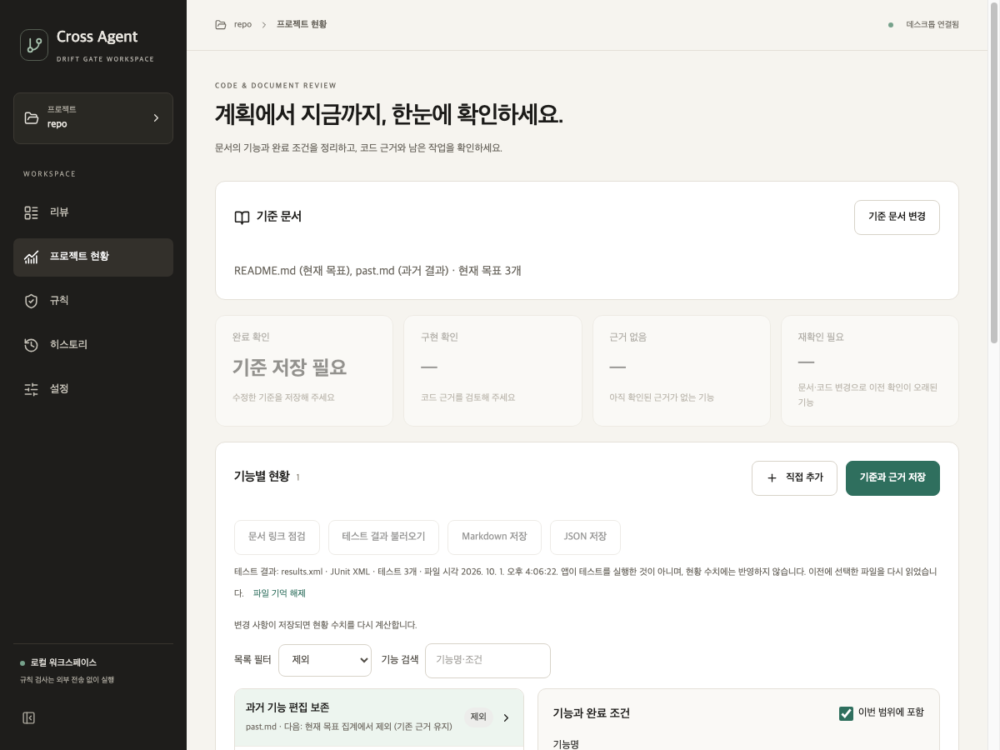

# 현황 편집 보존과 후속 코드 리뷰

2026-10-01 · `ver2` · 변경 전 `244bf3274c8ec0bb462ae6ff6255a427ab32b6cf`

## 수정 결과

| 발견한 문제 | 수정한 동작 |
|---|---|
| 현황에서 제목을 편집하고 규칙 화면을 다녀오면 편집이 사라짐 | 현황 화면을 유지하고, 다른 화면에서는 미저장 안내 표시 |
| 저장소 A → B → A 이후 예전 A 저장 응답이 새 편집을 덮음 | 방문 세션과 요청 ID를 함께 검사. 이전 방문·이전 요청 응답 무시 |
| 저장소를 바꾸면 미저장 초안이 사라짐 | 저장소별 미저장 초안을 메모리에 보존. 다른 저장소의 초안이 남아 있으면 안내 |
| 앱 종료로 미저장 내용 유실 | Qt 종료 확인의 기본 선택을 취소로 설정. 저장 성공 후 경고 해제 |
| 문서의 줄 이동·제목 변경으로 중복 후보 생성 | 같은 문서의 유일한 원문은 보수적으로 연결. 명시적 `progress-id`로 제목 변경 후에도 연결 |
| JSON 파싱만 하고 응답 타입을 가정 | 응답의 중첩 구조·상태 값·요청 문맥을 Zod로 검증. 잘못된 현황 응답은 해당 요청의 오류로 처리 |
| 큰 App에 규칙·이력·설정 화면 혼재 | 표시 패널과 공통 표시 요소 분리. 현황은 hook/reducer, Qt 요청은 요청 관리자에서 처리 |
| 리뷰에 사용하지 않아도 큰 diff 모듈을 처음에 로드 | 리뷰의 코드 변경을 표시할 때 지연 로드. 로드 중에는 원문 patch 표시 |

편집으로 오래된 분석·테스트 결과가 무효화되더라도 작업 완료 응답은 대기 상태를 해제한다. 저장 응답 묶음은 같은 요청 ID를 공유하고 마지막 응답에서만 완료된다. 이미 완료된 응답의 재전달도 거부한다.

## 재추출의 항목 연결

```markdown
- [ ] 로그인 <!-- progress-id: login -->
```

표시는 화면의 기능명에서 제거한다. 같은 문서 안에서 값이 고유해야 하며, 한 항목에 여러 값을 쓰면 추출이 실패한다. 줄 이동·제목 변경 후에도 동일한 출처 키로 기존 항목을 연결한다. 기존 항목에 표시를 처음 추가하는 경우에도 원문이 유일하게 일치하면 기존 ID·근거·수동 편집을 보존한다.

표시가 없으면 같은 문서의 동일한 원문이 양쪽에서 유일한 경우만 연결한다. 동명이거나 뜻이 바뀐 항목, 문서 경로 변경은 추측해서 합치지 않는다. 기존 항목과 새 후보를 유지한다. 문서가 바뀌었으면 연결이 성공해도 이전 확인은 재확인 대상으로 남는다. 기존 제목·완료 조건 등 사용자 편집도 보존한다.

## 검증

| 검사 | 결과 |
|---|---|
| 동일 입력으로 페이지 이동·A → B → A 오래된 저장 응답 | 변경 전 0/2, 변경 후 2/2 충족 |
| Python 전체, Qt 포함 | 686 통과 |
| React 전체 | 72 통과 |
| TypeScript·UI 빌드·Python 치명 오류 검사 | 통과 |
| 실제 Qt 화면, 합성 저장소 | 카드 4개 켜기/끄기, 제외 항목 힌트·테스트 연결 배제, 파일 선택 취소 후 잠금 해제 |
| 실제 Qt 편집 흐름 | 페이지 이동 후 편집 유지, 종료 취소, 저장 후 경고 해제, rich diff 지연 로드 렌더링 |
| Python → Qt → React 계약 | 실제 Qt 응답을 고정 입력으로 보존하고 화면 응답 검증기에 재입력 |

Qt 검증 중 첫 이력의 비교 값이 `null`인 실제 계약을 발견했다. TypeScript와 응답 검증에서 이를 허용하고 고정 회귀 입력을 추가했다.

같은 환경에서 초기 JavaScript 파일은 1,466.48KB → 528.69KB, gzip 420.51KB → 149.72KB였다. 나머지 diff 모듈은 필요할 때 로드한다. 전체 파일 용량 감소나 시작 속도 개선을 측정한 결과는 아니며, 큰 chunk 경고는 남는다.

[검증 입력·원본](../assessment/progress-session-review-2026-10-01/README.md)에 입력, 실제 Qt 응답, 환경, 로그와 실행 스크립트를 보존했다. 두 재현 사례는 문제 발견 후 작성한 통제 사례이며 일반 판정 정확도의 증거가 아니다. 32개 반례와 12개 엔진 비교 입력의 새로운 정확도 평가는 수행하지 않았다.



## 이번 대화의 누적 수정

1. 재추출은 기존 항목을 합치며 근거·검증·수동 편집을 보존한다. 새 문서 후보만 추가하고 상한 초과는 전체 적용을 거부한다.
2. 요약의 근거 없음·재확인 필요를 별도 카드로 나눴다. 필터와 같은 판정을 사용하며 선택된 카드를 다시 누르면 해제한다.
3. 문서 범위 밖 항목은 테스트 연결·이름 힌트·다음 행동의 현재 목표 판단에서 제외한다. 기존 근거는 보존한다.
4. 현황 표시·상태 전이·Qt 부수 효과·타입·집계를 분리했다. 응답 순서, 저장 중 편집, 문서 새로고침 등의 회귀를 보완했다.
5. Windows 테스트 입력 두 곳에서 UTF-8을 명시했다. `244bf32`의 CI와 세 플랫폼 패키지는 성공했다.
6. 이번 후속 검토에서 편집 세션 보존, 요청 ID, 안정적 문서 표시, 실행 시 응답 검증, 추가 패널 분리와 diff 지연 로딩을 보완했다.

## 남은 범위

초안은 앱 실행 중 메모리에 보존한다. 충돌·강제 종료·재시작 후 복구하는 디스크 자동 저장은 제공하지 않는다. 표시 없이 문구·경로가 바뀐 기능은 사용자가 정리해야 한다. App의 큰 리뷰 화면, 언어별 큰 diff 파일, 자동 의미 판정은 후속 범위다.

`ver2` 개발 빌드와 기존 공개 미리보기 릴리스는 다르다. 이번 작업은 main 병합·새 릴리스 게시·기존 태그 이동을 포함하지 않는다. GitHub 검증은 아래 별도 기록에 정확한 커밋과 실행을 남긴다.

## GitHub 검증

이 문서는 로컬 검증 결과를 기록한다. 원격 검증은 [ver2 Actions](https://github.com/cres17/pr-convention-checker/actions?query=branch%3Aver2)에서 해당 커밋의 CI와 Desktop app build를 확인한다. 세 플랫폼 빌드·설치 검사와 산출물 확인 결과는 작업 완료 채팅에 정확한 실행 링크로 보고한다.
