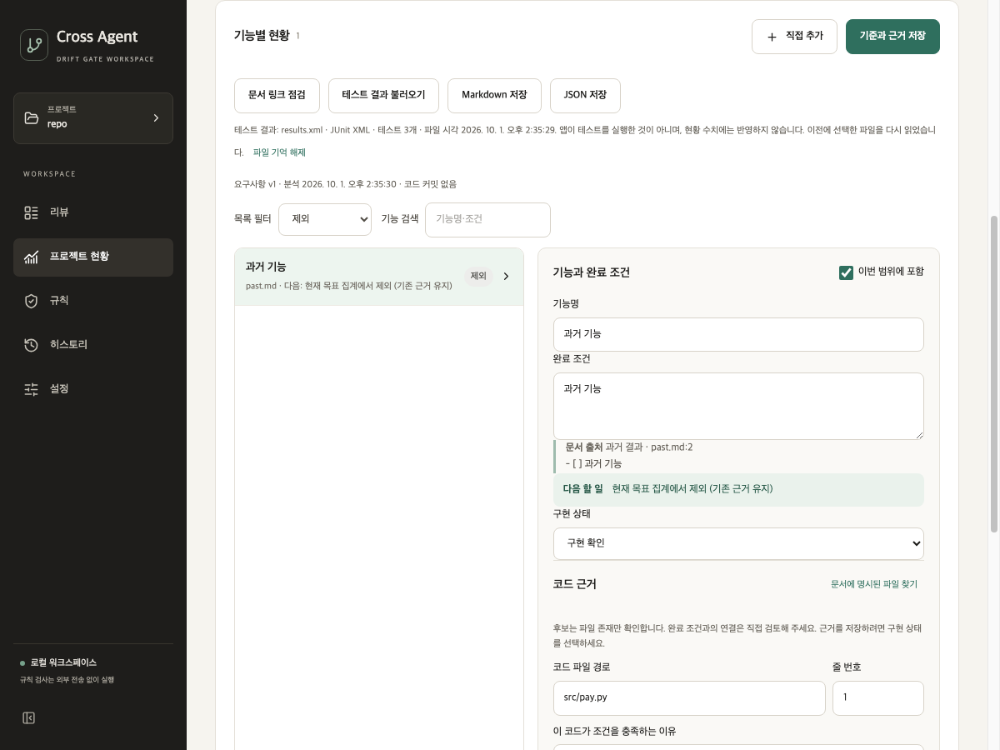

# 누적 변경 코드 리뷰·구조 정리 · 2026-10-01

## 검토 범위와 결과

재추출 합치기·문서 재확인 경계·근거 보존, V5 카드 분리, V6 다음 행동, V7 카드 필터, 테스트 이름 힌트·결과 연결, 현황 상태·이벤트 분리의 누적 로컬 소스를 검토했다. Python 저장·검사·보고서와 React 화면·상태·Qt 이벤트 계약을 함께 확인했다. 기존 변경은 유지했고 실제로 재현한 응답 처리·연결 문제와 책임 경계를 수정했다.

| 발견한 문제 | 근거 | 수정 |
| --- | --- | --- |
| 같은 렌더에 온 문서·추출 응답이 기존 근거를 덮어씀 | 기준 응답 뒤 추출 응답을 한 묶음으로 주입하면 근거·검증 기록이 사라짐 | reducer가 앞 응답의 상태에 다음 응답을 적용 |
| 연속 추출 응답 중 앞 응답의 추가 항목이 사라짐 | 동일 묶음에서 추가 A 뒤 추가 B를 처리하면 A가 누락 | 순차 상태 전이로 두 후보 모두 합침 |
| 파일 선택 취소 후 계속 읽는 중 | Qt 취소 경로가 응답을 보내지 않음 | `progressTestsCancelled` 계약 추가, 해당 읽기만 종료·이전 기록 보존 |
| 테스트 이름 편집 후 이전 연결이 남음 | 편집 후에도 과거 테스트 기록이 표시되고 지연 응답으로 복구됨 | 관련 입력 편집 시 표시 결과 무효화, 수정 중인 기준에 과거 응답 적용 차단 |
| 현재 문서에서 사라진 중복 위치가 계속 범위 판단에 사용됨 | 재추출 후보에 중복이 없으면 이전 중복 정보가 남음 | 현재 목표 출처를 갱신하고 과거·참고 출처는 보존 |

출처 보존 과정의 추가 경계도 점검했다. 보존한 참고 출처와 새 현재 목표 출처가 합쳐져 중복 출처 상한 20개를 넘으면 재추출을 거부하고 이전 편집을 유지한다. 동일 위치는 중복 저장하지 않는다. 조용히 출처를 버리거나 저장 불가능한 목록을 적용하지 않는다.

## 코드 경계

| 모듈 | 책임 |
| --- | --- |
| `ProjectProgress.tsx`와 표시 컴포넌트 | 상태·표시 데이터·행동을 받아 화면 구성. 직접 Qt 호출 없음 |
| `useProjectProgress.ts` | Qt 명령과 이벤트 큐 연결, 요청 시작, 포커스 적용. 상태 setter·dispatch를 화면에 노출하지 않음 |
| `progressState.ts` | 초기화·응답·편집·선택·필터·저장 잠금의 순수 상태 전이와 화면용 조회 |
| `requirement.ts` | 문서 출처, 재확인 스냅샷, 근거·조건 편집의 검증 무효화, 직접 추가 항목 생성 |
| `merge.ts` | 기존 항목·근거 유지, 후보·출처 갱신, 문서·항목·출처 상한 |
| `status.ts` | 범위·실효 상태·목록 필터. 필터 타입과 표시 이름도 한곳에서 관리 |
| `events.ts` | 화면·연결 모듈이 공유하는 종류별 이벤트 계약 |
| `progress_scope.py` | 테스트 결과 읽기에 종속되지 않는 공통 문서 범위·출처 판단 |

`RequirementDetail`은 근거 찾기·문서 재확인을 행동으로 요청하며 직렬화와 Qt 호출은 연결 모듈이 맡는다. 목록·상세는 범위와 테스트 연결을 한 번 조회해 사용한다. 요약 카드의 활성 상태·해제·접근성 표시는 내부 `SummaryCard`가 맡는다. 독립적인 새 화면이나 범용 플러그인 체계는 추가하지 않았다.

완료 응답은 자신이 시작한 읽기만 해제해 다른 작업의 잠금을 유지한다. 편집은 분석·링크·내보내기 표시를 무효화하며 근거·완료 조건·테스트 이름을 바꾸면 기존 자동 테스트 연결도 숨긴다. 저장 후 기억한 결과 파일을 다시 연결할 수 있다. 근거·검증 기록·테스트 이름을 삭제하지 않는다. 이전 상태에서 문서 범위를 바꿔도 제외 항목의 기존 입력은 남는다.

## 동일 입력 검증

| 검사 | 변경 전 | 변경 후 |
| --- | --- | --- |
| 새 React 회귀 사례 | 0/7 | 7/7 |
| 기존 React 사례 | 47/47 | 47/47 |
| 새 Qt 연결 취소 사례 | 0/1 | 1/1 |
| 전체 Python | 이 비교의 이전 전체는 재실행하지 않음 | 678개 통과 |
| 전체 React | 47개 통과·새 7개 실패 | 54개 통과 |

비교 시 두 React 테스트 모듈의 입력 바이트와 새 Qt 연결 검사의 함수 AST가 같은 것을 확인했다. 기존 Qt 검사의 ‘취소 시 무응답’ 기대값은 새 완료 이벤트 계약에 맞춰 갱신했다. 회귀 입력·소스 해시·임시 로그 위치는 [평가 기록](../assessment/progress-structure-review-2026-10-01/summary.json)에 저장했다. 작성자가 통제한 기능·상태 검증이며 판정 정확도 평가가 아니다.

TypeScript·UI 빌드·치명 Python 린트·변경 공백 검사를 통과했다. 기존 React `act` 경고와 Vite 큰 번들 경고는 남았다. 실제 Qt WebEngine 오프스크린 앱과 임시 저장소·별도 설정에서 네 카드의 재클릭 해제, 현재 목표 3개 복귀, 과거 항목의 테스트 힌트·연결 없음과 제외 안내, 기존 입력 보존을 확인했다. 테스트 결과 파일 선택을 취소한 뒤 저장 버튼 활성화와 이전 결과 파일 기억 유지도 확인했다.

## 남은 한계

이벤트 계약은 TypeScript 타입이며 JSON 전체의 런타임 검증은 아니다. 재추출은 항목 ID 기준이다. 문서 줄·제목이 바뀌어 ID가 달라지면 자동 의미 비교로 같은 항목이라고 합치지 않고 이전 항목과 새 후보를 함께 보존한다. `App.tsx`의 다른 화면 전체 분리도 이번 현황 기능 리뷰의 범위 밖이다.

32개 반례·12개 통제 사례의 정확도 재평가, Windows·macOS 설치 패키지, 원격 CI·릴리스는 실행하지 않았다. 소스는 `ver2`의 `f0fda3c` 위 누적 로컬 수정이며 커밋·푸시하지 않았다.
