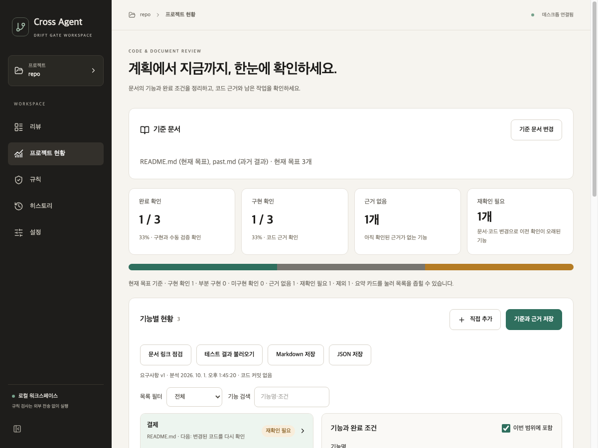
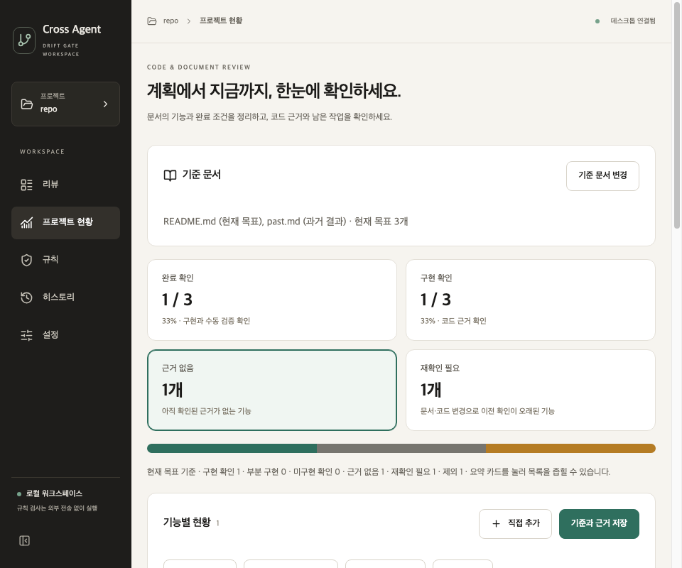

# V5 요약 카드의 상태 구분

2026-10-01 · 재추출 보존 수정이 포함된 로컬 소스를 기준으로 비교

목록에서는 결제를 재확인 필요, 알림을 근거 없음으로 구분하면서 요약 카드에서 두 항목을 합산하던 문제를 수정했다. 요약은 완료 확인·구현 확인·근거 없음·재확인 필요의 네 카드로 표시한다.

## 동작

- 근거 없음: 현재 목표의 항목 중 확인된 근거가 없고 변경으로 무효화된 확인도 없는 항목이다.
- 재확인 필요: 코드 근거 변경, 현재 기준 문서 변경, 재추출 후 유지된 문서 재확인 상태가 있는 항목이다. 코드 근거를 아직 입력하지 않은 문서 재확인 항목도 여기에 포함한다.
- 카드·목록 배지·필터는 같은 표시 상태 함수를 사용한다. 범위 밖 항목은 두 카드에서 세지 않는다. 근거 없음과 재확인 필요 필터는 서로 겹치지 않는다.
- 카드 선택 시 검색어를 지우고 대응하는 목록 필터를 선택한다. `aria-pressed`로 현재 선택을 알린다. 0개 카드도 선택할 수 있으며 빈 목록 안내를 보여준다.
- 상태 막대와 범례도 두 상태를 나누어 표시한다. 두 상태가 함께 있는 안내에서는 근거 입력 대상과 재확인 대상을 각각 열 수 있다.
- 1200px 창에서는 카드 네 개를 한 줄에, 앱의 최소 너비인 960px에서는 두 줄에 배치한다.

백엔드의 저장 형식과 `counts.unknown` 계약은 유지한다. 두 카드 수는 현재 목표 항목의 표시 상태에서 나누어 계산한다. 이전 턴의 재추출 합치기와 근거 보존 수정도 유지했다.

## 검증

수정 전 소스는 이전 턴의 미커밋 변경까지 포함해 임시 폴더에 복사했다. 새 `ProgressOverview.test.tsx`를 양쪽 소스에서 동일하게 실행했다.

| 통제 입력 | 수정 전 | 수정 후 |
|---|---:|---:|
| 혼합 상태 카드·필터·검색 초기화·범위 제외 | 실패 | 통과 |
| 코드 근거 없는 문서 재확인·두 다음 행동 | 실패 | 통과 |
| 현재 문서 변경·0개 필터 | 실패 | 통과 |
| 현재 목표 0개·과거 범위 제외 | 실패 | 통과 |
| 합계 | 0/4 | 4/4 |

전체 React는 33개에서 37개로 늘었으며 모두 통과했다. 기존 카드 필터 검사도 새 구분에 맞춰 갱신했다. Python 672개, TypeScript, UI 빌드와 공백 오류 검사가 통과했다. 기존 React `act` 경고와 큰 UI 번들 경고는 남아 있다.

Qt 앱을 macOS에서 오프스크린으로 실행해 실제 React → Qt 분석 결과 흐름을 확인했다. 현재 목표 3개 중 완료 확인 1개·근거 없음 1개·재확인 필요 1개이고, 오래된 과거 항목 1개는 제외됐다. 재확인 카드를 누르면 결제 1개, 근거 없음 카드를 누르면 알림 1개만 나왔다. 검색어 초기화와 선택 상태, 1200px·960px 배치 및 가로 넘침 없음을 확인했다. 아래 캡처도 직접 확인했다.

환경·고정 입력 해시·실행 요약은 [검증 요약](../assessment/v5-summary-card-split-2026-10-01/summary.json)에 보관한다. 작성자 통제 합성 검사이며 실서비스 판정 정확도나 실제 사용자 사용성을 측정한 결과는 아니다. Windows 기기와 설치 패키지는 이번에 검증하지 않았다. 커밋·푸시·릴리스는 하지 않았다.
