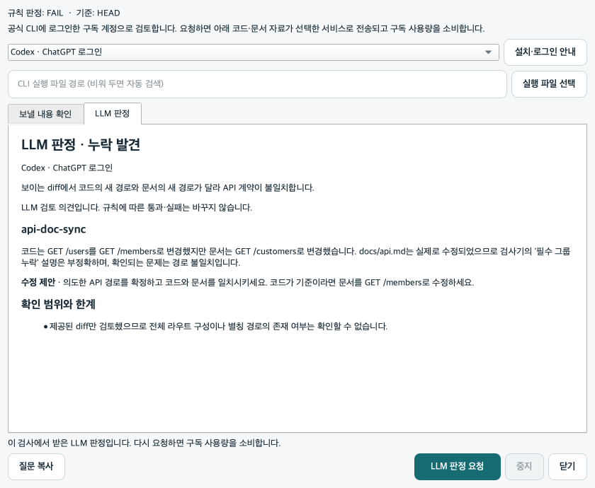

# 구독 계정으로 LLM 추가 판정 받기

API 키 없이도 **사용자가 직접 로그인한 공식 Codex·Claude Code CLI**를 통해 검토 의견을 받을 수 있습니다. ChatGPT 구독은 Codex 이용 권한이 있어야 하고, Claude 구독은 Claude Code를 이용할 수 있는 플랜이어야 합니다. 구독별 이용 한도가 적용됩니다.

Drift Gate는 계정 토큰을 읽거나 저장하지 않습니다. 로그인은 제공사의 공식 CLI에서 완료하고, 앱은 설치된 원본 CLI에 검사 자료를 전달해 결과를 받습니다. ChatGPT·Claude 웹 구독이 범용 API 크레딧으로 바뀌는 방식은 아닙니다.

## 처음 연결할 때

| 선택 | 먼저 준비할 것 | 로그인 |
|---|---|---|
| Codex · ChatGPT 로그인 | [공식 Codex CLI](https://developers.openai.com/codex/cli/)와 이용 가능한 ChatGPT 계정 | 터미널에서 `codex login` |
| Claude Code · Claude 로그인 | [공식 Claude Code](https://code.claude.com/docs/en/setup)와 이용 가능한 Claude 계정 | 터미널에서 `claude auth login` |

CLI는 앱에 포함되지 않습니다. 설치된 CLI를 자동으로 찾지 못하면 **실행 파일 선택**으로 경로를 지정합니다. API 키 로그인으로 확인되면 구독 연결을 진행하지 않으며, API 방식으로 자동 전환하지 않습니다. 기존 Claude API 연결은 CLI의 `--anthropic-api-key` 옵션으로 계속 사용할 수 있습니다.

## 앱에서 사용하는 순서

1. 저장소와 비교 기준을 선택해 **검사 시작**을 누릅니다.
2. **전송 내용 확인**을 열고 연결할 CLI를 선택합니다.
3. **전송 원문 펼치기**에서 마지막 검사 시점의 코드·문서 diff와 정책을 확인합니다.
4. **전송하고 검토**를 누르면 선택한 서비스로 자료가 전송됩니다. 결론, 근거, 수정 제안, 확인 한계를 읽고 HTML·JSON 결과로 저장할 수 있습니다.

LLM 결론은 `충족`, `확인 필요`, `누락 발견`, `판단 유보` 중 하나입니다. **규칙 엔진의 판정과 LLM 의견은 별도**입니다. LLM 오류나 취소가 기존 실패를 통과로 바꾸지 않습니다. 사용 한도·로그인·응답 형식 오류는 미완료로 표시하고, 실행 중에는 중지할 수 있습니다.

CLI 설치 없이 웹 채팅에서 검토하려면 전송 원문을 직접 복사해 ChatGPT나 Claude에 직접 붙여넣을 수도 있습니다. 웹 답변을 앱으로 자동 가져오는 기능은 현재 없습니다.

이전 Qt Widgets 화면의 실제 Codex 응답 예시입니다. 새 앱에서는 같은 결과를 리뷰 화면의 AI 검토 영역에서 표시합니다.



## 전송 범위

최대 60개 파일, 파일당 diff 5,000자, 전체 diff 24,000자, 정책 10,000자를 전달합니다. 잘리거나 생략된 항목은 요청에 표시합니다. `.env*`, 대표 인증 파일·개인키 확장자의 본문은 제외합니다. 이 처리는 모든 소스 안의 비밀값을 찾아낸다는 보장은 아니므로 미리보기에서 실제 전송 내용을 확인할 수 있습니다.

CLI는 빈 임시 폴더에서 실행합니다. Codex는 읽기 전용 모드에서 셸·웹 검색·추가 에이전트를 끄고 사용자 설정을 불러오지 않습니다. Claude Code는 safe mode에서 도구와 MCP를 끕니다. 저장소 전체를 탐색하는 작업이 아니라 제공된 검사 자료를 판단하는 요청입니다. 구독 로그인 정보는 CI나 패키지에 포함하지 않습니다.

## 확인한 결과 · 2026-09-28

같은 합성 입력을 정책 엔진에 넣고, 생성된 검사 자료를 두 CLI의 실제 구독 로그인으로 전송했습니다. API 키 없이 실행했으며 응답 원문을 저장했습니다.

| 입력 | Codex | Claude Code | 기존 규칙 판정 |
|---|---|---|---|
| 코드는 `GET /members`, 문서는 `GET /customers`로 변경 | `fail` · 경로 불일치 지적 | `fail` · 경로 불일치 지적 | 전후 `fail` 유지 |

- [Codex 원본 응답](assessment/subscription-review-2026-09-28/codex.json): `codex-cli 0.158.0-alpha.2.1`
- [Claude Code 원본 응답](assessment/subscription-review-2026-09-28/claude.json): `2.1.283`

이는 **합성 사례 한 개의 실제 연결 시험**입니다. 탐지 정확도, 일반화 성능, 두 모델 간 우열의 근거가 아닙니다. 모델은 각 CLI의 기본 선택을 사용했고 응답은 반복 실행 시 달라질 수 있습니다. 실제 구독 호출은 macOS에서 확인했으며 Windows CI는 모의 응답·UI 테스트와 앱 빌드를 확인합니다.

재현 명령은 구독 사용량을 소비합니다. 로그인한 후 아직 없는 출력 경로를 지정합니다.

```bash
python scripts/smoke_subscription_review.py --provider codex --out /tmp/codex-review.json
python scripts/smoke_subscription_review.py --provider claude --out /tmp/claude-review.json
```

연결 근거: [OpenAI 인증 문서](https://learn.chatgpt.com/docs/auth), [Codex 비대화형 실행](https://learn.chatgpt.com/docs/non-interactive-mode), [Claude Code 인증](https://code.claude.com/docs/en/authentication), [Claude Code 비대화형 실행](https://code.claude.com/docs/en/headless). Claude 연결은 [공식 원본 CLI와 사용자 본인 인증에 관한 안내](https://code.claude.com/docs/en/legal-and-compliance)를 따릅니다.
